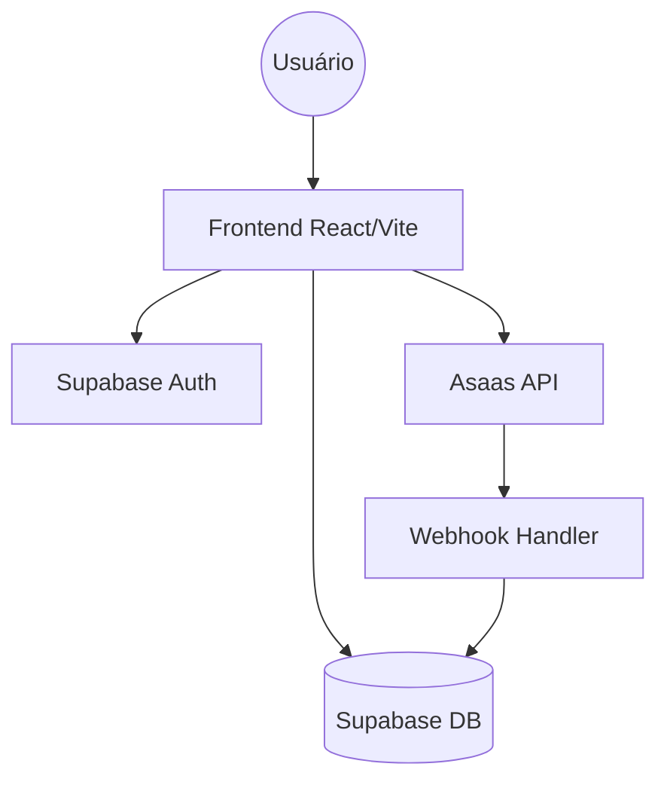

## Architecture Overview

O sistema segue uma arquitetura moderna de Single Page Application (SPA) baseada em React, consumindo um backend-as-a-service via Supabase.

## Architectural Layers

- **Frontend (UI/UX)**: Componentes React estruturados via `shadcn-ui`.
- **State Management**: React Query para sincronização de dados com o Supabase.
- **Backend (Storage/DB/Auth)**: Supabase provendo a camada de persistência e autenticação.
- **External Integrations**: Gateway Asaas para processamento de pagamentos.

## System Boundaries

- **Supabase Auth**: Limite entre usuários anônimos e autenticados.
- **Asaas API**: Integração externa para transações financeiras.

## Key Service Flow: Solicitação de Serviços

1. Usuário seleciona serviço.
2. Preenche formulário dinâmico.
3. Upload de documentos via Supabase Storage.
4. Checkout via Asaas (PIX/Cartão).
5. Confirmação automática e criação de registro em `solicitacoes_servicos`.

## Diagrams

## Related Resources

- [project-overview.md](./project-overview.md)
- [data-flow.md](./data-flow.md)
- [codebase-map.json](./codebase-map.json)
