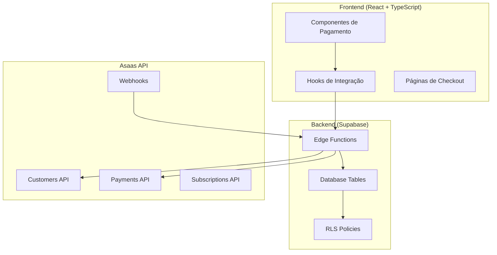

# Design Document - Integração Completa API Asaas

## Overview

Este documento detalha o design técnico para implementar a integração completa com a API do Asaas no sistema COMADEMIG. A solução será construída sobre a arquitetura existente (React + TypeScript + Supabase) e transformará o sistema atual de simulação em uma integração real e funcional.

## Architecture

### Arquitetura Geral



### Fluxo de Dados Principal

1. **Frontend** coleta dados do usuário
2. **Edge Functions** processam e validam dados
3. **Asaas API** cria clientes e cobranças
4. **Webhooks** confirmam pagamentos
5. **Database** armazena estados atualizados
6. **Frontend** exibe resultados ao usuário

## Components and Interfaces

### 1. Configuração e Credenciais

#### Environment Variables
```typescript
interface AsaasConfig {
  apiKey: string;           // $aact_hmlg_* ou $aact_prod_*
  environment: 'sandbox' | 'production';
  baseUrl: string;          // URL base da API
  webhookToken: string;     // Token para validar webhooks
  userAgent: string;        // Identificação da aplicação
}
```

#### Configuração Centralizada
```typescript
// src/lib/asaas/config.ts
export const asaasConfig: AsaasConfig = {
  apiKey: process.env.ASAAS_API_KEY!,
  environment: process.env.ASAAS_ENVIRONMENT as 'sandbox' | 'production',
  baseUrl: process.env.ASAAS_BASE_URL!,
  webhookToken: process.env.ASAAS_WEBHOOK_TOKEN!,
  userAgent: 'COMADEMIG-Portal/1.0'
};
```

### 2. Cliente HTTP para Asaas

#### Interface Base
```typescript
interface AsaasClient {
  customers: CustomerService;
  payments: PaymentService;
  subscriptions: SubscriptionService;
  webhooks: WebhookService;
}

interface AsaasResponse<T> {
  data?: T;
  errors?: AsaasError[];
  hasMore?: boolean;
  totalCount?: number;
}

interface AsaasError {
  code: string;
  description: string;
}
```

#### Implementação do Cliente
```typescript
// src/lib/asaas/client.ts
export class AsaasApiClient {
  private baseUrl: string;
  private apiKey: string;
  private userAgent: string;

  constructor(config: AsaasConfig) {
    this.baseUrl = config.baseUrl;
    this.apiKey = config.apiKey;
    this.userAgent = config.userAgent;
  }

  private async request<T>(
    endpoint: string,
    options: RequestInit = {}
  ): Promise<AsaasResponse<T>> {
    // Implementação com retry, timeout e tratamento de erros
  }
}
```

### 3. Serviços de Domínio

#### Customer Service
```typescript
interface CustomerService {
  create(data: CreateCustomerData): Promise<AsaasCustomer>;
  update(id: string, data: UpdateCustomerData): Promise<AsaasCustomer>;
  get(id: string): Promise<AsaasCustomer>;
  list(filters?: CustomerFilters): Promise<AsaasResponse<AsaasCustomer[]>>;
}

interface AsaasCustomer {
  id: string;
  name: string;
  cpfCnpj: string;
  email: string;
  phone?: string;
  mobilePhone?: string;
  address?: string;
  addressNumber?: string;
  complement?: string;
  province?: string;
  postalCode?: string;
  city?: string;
  state?: string;
}
```

#### Payment Service
```typescript
interface PaymentService {
  create(data: CreatePaymentData): Promise<AsaasPayment>;
  get(id: string): Promise<AsaasPayment>;
  list(filters?: PaymentFilters): Promise<AsaasResponse<AsaasPayment[]>>;
  cancel(id: string): Promise<void>;
  refund(id: string, value?: number): Promise<AsaasRefund>;
}

interface AsaasPayment {
  id: string;
  customer: string;
  billingType: 'PIX' | 'CREDIT_CARD' | 'BOLETO';
  value: number;
  netValue: number;
  status: PaymentStatus;
  dueDate: string;
  description: string;
  invoiceUrl?: string;
  bankSlipUrl?: string;
  pixQrCode?: string;
  pixCopyAndPaste?: string;
  externalReference?: string;
}
```

### 4. Edge Functions

#### Estrutura das Edge Functions
```
supabase/functions/
├── asaas-create-customer/
│   └── index.ts
├── asaas-create-payment/
│   └── index.ts
├── asaas-process-webhook/
│   └── index.ts
├── asaas-tokenize-card/
│   └── index.ts
└── shared/
    ├── asaas-client.ts
    ├── validation.ts
    └── types.ts
```

#### Edge Function: Create Customer
```typescript
// supabase/functions/asaas-create-customer/index.ts
interface CreateCustomerRequest {
  user_id: string;
  customer_data: {
    name: string;
    cpfCnpj: string;
    email: string;
    phone?: string;
    address?: AddressData;
  };
}

export default async function handler(req: Request) {
  // 1. Validar dados de entrada
  // 2. Verificar se cliente já existe
  // 3. Criar cliente no Asaas
  // 4. Salvar customer_id no perfil
  // 5. Retornar resultado
}
```

#### Edge Function: Create Payment
```typescript
// supabase/functions/asaas-create-payment/index.ts
interface CreatePaymentRequest {
  customer_id: string;
  service_type: 'filiacao' | 'certidao' | 'regularizacao';
  service_data: any;
  payment_data: {
    billingType: 'PIX' | 'CREDIT_CARD' | 'BOLETO';
    value: number;
    description: string;
    dueDate: string;
  };
  split_config?: SplitConfig[];
}

export default async function handler(req: Request) {
  // 1. Validar dados e autenticação
  // 2. Criar cobrança no Asaas
  // 3. Configurar split se necessário
  // 4. Salvar no banco local
  // 5. Retornar dados de pagamento
}
```

#### Edge Function: Webhook Handler
```typescript
// supabase/functions/asaas-process-webhook/index.ts
interface WebhookPayload {
  event: string;
  payment: AsaasPayment;
  dateCreated: string;
}

export default async function handler(req: Request) {
  // 1. Validar token do webhook
  // 2. Processar evento específico
  // 3. Atualizar banco de dados
  // 4. Executar ações pós-pagamento
  // 5. Retornar 200 OK
}
```

## Data Models

### 1. Tabela: asaas_cobrancas (Corrigida)

```sql
CREATE TABLE asaas_cobrancas (
    id UUID PRIMARY KEY DEFAULT gen_random_uuid(),
    user_id UUID NOT NULL REFERENCES auth.users(id),
    asaas_id VARCHAR(255) UNIQUE NOT NULL,
    customer_id VARCHAR(255) NOT NULL,
    
    -- Dados básicos
    valor DECIMAL(10,2) NOT NULL,
    descricao TEXT NOT NULL,
    forma_pagamento VARCHAR(20) CHECK (forma_pagamento IN ('PIX', 'CREDIT_CARD', 'BOLETO')),
    status VARCHAR(50) NOT NULL DEFAULT 'PENDING',
    
    -- Datas
    data_vencimento DATE NOT NULL,
    data_pagamento TIMESTAMP WITH TIME ZONE,
    
    -- URLs e códigos
    url_pagamento TEXT,
    linha_digitavel TEXT,
    qr_code_pix TEXT,
    
    -- Metadados de serviço
    service_type VARCHAR(20) CHECK (service_type IN ('filiacao', 'certidao', 'regularizacao', 'evento', 'taxa_anual')),
    service_data JSONB,
    
    -- Referências
    referencia_id VARCHAR(255),
    external_reference VARCHAR(255),
    
    -- Timestamps
    created_at TIMESTAMP WITH TIME ZONE DEFAULT NOW(),
    updated_at TIMESTAMP WITH TIME ZONE DEFAULT NOW()
);
```

### 2. Tabela: asaas_customers

```sql
CREATE TABLE asaas_customers (
    id UUID PRIMARY KEY DEFAULT gen_random_uuid(),
    user_id UUID NOT NULL REFERENCES auth.users(id),
    asaas_customer_id VARCHAR(255) UNIQUE NOT NULL,
    
    -- Dados do cliente
    name VARCHAR(255) NOT NULL,
    cpf_cnpj VARCHAR(20) NOT NULL,
    email VARCHAR(255) NOT NULL,
    phone VARCHAR(20),
    mobile_phone VARCHAR(20),
    
    -- Endereço
    address TEXT,
    address_number VARCHAR(10),
    complement VARCHAR(255),
    province VARCHAR(100),
    postal_code VARCHAR(10),
    city VARCHAR(100),
    state VARCHAR(2),
    
    -- Metadados
    external_reference VARCHAR(255),
    
    -- Timestamps
    created_at TIMESTAMP WITH TIME ZONE DEFAULT NOW(),
    updated_at TIMESTAMP WITH TIME ZONE DEFAULT NOW()
);
```

### 3. Tabela: asaas_subscriptions

```sql
CREATE TABLE asaas_subscriptions (
    id UUID PRIMARY KEY DEFAULT gen_random_uuid(),
    user_id UUID NOT NULL REFERENCES auth.users(id),
    asaas_subscription_id VARCHAR(255) UNIQUE NOT NULL,
    customer_id VARCHAR(255) NOT NULL,
    
    -- Dados da assinatura
    billing_type VARCHAR(20) NOT NULL,
    value DECIMAL(10,2) NOT NULL,
    cycle VARCHAR(20) NOT NULL, -- MONTHLY, QUARTERLY, SEMIANNUALLY, YEARLY
    description TEXT,
    
    -- Status e datas
    status VARCHAR(20) NOT NULL DEFAULT 'ACTIVE',
    next_due_date DATE,
    
    -- Configurações
    max_payments INTEGER,
    
    -- Metadados
    service_type VARCHAR(20),
    service_data JSONB,
    
    -- Timestamps
    created_at TIMESTAMP WITH TIME ZONE DEFAULT NOW(),
    updated_at TIMESTAMP WITH TIME ZONE DEFAULT NOW()
);
```

### 4. Tabela: asaas_splits

```sql
CREATE TABLE asaas_splits (
    id UUID PRIMARY KEY DEFAULT gen_random_uuid(),
    cobranca_id UUID NOT NULL REFERENCES asaas_cobrancas(id),
    affiliate_id UUID NOT NULL REFERENCES profiles(id),
    
    -- Dados do split
    percentage DECIMAL(5,2) NOT NULL, -- Percentual da comissão (ex: 10.50)
    fixed_value DECIMAL(10,2), -- Valor fixo alternativo
    wallet_id VARCHAR(255), -- ID da carteira no Asaas para receber
    
    -- Status
    status VARCHAR(20) NOT NULL DEFAULT 'PENDING', -- PENDING, PROCESSED, FAILED
    asaas_split_id VARCHAR(255), -- ID do split no Asaas
    
    -- Valores calculados
    commission_amount DECIMAL(10,2), -- Valor da comissão calculado
    processed_at TIMESTAMP WITH TIME ZONE,
    
    -- Metadados
    error_message TEXT,
    retry_count INTEGER DEFAULT 0,
    
    -- Timestamps
    created_at TIMESTAMP WITH TIME ZONE DEFAULT NOW(),
    updated_at TIMESTAMP WITH TIME ZONE DEFAULT NOW()
);
```

## Error Handling

### 1. Estratégia de Tratamento de Erros

#### Classificação de Erros
```typescript
enum AsaasErrorType {
  AUTHENTICATION = 'authentication',
  VALIDATION = 'validation',
  BUSINESS_RULE = 'business_rule',
  NETWORK = 'network',
  RATE_LIMIT = 'rate_limit',
  SERVER_ERROR = 'server_error'
}

interface AsaasErrorHandler {
  handle(error: AsaasError): ErrorResponse;
  retry(operation: () => Promise<any>, maxRetries: number): Promise<any>;
  fallback(error: AsaasError): FallbackResponse;
}
```

#### Implementação de Retry
```typescript
class RetryHandler {
  async executeWithRetry<T>(
    operation: () => Promise<T>,
    maxRetries: number = 3,
    backoffMs: number = 1000
  ): Promise<T> {
    // Implementação com exponential backoff
    // Retry apenas para erros temporários (5xx, network)
    // Não retry para erros de validação (4xx)
  }
}
```

### 2. Tratamento Específico por Tipo de Erro

#### Erros de Autenticação (401)
- Verificar ambiente (sandbox vs production)
- Validar formato da chave API
- Sugerir renovação de credenciais

#### Erros de Validação (400)
- Mapear campos específicos com erro
- Mostrar mensagens amigáveis ao usuário
- Sugerir correções

#### Erros de Rate Limit (429)
- Implementar backoff automático
- Mostrar tempo de espera ao usuário
- Queue de requisições se necessário

## Testing Strategy

### 1. Ambiente de Testes

#### Configuração Sandbox
```typescript
const sandboxConfig: AsaasConfig = {
  apiKey: process.env.ASAAS_SANDBOX_API_KEY!,
  environment: 'sandbox',
  baseUrl: 'https://api-sandbox.asaas.com/v3',
  webhookToken: process.env.ASAAS_SANDBOX_WEBHOOK_TOKEN!,
  userAgent: 'COMADEMIG-Portal-Test/1.0'
};
```

#### Dados de Teste
- Usar CPFs/CNPJs de teste válidos
- Emails de teste (não reais)
- Cartões de teste fornecidos pelo Asaas
- Valores baixos para testes

### 2. Testes Automatizados

#### Testes de Integração
```typescript
describe('Asaas Integration', () => {
  test('should create customer successfully', async () => {
    // Teste de criação de cliente
  });
  
  test('should create PIX payment', async () => {
    // Teste de pagamento PIX
  });
  
  test('should process webhook correctly', async () => {
    // Teste de processamento de webhook
  });
});
```

#### Testes de Edge Functions
- Validação de entrada
- Processamento correto
- Tratamento de erros
- Timeout e retry

### 3. Validação Manual

#### Checklist de Testes
- [ ] Criar cliente no Asaas
- [ ] Gerar cobrança PIX
- [ ] Gerar cobrança Cartão
- [ ] Gerar cobrança Boleto
- [ ] Processar webhook de pagamento
- [ ] Testar split de pagamentos
- [ ] Validar assinaturas recorrentes

## Implementation Phases

### Fase 1: Fundação (Semana 1)
1. **Configurar credenciais** e variáveis de ambiente
2. **Criar tabela asaas_cobrancas** faltante
3. **Implementar cliente HTTP** básico
4. **Criar Edge Function** para clientes
5. **Testar conectividade** com API

### Fase 2: Pagamentos Básicos (Semana 2)
1. **Implementar criação de cobranças** PIX
2. **Desenvolver processamento** de cartão
3. **Configurar webhooks** básicos
4. **Corrigir fluxo de certidões**
5. **Testar pagamentos** em sandbox

### Fase 3: Funcionalidades Avançadas (Semana 3)
1. **Implementar split** para afiliados
2. **Desenvolver assinaturas** recorrentes
3. **Criar dashboard** financeiro
4. **Implementar estornos**
5. **Otimizar performance**

### Fase 4: Produção (Semana 4)
1. **Migrar para ambiente** de produção
2. **Configurar monitoramento**
3. **Implementar logs** de auditoria
4. **Treinar equipe**
5. **Go-live** controlado

## Security Considerations

### 1. Proteção de Credenciais
- Chaves API em variáveis de ambiente
- Rotação regular de tokens
- Logs sem exposição de dados sensíveis
- Criptografia de dados em trânsito

### 2. Validação de Webhooks
```typescript
interface WebhookValidator {
  validateToken(token: string): boolean;
  validatePayload(payload: any): boolean;
  preventReplay(eventId: string): boolean;
}
```

### 3. Auditoria e Compliance
- Log de todas as transações
- Rastreabilidade de alterações
- Backup de dados críticos
- Conformidade com LGPD

## Performance Optimizations

### 1. Caching Strategy
- Cache de clientes por 1 hora
- Cache de configurações por 24 horas
- Invalidação automática em updates

### 2. Database Optimizations
- Índices otimizados para consultas frequentes
- Particionamento por data se necessário
- Cleanup automático de logs antigos

### 3. API Rate Limiting
- Implementar queue para requisições
- Respeitar limites do Asaas (25k/12h)
- Backoff exponencial em rate limits

## Monitoring and Observability

### 1. Métricas Importantes
- Taxa de sucesso de pagamentos
- Tempo de resposta da API
- Erros por tipo e frequência
- Volume de transações por período

### 2. Alertas Críticos
- Falhas de webhook por mais de 15 minutos
- Taxa de erro acima de 5%
- Indisponibilidade da API Asaas
- Problemas de conectividade

### 3. Dashboards
- Visão geral financeira
- Status de integrações
- Performance de pagamentos
- Análise de erros

## Migration Strategy

### 1. Dados Existentes
- Migrar user_subscriptions existentes
- Criar customers no Asaas para usuários ativos
- Manter compatibilidade com sistema atual

### 2. Rollback Plan
- Manter sistema simulado como fallback
- Feature flags para ativar/desativar integração
- Backup completo antes da migração

### 3. Deployment Strategy
- Deploy gradual por funcionalidade
- Testes A/B se necessário
- Monitoramento intensivo pós-deploy

## Integration Points

### 1. Sistema de Filiação
- Integrar com `useFiliacaoFlow`
- Criar assinatura no Asaas
- Processar pagamento inicial
- Configurar renovação automática

### 2. Sistema de Certidões
- Corrigir `useCertidoesWithPayment`
- Criar cobrança por certidão
- Processar após confirmação de pagamento
- Notificar conclusão

### 3. Sistema de Regularização
- Corrigir `useRegularizacaoWithPayment`
- Implementar desconto combo
- Processar múltiplos serviços
- Acompanhar progresso

### 4. Programa de Afiliados
- Configurar split automático
- Calcular comissões
- Processar pagamentos de comissão
- Dashboard de afiliados

## Quality Assurance

### 1. Code Quality
- TypeScript strict mode
- ESLint + Prettier
- Testes unitários > 80%
- Code review obrigatório

### 2. Security Testing
- Penetration testing básico
- Validação de inputs
- Teste de webhooks maliciosos
- Verificação de permissões

### 3. Performance Testing
- Load testing com volume esperado
- Stress testing de Edge Functions
- Teste de concorrência
- Validação de timeouts

## Documentation

### 1. Documentação Técnica
- README atualizado
- Guia de configuração
- Troubleshooting guide
- API reference interna

### 2. Documentação de Usuário
- Guia de pagamentos
- FAQ sobre problemas comuns
- Vídeos explicativos
- Suporte técnico

## Success Metrics

### 1. Métricas Técnicas
- 99.5% uptime da integração
- < 2s tempo de resposta médio
- < 1% taxa de erro
- 100% dos webhooks processados

### 2. Métricas de Negócio
- Aumento de 300% em conversões
- Redução de 80% em pagamentos manuais
- 95% satisfação do usuário
- ROI positivo em 30 dias