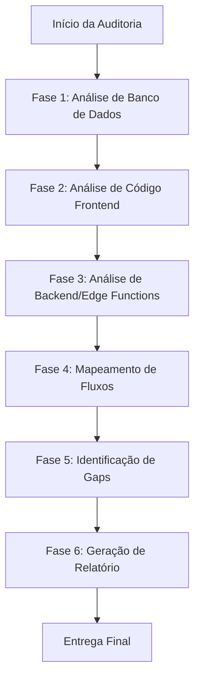
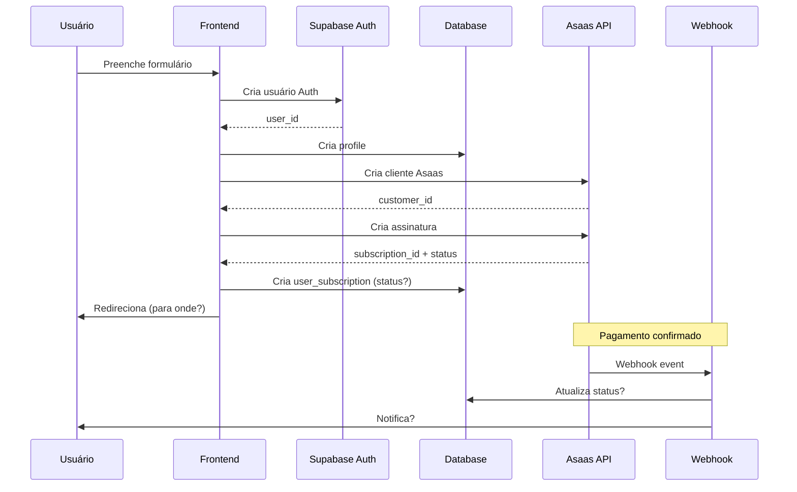
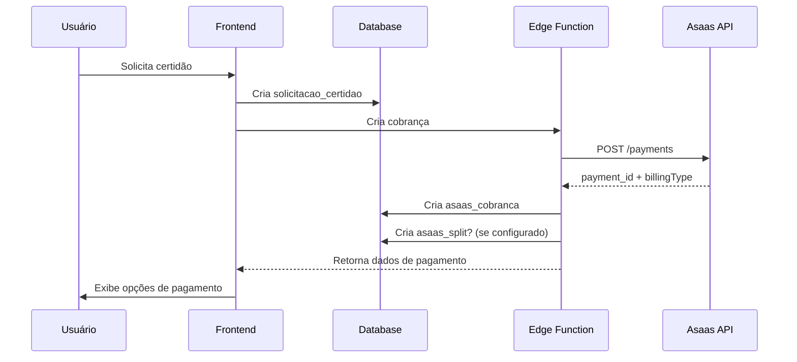

# Design Document - Auditoria Completa do Sistema de Pagamentos

## Overview

Esta auditoria seguirá uma metodologia sistemática de análise em camadas, começando pela verificação do estado real do banco de dados, seguida pela análise de código frontend, backend (Edge Functions), e finalmente mapeamento de fluxos completos. A abordagem é **não-invasiva** e **somente leitura**, garantindo que nenhuma alteração seja feita no sistema durante o processo.

## Architecture

### Metodologia de Auditoria



### Camadas de Análise

1. **Camada de Dados (Database Layer)**
   - Conexão via Python com supabase-py (somente leitura)
   - Verificação de estrutura de tabelas
   - Análise de dados reais
   - Verificação de políticas RLS

2. **Camada de Aplicação (Application Layer)**
   - Análise de código React/TypeScript
   - Verificação de hooks customizados
   - Análise de componentes de UI
   - Verificação de rotas e proteções

3. **Camada de Integração (Integration Layer)**
   - Análise de Edge Functions
   - Verificação de webhooks
   - Análise de integração com Asaas
   - Verificação de sistema de split

4. **Camada de Fluxo (Flow Layer)**
   - Mapeamento de user journeys
   - Identificação de pontos de falha
   - Análise de estados e transições
   - Verificação de consistência

## Components and Interfaces

### 1. Módulo de Análise de Banco de Dados

**Responsabilidade:** Conectar ao Supabase e extrair informações reais sobre estrutura e dados.

**Ferramentas:**
- Script Python com `supabase-py`
- Queries SQL de análise (somente SELECT)
- Extração de metadados de tabelas

**Tabelas Críticas a Analisar:**
```python
CRITICAL_TABLES = [
    'user_subscriptions',      # Status de assinaturas
    'profiles',                # Dados de usuários
    'member_types',            # Tipos de membros
    'subscription_plans',      # Planos disponíveis
    'asaas_cobrancas',        # Cobranças registradas
    'asaas_splits',           # Configuração de split
    'affiliates',             # Sistema de afiliados
    'solicitacoes_certidoes', # Solicitações de serviços
    'certificates',           # Certificados emitidos
    'support_tickets'         # Tickets de suporte
]
```

**Script de Análise:**
```python
#!/usr/bin/env python3
"""
Script de Auditoria - Análise de Banco de Dados
ATENÇÃO: Somente operações de LEITURA
"""
from supabase import create_client, Client
import json
from datetime import datetime

SUPABASE_URL = "https://amkelczfwazutrciqtlk.supabase.co"
SUPABASE_KEY = "[extrair de src/integrations/supabase/client.ts]"

def audit_database():
    """Auditoria completa do banco de dados"""
    supabase: Client = create_client(SUPABASE_URL, SUPABASE_KEY)
    
    report = {
        'timestamp': datetime.now().isoformat(),
        'tables': {}
    }
    
    for table in CRITICAL_TABLES:
        try:
            # Contar registros
            count_response = supabase.table(table).select('*', count='exact').execute()
            
            # Pegar amostra
            sample_response = supabase.table(table).select('*').limit(5).execute()
            
            # Identificar colunas
            columns = list(sample_response.data[0].keys()) if sample_response.data else []
            
            report['tables'][table] = {
                'exists': True,
                'count': count_response.count,
                'columns': columns,
                'sample': sample_response.data
            }
            
        except Exception as e:
            report['tables'][table] = {
                'exists': False,
                'error': str(e)
            }
    
    return report
```

### 2. Módulo de Análise de Controle de Acesso

**Responsabilidade:** Identificar todos os pontos onde deveria haver verificação de status de assinatura.

**Arquivos a Analisar:**
```typescript
// 1. Middleware de autenticação
src/lib/auth/middleware.ts
src/contexts/AuthContext.tsx

// 2. Hooks de autenticação
src/hooks/useAuthState.ts
src/hooks/useSubscriptionStatus.ts (se existir)

// 3. Componentes de proteção
src/components/auth/ProtectedRoute.tsx (se existir)
src/components/layout/DashboardLayout.tsx

// 4. Rotas
src/App.tsx

// 5. Dashboard
src/pages/Dashboard.tsx
src/pages/dashboard/*
```

**Checklist de Verificação:**
- [ ] Existe verificação de `user_subscriptions.status`?
- [ ] Onde está implementada a verificação?
- [ ] Quais status permitem acesso?
- [ ] Há diferença entre verificação de role e status?
- [ ] Dashboard verifica status antes de renderizar?
- [ ] Rotas protegidas verificam status?
- [ ] Há redirect para página de pagamento pendente?

### 3. Módulo de Análise de Fluxo de Filiação

**Responsabilidade:** Mapear passo a passo o fluxo desde cadastro até acesso liberado.

**Arquivos Críticos:**
```typescript
// Hook principal de filiação
src/hooks/useFiliacaoPayment.ts

// Componentes de filiação
src/pages/Filiacao.tsx
src/components/forms/FiliacaoForm.tsx (se existir)

// Edge Functions
supabase/functions/asaas-webhook/index.ts
supabase/functions/asaas-create-subscription/index.ts (se existir)
```

**Fluxo a Mapear:**


**Perguntas Críticas:**
1. Qual o status inicial de `user_subscription` após criação?
2. Para onde usuário é redirecionado após filiação?
3. Usuário tem acesso imediato ou aguarda confirmação?
4. Webhook está configurado e funcionando?
5. Qual evento do Asaas confirma pagamento?
6. O que exatamente o webhook atualiza no BD?

### 4. Módulo de Análise de Pagamentos Recorrentes

**Responsabilidade:** Verificar sistema de renovação automática e tratamento de falhas.

**Componentes a Analisar:**
```sql
-- Verificar se existe trigger de expiração
SELECT * FROM pg_trigger WHERE tgname LIKE '%subscription%';

-- Verificar se existe função de verificação
SELECT proname, prosrc FROM pg_proc WHERE proname LIKE '%subscription%';

-- Verificar uso do campo expires_at
SELECT expires_at, status FROM user_subscriptions LIMIT 10;
```

**Arquivos a Verificar:**
```typescript
// Webhook de eventos Asaas
supabase/functions/asaas-webhook/index.ts

// Possível job de verificação
supabase/functions/check-expired-subscriptions/index.ts (se existir)
```

**Cenários a Testar (via análise de código):**
1. Assinatura expira → Status muda automaticamente?
2. Pagamento falha → Webhook recebe evento?
3. Webhook atualiza status → Para qual status?
4. Há tentativa de recobrança automática?
5. Usuário é notificado de falha?
6. Acesso é bloqueado imediatamente?

### 5. Módulo de Análise de Interface de Pagamento

**Responsabilidade:** Verificar se existe interface para membros gerenciarem pagamentos.

**Busca de Arquivos:**
```bash
# Buscar páginas relacionadas
src/pages/*Payment*
src/pages/*Subscription*
src/pages/*Billing*
src/pages/dashboard/*Payment*

# Buscar componentes
src/components/*Payment*
src/components/*Subscription*
src/components/*Billing*

# Verificar rotas
src/App.tsx (buscar por "payment", "subscription", "billing")
```

**Funcionalidades Esperadas:**
- [ ] Página de gerenciamento de assinatura
- [ ] Visualização de status atual
- [ ] Histórico de pagamentos
- [ ] Opção de pagar fatura pendente
- [ ] Opção de trocar método de pagamento
- [ ] Opção de cancelar assinatura
- [ ] Visualização de próxima cobrança

### 6. Módulo de Análise de Pagamentos de Serviços

**Responsabilidade:** Mapear fluxo de solicitação e pagamento de certidões/regularizações.

**Arquivos Críticos:**
```typescript
// Páginas de serviços
src/pages/Services.tsx
src/pages/Certidoes.tsx (se existir)

// Componentes de checkout
src/components/certidoes/*
src/components/payments/*

// Edge Functions
supabase/functions/asaas-create-service-payment/index.ts (se existir)
supabase/functions/process-service-payment/index.ts (se existir)
```

**Fluxo a Mapear:**


**Verificações:**
- [ ] Tabela `solicitacoes_certidoes` existe?
- [ ] Relacionamento com `asaas_cobrancas`?
- [ ] Edge Function de criação de pagamento existe?
- [ ] Split está configurado para serviços?
- [ ] Status do serviço é atualizado após pagamento?
- [ ] Webhook processa pagamento de serviços?

### 7. Módulo de Análise de Sistema de Split

**Responsabilidade:** Complementar relatório existente e verificar integração completa.

**Arquivos a Analisar:**
```typescript
// Edge Function de split
supabase/functions/asaas-configure-split/index.ts

// Integração com filiação
src/hooks/useFiliacaoPayment.ts
// Buscar por: invoke('asaas-configure-split')

// Integração com serviços
src/pages/Services.tsx
src/components/certidoes/*
// Buscar por: split, asaas-configure-split
```

**Tabelas a Verificar:**
```sql
-- Estrutura de asaas_splits
SELECT column_name, data_type, is_nullable 
FROM information_schema.columns 
WHERE table_name = 'asaas_splits';

-- Relacionamentos
SELECT * FROM asaas_splits LIMIT 5;

-- Verificar affiliates
SELECT * FROM affiliates LIMIT 5;
```

**Matriz de Integração:**
| Tipo de Transação | Split Configurado? | Afiliado Vinculado? | Comissão Calculada? |
|-------------------|-------------------|---------------------|---------------------|
| Filiação          | ?                 | ?                   | ?                   |
| Anuidade          | ?                 | ?                   | ?                   |
| Certidão          | ?                 | ?                   | ?                   |
| Regularização     | ?                 | ?                   | ?                   |
| Evento            | ?                 | ?                   | ?                   |

### 8. Módulo de Análise de Métodos de Pagamento

**Responsabilidade:** Verificar implementação completa de PIX, Cartão e Boleto.

### 9. Módulo de Análise Completa de Edge Functions

**Responsabilidade:** Inventariar e analisar TODAS as Edge Functions do sistema.

**Processo:**
```bash
# Listar todas as Edge Functions
ls -la supabase/functions/

# Para cada função encontrada:
# 1. Ler código completo
# 2. Identificar responsabilidade
# 3. Documentar parâmetros de entrada
# 4. Documentar resposta
# 5. Buscar onde é chamada no frontend
# 6. Verificar variáveis de ambiente necessárias
# 7. Buscar logs de execução
```

**Tabela Resumo Esperada:**
| Edge Function | Responsabilidade | Entrada | Saída | Chamada em | Env Vars | Status |
|---------------|------------------|---------|-------|------------|----------|--------|
| asaas-webhook | Processar eventos Asaas | event payload | 200/error | N/A (webhook) | ASAAS_API_KEY | ✅ |
| asaas-create-subscription | Criar assinatura | user_id, plan_id | subscription_id | useFiliacaoPayment | ASAAS_API_KEY | ? |
| ... | ... | ... | ... | ... | ... | ? |

**Verificações Críticas:**
- [ ] Todas as Edge Functions têm tratamento de erro?
- [ ] Todas validam entrada?
- [ ] Todas têm logs adequados?
- [ ] Todas têm timeout configurado?
- [ ] Todas têm retry em caso de falha?

### 10. Módulo de Análise de Hooks

**Responsabilidade:** Analisar todos os hooks relacionados a pagamento e assinatura.

**Hooks Esperados:**
```typescript
// Hooks a buscar e analisar
src/hooks/useFiliacaoPayment.ts
src/hooks/useAsaasCustomers.ts
src/hooks/useSubscription.ts
src/hooks/usePayment.ts
src/hooks/usePixPayment.ts
src/hooks/useCreditCardPayment.ts
src/hooks/useBoletoPayment.ts
src/hooks/useServicePayment.ts
src/hooks/useSplitConfiguration.ts
```

**Para Cada Hook Documentar:**
```typescript
// Template de análise
{
  nome: "useFiliacaoPayment",
  arquivo: "src/hooks/useFiliacaoPayment.ts",
  responsabilidade: "Gerenciar processo completo de filiação",
  estados: ["loading", "error", "success", "paymentData"],
  mutations: ["createProfile", "createAsaasCustomer", "createSubscription"],
  queries: ["getSubscriptionPlans", "getMemberTypes"],
  usadoEm: ["src/pages/Filiacao.tsx", "src/components/forms/FiliacaoForm.tsx"],
  dependencias: ["supabase", "asaas-api"],
  problemas: ["Não verifica status antes de liberar acesso"],
  propostas: ["Adicionar verificação de status após criação"]
}
```

**Análise de Duplicação:**
- Identificar código duplicado entre hooks
- Propor hooks compartilhados
- Propor utilitários comuns

### 11. Módulo de Análise de Integração Asaas

**Responsabilidade:** Documentar completamente a integração com API Asaas.

**Configuração a Verificar:**
```typescript
// Buscar em código
const ASAAS_API_KEY = process.env.ASAAS_API_KEY;
const ASAAS_BASE_URL = "https://api.asaas.com/v3";
const ASAAS_TIMEOUT = ?;
const ASAAS_RETRY_ATTEMPTS = ?;
const ASAAS_WEBHOOK_URL = ?;
const ASAAS_WEBHOOK_TOKEN = ?;
```

**Endpoints a Documentar:**
```typescript
// Listar TODOS os endpoints usados
const ASAAS_ENDPOINTS = [
  {
    endpoint: "POST /customers",
    usado_em: "asaas-create-customer",
    parametros: { name, cpfCnpj, email, phone },
    resposta: { id, name, email },
    tratamento_erro: "?"
  },
  {
    endpoint: "POST /subscriptions",
    usado_em: "asaas-create-subscription",
    parametros: { customer, billingType, value, cycle },
    resposta: { id, status, nextDueDate },
    tratamento_erro: "?"
  },
  // ... listar TODOS
];
```

**Webhook a Documentar:**
```typescript
// Configuração completa
{
  url: "https://[projeto].supabase.co/functions/v1/asaas-webhook",
  token: "?",
  eventos_tratados: [
    "PAYMENT_RECEIVED",
    "PAYMENT_CONFIRMED",
    "PAYMENT_OVERDUE",
    "PAYMENT_DELETED",
    "SUBSCRIPTION_CREATED",
    "SUBSCRIPTION_UPDATED",
    // ... listar TODOS
  ],
  logs_ultimas_24h: "?",
  erros_recorrentes: "?"
}
```

### 12. Módulo de Análise de Testes

**Responsabilidade:** Verificar cobertura de testes e identificar gaps.

**Busca de Testes:**
```bash
# Buscar arquivos de teste
find src -name "*.test.ts"
find src -name "*.test.tsx"
find src -name "*.spec.ts"
find supabase/functions -name "*.test.ts"
```

**Análise de Cobertura:**
```typescript
// Para cada área crítica, verificar se há testes
const AREAS_CRITICAS = [
  {
    area: "Hooks de Pagamento",
    arquivos: ["useFiliacaoPayment.ts", "usePayment.ts"],
    testes_existentes: "?",
    cobertura: "?%",
    testes_faltantes: ["Teste de falha de pagamento", "Teste de timeout"]
  },
  {
    area: "Edge Functions",
    arquivos: ["asaas-webhook", "asaas-create-subscription"],
    testes_existentes: "?",
    cobertura: "?%",
    testes_faltantes: ["Teste de webhook inválido", "Teste de retry"]
  },
  // ... para cada área
];
```

### 13. Módulo de Análise de Logs

**Responsabilidade:** Analisar logs para identificar problemas recorrentes.

**Logs a Verificar:**
```typescript
// Via Supabase Dashboard ou código
const LOG_SOURCES = [
  {
    fonte: "Edge Functions",
    periodo: "últimas 24h",
    erros_encontrados: "?",
    padroes: "?"
  },
  {
    fonte: "Database Logs",
    periodo: "últimas 24h",
    queries_lentas: "?",
    erros_encontrados: "?"
  },
  {
    fonte: "Auth Logs",
    periodo: "últimas 24h",
    falhas_autenticacao: "?",
    padroes: "?"
  }
];
```

**Análise de Padrões:**
- Identificar erros que se repetem
- Identificar horários de pico de erro
- Identificar correlação entre erros
- Propor alertas para erros críticos

**Arquivos por Método:**

**PIX:**
```typescript
// Edge Function
supabase/functions/asaas-create-pix-payment/index.ts

// Componentes
src/components/payments/PixPayment.tsx (se existir)
src/components/payments/QRCodeDisplay.tsx (se existir)

// Hooks
src/hooks/usePixPayment.ts (se existir)
```

**Cartão de Crédito:**
```typescript
// Edge Function
supabase/functions/asaas-process-credit-card/index.ts (se existir)

// Componentes
src/components/payments/CreditCardForm.tsx (se existir)

// Hooks
src/hooks/useCreditCardPayment.ts (se existir)
```

**Boleto:**
```typescript
// Edge Function
supabase/functions/asaas-create-boleto/index.ts (se existir)

// Componentes
src/components/payments/BoletoPayment.tsx (se existir)
```

**Checklist por Método:**

**PIX:**
- [ ] Geração de QR Code funciona?
- [ ] Expiração configurada?
- [ ] Webhook de confirmação implementado?
- [ ] Fluxo completo no frontend?
- [ ] Tratamento de erro?

**Cartão:**
- [ ] Tokenização implementada?
- [ ] Dados sensíveis não trafegam pelo frontend?
- [ ] Webhook de confirmação implementado?
- [ ] Tratamento de erro de autorização?
- [ ] Suporte a parcelamento?

**Boleto:**
- [ ] Geração de boleto funciona?
- [ ] Prazo de vencimento configurado?
- [ ] Webhook de confirmação implementado?
- [ ] Tratamento de expiração?
- [ ] Link para download do boleto?

## Data Models

### Modelo de Dados Esperado vs Real

**user_subscriptions:**
```typescript
// Esperado
interface UserSubscription {
  id: string;
  user_id: string;
  subscription_plan_id: string;
  status: 'PENDING' | 'ACTIVE' | 'PAST_DUE' | 'CANCELED' | 'SUSPENDED';
  started_at: string;
  expires_at: string;
  asaas_subscription_id: string;
  asaas_customer_id: string;
  created_at: string;
  updated_at: string;
}

// Verificar se estrutura real corresponde
```

**asaas_cobrancas:**
```typescript
// Esperado
interface AsaasCobranca {
  id: string;
  user_id: string;
  asaas_payment_id: string;
  asaas_customer_id: string;
  value: number;
  billing_type: 'PIX' | 'CREDIT_CARD' | 'BOLETO';
  status: string;
  due_date: string;
  payment_date?: string;
  description: string;
  // Relacionamento com split?
  split_configured: boolean;
  created_at: string;
}
```

**asaas_splits:**
```typescript
// Esperado
interface AsaasSplit {
  id: string;
  cobranca_id: string; // FK para asaas_cobrancas
  wallet_id: string;   // Wallet do afiliado
  percentage: number;  // Percentual da comissão
  fixed_value?: number; // Ou valor fixo
  status: string;
  created_at: string;
}
```

## Error Handling

### Categorias de Problemas a Identificar

**Críticos (Bloqueiam funcionalidade essencial):**
- Usuário PENDING com acesso total
- Webhook não funcionando
- Pagamentos não sendo registrados
- Split não configurado

**Altos (Impactam experiência ou segurança):**
- Falta de interface de pagamento para membros
- Renovação automática não funcionando
- Notificações não sendo enviadas
- Políticas RLS permissivas demais

**Médios (Melhorias necessárias):**
- Falta de histórico de pagamentos
- Tratamento de erro incompleto
- Logs insuficientes
- Documentação faltando

**Baixos (Melhorias desejáveis):**
- UX de pagamento pode melhorar
- Mensagens de erro genéricas
- Falta de feedback visual

## Testing Strategy

### Abordagem de Teste (Análise Estática)

**Não faremos testes executáveis**, mas analisaremos:

1. **Análise de Código:**
   - Verificar se lógica de verificação existe
   - Identificar pontos onde deveria ter validação
   - Verificar tratamento de casos extremos

2. **Análise de Dados:**
   - Verificar consistência de dados no BD
   - Identificar registros órfãos
   - Verificar integridade referencial

3. **Análise de Fluxo:**
   - Mapear user journeys completos
   - Identificar pontos de falha
   - Verificar estados inconsistentes

4. **Análise de Segurança:**
   - Verificar políticas RLS
   - Identificar dados expostos
   - Verificar autenticação/autorização

### Matriz de Testes Conceituais

| Cenário | Estado Esperado | Como Verificar |
|---------|----------------|----------------|
| Usuário se filia | Status PENDING, sem acesso | Verificar código de proteção de rotas |
| Pagamento confirmado | Status ACTIVE, acesso liberado | Verificar webhook e atualização de status |
| Pagamento falha | Status PENDING, sem acesso | Verificar tratamento de erro |
| Assinatura expira | Status PAST_DUE, acesso bloqueado | Verificar job de expiração |
| Usuário cancela | Status CANCELED, acesso bloqueado | Verificar fluxo de cancelamento |

## Deliverables

### Estrutura do Relatório Final

```markdown
# AUDITORIA_SISTEMA_PAGAMENTOS.md

## 📋 Sumário Executivo
- Resumo dos principais problemas
- Matriz de riscos
- Recomendações prioritárias

## 🔍 1. Controle de Acesso e Autenticação
### 1.1 Estado Atual
### 1.2 Estado Esperado
### 1.3 Problemas Identificados
### 1.4 Impacto
### 1.5 Proposta de Solução

## 💳 2. Fluxo de Filiação e Primeiro Pagamento
### 2.1 Mapeamento do Fluxo Atual
### 2.2 Análise de Gaps
### 2.3 Webhook de Confirmação
### 2.4 Matriz Status vs Acesso
### 2.5 Proposta de Correção

## 🔄 3. Pagamentos Recorrentes e Renovação
### 3.1 Sistema de Renovação Atual
### 3.2 Tratamento de Falhas
### 3.3 Gaps Identificados
### 3.4 Proposta de Implementação

## 💰 4. Módulo de Pagamento para Membros
### 4.1 Estado Atual
### 4.2 Funcionalidades Faltantes
### 4.3 Proposta de Interface

## 📄 5. Pagamentos de Serviços
### 5.1 Fluxo Atual
### 5.2 Integração com Asaas
### 5.3 Problemas Identificados
### 5.4 Proposta de Correção

## 🔀 6. Sistema de Split de Pagamentos
### 6.1 Status Atual
### 6.2 Integração com Transações
### 6.3 Programa de Afiliados
### 6.4 Gaps de Implementação

## 💳 7. Métodos de Pagamento
### 7.1 PIX
### 7.2 Cartão de Crédito
### 7.3 Boleto
### 7.4 Análise Comparativa

## ⚙️ 8. Edge Functions
### 8.1 Inventário Completo
### 8.2 Análise Individual por Função
### 8.3 Variáveis de Ambiente
### 8.4 Logs e Erros
### 8.5 Gaps Identificados

## 🔧 9. Hooks e Lógica de Negócio
### 9.1 Inventário de Hooks
### 9.2 Análise Individual por Hook
### 9.3 Estados e Mutations
### 9.4 Duplicação de Código
### 9.5 Propostas de Refatoração

## 🔗 10. Integração com Asaas
### 10.1 Configuração Completa
### 10.2 Endpoints Utilizados
### 10.3 Webhook (Configuração e Eventos)
### 10.4 Logs de Integração
### 10.5 Tratamento de Erros
### 10.6 Gaps Identificados

## 🧪 11. Testes e Monitoramento
### 11.1 Cobertura de Testes Atual
### 11.2 Testes Faltantes
### 11.3 Análise de Logs
### 11.4 Sistema de Monitoramento
### 11.5 Propostas de Melhoria

## 🎯 12. Roadmap de Correções
### 12.1 Fase 1: Crítico (Imediato)
### 12.2 Fase 2: Alto (Curto Prazo)
### 12.3 Fase 3: Médio (Médio Prazo)
### 12.4 Fase 4: Baixo (Longo Prazo)

## 📊 Anexos
### A. Diagramas de Fluxo
### B. Estrutura de Tabelas
### C. Código de Referência
### D. Checklist de Implementação
### E. Tabela Resumo de Edge Functions
### F. Tabela Resumo de Hooks
### G. Tabela Resumo de Endpoints Asaas
```

## Timeline

### Estimativa de Tempo por Fase

1. **Análise de Banco de Dados:** 30 minutos
   - Criar e executar script Python
   - Documentar estrutura e dados

2. **Análise de Controle de Acesso:** 45 minutos
   - Verificar middleware e hooks
   - Analisar rotas e componentes
   - Identificar gaps

3. **Análise de Fluxo de Filiação:** 1 hora
   - Mapear fluxo completo
   - Analisar webhook
   - Documentar problemas

4. **Análise de Pagamentos Recorrentes:** 30 minutos
   - Verificar sistema de renovação
   - Analisar tratamento de falhas

5. **Análise de Interface de Pagamento:** 30 minutos
   - Buscar arquivos existentes
   - Documentar funcionalidades

6. **Análise de Pagamentos de Serviços:** 45 minutos
   - Mapear fluxo de serviços
   - Verificar integração

7. **Análise de Sistema de Split:** 45 minutos
   - Complementar relatório existente
   - Verificar integrações

8. **Análise de Métodos de Pagamento:** 45 minutos
   - Verificar PIX, Cartão, Boleto
   - Documentar problemas

9. **Geração de Relatório Final:** 1 hora
   - Consolidar todas as análises
   - Criar roadmap de correções

**Total Estimado:** 6-7 horas de trabalho focado

## Constraints and Assumptions

### Constraints

1. **Somente Leitura:** Nenhuma alteração será feita no sistema
2. **Sem Testes Executáveis:** Apenas análise estática de código
3. **Acesso Limitado:** Dependente de permissões do Supabase
4. **Tempo:** Auditoria deve ser concluída em prazo razoável

### Assumptions

1. Acesso ao código fonte está disponível
2. Acesso ao banco de dados via Python é possível
3. Documentação existente (como RELATORIO_SISTEMA_SPLIT.md) está disponível
4. Credenciais do Supabase estão em `src/integrations/supabase/client.ts`

## Success Criteria

A auditoria será considerada bem-sucedida quando:

1. ✅ Todos os 7 pontos do escopo foram analisados
2. ✅ Problema do usuário PENDING foi identificado e explicado
3. ✅ Todos os fluxos foram mapeados com diagramas
4. ✅ Gaps de implementação foram documentados
5. ✅ Propostas de solução foram fornecidas (sem implementar)
6. ✅ Relatório final está completo e estruturado
7. ✅ Matriz de riscos foi criada
8. ✅ Roadmap de correções foi proposto
