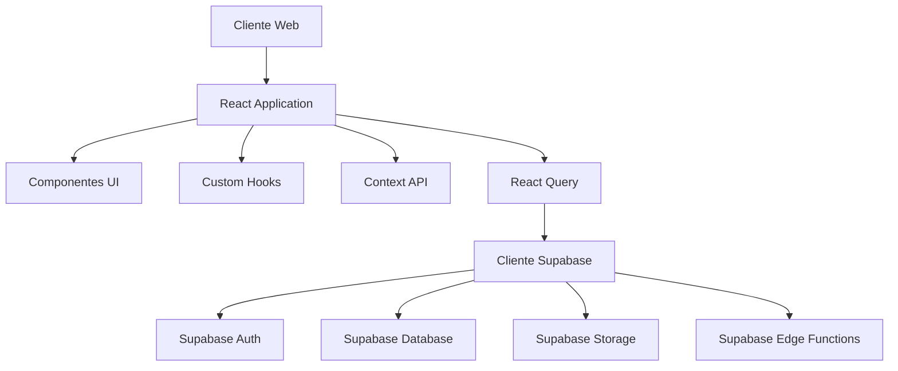
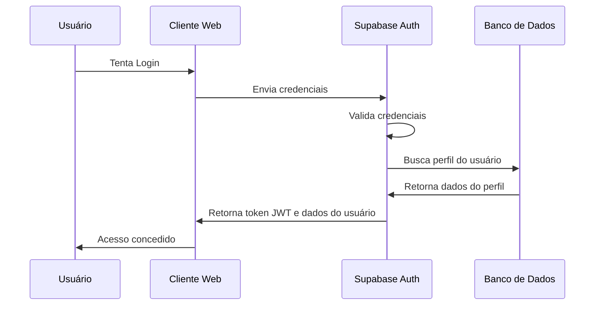
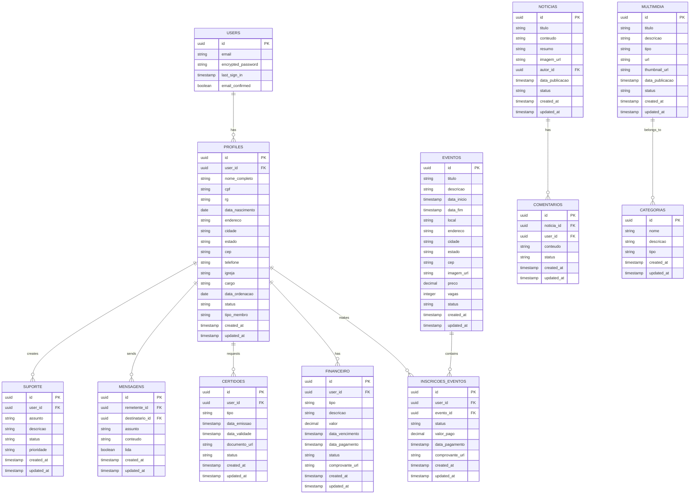

# Design Document

## Visão Geral

Este documento detalha o design técnico para implementação dos aprimoramentos do sistema COMADEMIG. O design abrange arquitetura, componentes, interfaces, modelos de dados, estratégias de segurança e testes para cada um dos requisitos identificados no documento de requisitos.

## Arquitetura

### Arquitetura Geral do Sistema

O sistema COMADEMIG seguirá uma arquitetura de aplicação web moderna baseada em componentes, utilizando o padrão de arquitetura Flux/Redux para gerenciamento de estado e uma abordagem orientada a serviços para comunicação com o backend.



### Arquitetura de Autenticação

O sistema de autenticação será implementado utilizando o Supabase Auth, que fornece funcionalidades completas de autenticação e autorização.



## Componentes e Interfaces

### Componentes Principais

1. **AuthProvider**: Componente de contexto para gerenciar estado de autenticação
2. **ProtectedRoute**: Componente HOC para proteger rotas que requerem autenticação
3. **DashboardLayout**: Layout para páginas do painel administrativo
4. **PublicLayout**: Layout para páginas públicas
5. **FormComponents**: Componentes reutilizáveis para formulários com validação
6. **NotificationSystem**: Sistema de notificações em tempo real
7. **FileUploader**: Componente para upload de arquivos
8. **PaymentProcessor**: Componente para processamento de pagamentos
9. **DigitalWallet**: Componente para exibição da carteira digital
10. **ReportGenerator**: Componente para geração de relatórios

### Interfaces de Usuário

#### Autenticação

1. **Login**: Interface para autenticação de usuários
   - Campos: Email, Senha
   - Funcionalidades: Login, Recuperação de senha, Lembrar-me

2. **Cadastro**: Interface para registro de novos usuários
   - Campos: Nome completo, Email, Senha, Confirmação de senha, Dados pessoais básicos
   - Funcionalidades: Validação em tempo real, Termos de uso, Política de privacidade

3. **Recuperação de Senha**: Interface para recuperação de senha
   - Campos: Email
   - Funcionalidades: Envio de link de recuperação, Confirmação

#### Dashboard

1. **Visão Geral**: Dashboard principal com resumo de informações
   - Componentes: Cards de estatísticas, Gráficos, Notificações, Ações rápidas

2. **Perfil do Usuário**: Interface para gerenciamento de dados pessoais
   - Campos: Dados pessoais, Foto, Preferências
   - Funcionalidades: Edição, Upload de documentos

3. **Carteira Digital**: Interface para visualização da carteira digital
   - Componentes: Carteira visual, QR Code, Dados de filiação
   - Funcionalidades: Download, Compartilhamento

4. **Eventos**: Interface para gerenciamento de eventos
   - Componentes: Lista de eventos, Detalhes do evento, Formulário de inscrição
   - Funcionalidades: Inscrição, Pagamento, Cancelamento

5. **Financeiro**: Interface para gerenciamento financeiro
   - Componentes: Histórico de pagamentos, Faturas pendentes, Comprovantes
   - Funcionalidades: Pagamento online, Upload de comprovantes

6. **Certidões**: Interface para solicitação e visualização de certidões
   - Componentes: Lista de certidões, Formulário de solicitação
   - Funcionalidades: Solicitação, Download, Verificação

7. **Comunicação**: Interface para sistema de mensagens
   - Componentes: Caixa de entrada, Mensagem individual, Composição
   - Funcionalidades: Envio, Resposta, Arquivamento

8. **Suporte**: Interface para suporte técnico
   - Componentes: Formulário de contato, FAQ, Chat
   - Funcionalidades: Abertura de chamados, Acompanhamento

## Modelos de Dados

### Modelo de Dados Principal



## Estratégia de Segurança

### Autenticação e Autorização

1. **Autenticação**: Implementação baseada em JWT (JSON Web Tokens) através do Supabase Auth
   - Login com email/senha
   - Opção de autenticação social (Google, Facebook)
   - Autenticação de dois fatores (2FA) para contas administrativas

2. **Autorização**: Controle de acesso baseado em funções (RBAC)
   - Níveis de acesso: Público, Membro, Administrador, Super Administrador
   - Políticas de segurança em nível de linha (RLS) no Supabase

3. **Proteção de Dados**:
   - Criptografia de dados sensíveis
   - Sanitização de inputs para prevenir injeção SQL e XSS
   - Validação de dados no cliente e servidor

### Políticas de Segurança (RLS)

Implementação de Row Level Security no Supabase para garantir que usuários só possam acessar dados permitidos:

```sql
-- Exemplo de política para perfis
CREATE POLICY "Usuários podem ver seus próprios perfis" 
ON public.profiles FOR SELECT 
USING (auth.uid() = id);

-- Exemplo de política para administradores
CREATE POLICY "Administradores podem ver todos os perfis" 
ON public.profiles FOR SELECT 
USING (EXISTS (
  SELECT 1 FROM public.profiles
  WHERE id = auth.uid() AND tipo_membro = 'admin'
));
```

## Estratégia de Testes

### Testes Unitários

- Testes de componentes React usando React Testing Library
- Testes de hooks personalizados
- Testes de funções utilitárias

### Testes de Integração

- Testes de fluxos completos (ex: cadastro, login, inscrição em evento)
- Testes de integração com Supabase

### Testes End-to-End

- Testes de fluxos completos de usuário usando Cypress
- Simulação de interações de usuário

### Testes de Segurança

- Testes de penetração
- Análise de vulnerabilidades
- Testes de validação de entrada

## Considerações de Desempenho

1. **Otimização de Consultas**:
   - Índices apropriados no banco de dados
   - Consultas otimizadas com seleção específica de colunas

2. **Carregamento Lazy e Code Splitting**:
   - Implementação de carregamento lazy para componentes pesados
   - Code splitting para reduzir o tamanho do bundle inicial

3. **Caching**:
   - Implementação de cache para consultas frequentes usando React Query
   - Estratégias de invalidação de cache

4. **Otimização de Imagens**:
   - Uso de formatos modernos (WebP)
   - Carregamento progressivo
   - Dimensionamento apropriado

## Estratégia de Implantação

1. **Ambientes**:
   - Desenvolvimento
   - Homologação
   - Produção

2. **CI/CD**:
   - Integração contínua com GitHub Actions
   - Testes automatizados em cada pull request
   - Deploy automático após aprovação

3. **Monitoramento**:
   - Implementação de logging
   - Monitoramento de erros com Sentry
   - Análise de desempenho

## Integrações Externas

1. **Gateway de Pagamento**:
   - Integração com Stripe ou Mercado Pago
   - Processamento seguro de pagamentos
   - Geração de comprovantes

2. **Serviço de Email**:
   - Integração com SendGrid ou Amazon SES
   - Templates personalizados
   - Rastreamento de entregas

3. **Armazenamento de Arquivos**:
   - Utilização do Supabase Storage
   - Políticas de acesso seguro
   - Processamento de imagens

4. **Serviços de Mapas**:
   - Integração com Google Maps ou Mapbox
   - Exibição de locais de eventos
   - Cálculo de rotas