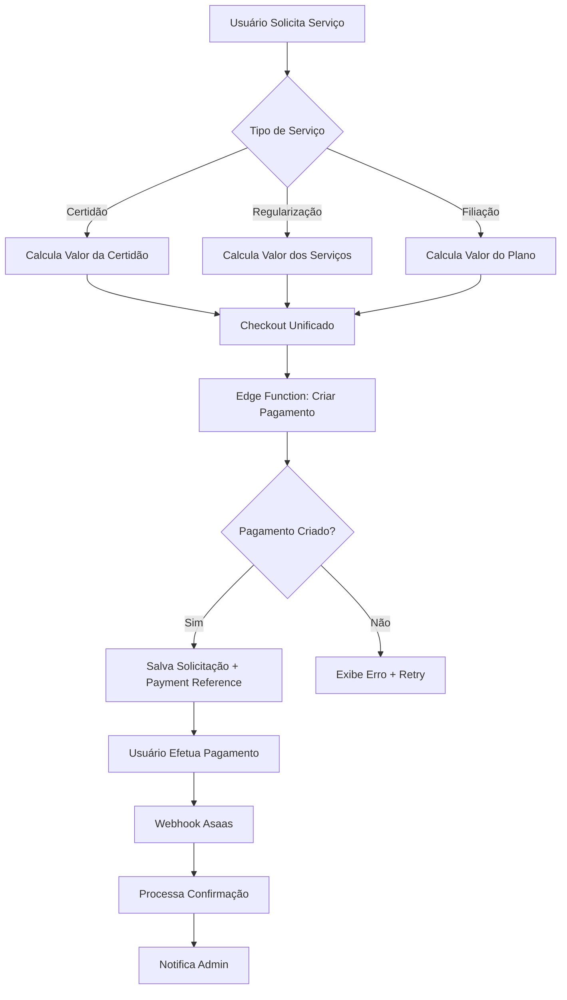

# Design - Correção e Integração dos Serviços com Sistema de Pagamentos

## Overview

Este design detalha a implementação completa da correção dos três serviços principais (Certidões, Regularização e Filiação) com integração adequada ao sistema de pagamentos. O foco é criar fluxos consistentes onde todos os serviços passem por checkout obrigatório antes de serem processados administrativamente.

## Architecture

### Fluxo Geral Unificado



### Componentes Principais

1. **Checkout Unificado**: Interface consistente para todos os serviços
2. **Edge Function Corrigida**: Processamento confiável de pagamentos
3. **Sistema de Webhooks**: Processamento automático de confirmações
4. **Painéis Administrativos**: Gestão de solicitações pagas

## Components and Interfaces

### 1. Checkout Unificado

#### Interface PaymentCheckoutProps
```typescript
interface PaymentCheckoutProps {
  serviceType: 'certidao' | 'regularizacao' | 'filiacao';
  serviceData: {
    // Para certidões
    tipo_certidao?: string;
    justificativa?: string;
    
    // Para regularização  
    servicos_selecionados?: string[];
    
    // Para filiação
    member_type_id?: string;
    subscription_plan_id?: string;
  };
  calculatedValue: number;
  onSuccess: (paymentResult: any) => void;
  onCancel: () => void;
}
```

#### Componente PaymentCheckout
```typescript
// src/components/payments/PaymentCheckout.tsx
export const PaymentCheckout = ({ 
  serviceType, 
  serviceData, 
  calculatedValue, 
  onSuccess, 
  onCancel 
}: PaymentCheckoutProps) => {
  // Lógica unificada de checkout
  // Integração com PaymentForm existente
  // Tratamento específico por tipo de serviço
}
```

### 2. Hooks de Serviços Atualizados

#### Hook useCertidoesWithPayment
```typescript
// src/hooks/useCertidoesWithPayment.ts
export const useCertidoesWithPayment = () => {
  const solicitarCertidaoComPagamento = async (data: CertidaoRequest) => {
    // 1. Calcular valor baseado no tipo
    const valor = await calcularValorCertidao(data.tipo);
    
    // 2. Redirecionar para checkout
    return { requiresPayment: true, valor, serviceData: data };
  };
  
  const confirmarSolicitacaoAposPagamento = async (
    serviceData: CertidaoRequest, 
    paymentReference: string
  ) => {
    // 3. Criar solicitação com referência de pagamento
    return await supabase.from('solicitacoes_certidoes').insert({
      ...serviceData,
      payment_reference: paymentReference,
      status: 'pago' // Aguardando processamento admin
    });
  };
}
```

#### Hook useRegularizacaoWithPayment
```typescript
// src/hooks/useRegularizacaoWithPayment.ts
export const useRegularizacaoWithPayment = () => {
  const solicitarRegularizacaoComPagamento = async (data: RegularizacaoRequest) => {
    // 1. Calcular valor total dos serviços
    const valor = await calcularValorRegularizacao(data.servicos_selecionados);
    
    // 2. Preparar dados para checkout
    return { requiresPayment: true, valor, serviceData: data };
  };
  
  const confirmarSolicitacaoAposPagamento = async (
    serviceData: RegularizacaoRequest,
    paymentReference: string
  ) => {
    // 3. Criar solicitação com referência de pagamento
    return await supabase.from('solicitacoes_regularizacao').insert({
      ...serviceData,
      payment_reference: paymentReference,
      status: 'pago' // Aguardando processamento admin
    });
  };
}
```

### 3. Edge Function Corrigida

#### Estrutura da Edge Function
```typescript
// supabase/functions/asaas-create-payment/index.ts (CORRIGIDA)

interface PaymentRequest {
  customer: CustomerData;
  billingType: 'BOLETO' | 'CREDIT_CARD' | 'PIX';
  value: number;
  dueDate: string;
  description: string;
  serviceType: 'certidao' | 'regularizacao' | 'filiacao';
  serviceData: any; // Dados específicos do serviço
  affiliateId?: string; // Para filiação com afiliados
}

const createPayment = async (req: Request) => {
  try {
    // 1. Validações aprimoradas
    const validationResult = await validatePaymentRequest(paymentData);
    if (!validationResult.valid) {
      return errorResponse(validationResult.errors);
    }
    
    // 2. Criar/buscar cliente no Asaas (com retry)
    const customerId = await createOrFindCustomer(paymentData.customer);
    
    // 3. Criar cobrança no Asaas (com tratamento de erro)
    const asaasPayment = await createAsaasPayment({
      customer: customerId,
      ...paymentData
    });
    
    // 4. Salvar no banco com dados do serviço
    const cobranca = await savePaymentToDatabase({
      ...asaasPayment,
      serviceType: paymentData.serviceType,
      serviceData: paymentData.serviceData
    });
    
    // 5. Buscar QR Code para PIX (se necessário)
    if (paymentData.billingType === 'PIX') {
      const qrCode = await getPixQrCode(asaasPayment.id);
      cobranca.qr_code_pix = qrCode;
    }
    
    return successResponse(cobranca);
    
  } catch (error) {
    console.error('Erro detalhado:', error);
    return errorResponse(error.message, error.details);
  }
};
```

### 4. Sistema de Webhooks Aprimorado

#### Processamento por Tipo de Serviço
```typescript
// supabase/functions/asaas-webhook/index.ts (APRIMORADO)

const processPaymentConfirmation = async (webhookData: any) => {
  const paymentId = webhookData.payment?.id;
  
  // Buscar cobrança com dados do serviço
  const cobranca = await supabase
    .from('asaas_cobrancas')
    .select('*, service_type, service_data')
    .eq('asaas_id', paymentId)
    .single();
    
  if (!cobranca) return;
  
  // Processar baseado no tipo de serviço
  switch (cobranca.service_type) {
    case 'certidao':
      await processCertidaoPayment(cobranca);
      break;
    case 'regularizacao':
      await processRegularizacaoPayment(cobranca);
      break;
    case 'filiacao':
      await processFiliacaoPayment(cobranca);
      break;
  }
};

const processCertidaoPayment = async (cobranca: any) => {
  // Criar solicitação de certidão
  await supabase.from('solicitacoes_certidoes').insert({
    user_id: cobranca.user_id,
    tipo_certidao: cobranca.service_data.tipo_certidao,
    justificativa: cobranca.service_data.justificativa,
    payment_reference: cobranca.asaas_id,
    status: 'pago', // Admin pode processar
    numero_protocolo: generateProtocol('CERT')
  });
  
  // Notificar admin
  await notifyAdmin('nova_certidao', cobranca);
};
```

## Data Models

### Estrutura Atualizada das Tabelas

#### Tabela asaas_cobrancas (ATUALIZADA)
```sql
ALTER TABLE asaas_cobrancas 
ADD COLUMN service_type TEXT CHECK (service_type IN ('certidao', 'regularizacao', 'filiacao')),
ADD COLUMN service_data JSONB; -- Dados específicos do serviço
```

#### Tabela solicitacoes_certidoes (ATUALIZADA)
```sql
ALTER TABLE solicitacoes_certidoes 
ADD COLUMN payment_reference TEXT, -- ID da cobrança Asaas
ADD COLUMN valor DECIMAL(10,2); -- Valor pago pela certidão
```

#### Tabela solicitacoes_regularizacao (ATUALIZADA)
```sql
ALTER TABLE solicitacoes_regularizacao 
ADD COLUMN payment_reference TEXT, -- ID da cobrança Asaas
ADD COLUMN valor_total DECIMAL(10,2); -- Valor total pago
```

### Interfaces TypeScript

#### ServicePaymentData
```typescript
interface ServicePaymentData {
  serviceType: 'certidao' | 'regularizacao' | 'filiacao';
  serviceData: {
    // Certidão
    tipo_certidao?: string;
    justificativa?: string;
    
    // Regularização
    servicos_selecionados?: Array<{
      id: string;
      nome: string;
      valor: number;
    }>;
    
    // Filiação
    member_type_id?: string;
    subscription_plan_id?: string;
  };
  calculatedValue: number;
  paymentReference?: string;
}
```

## Error Handling

### Estratégias de Tratamento de Erro

#### 1. Edge Function - Retry Logic
```typescript
const createPaymentWithRetry = async (paymentData: PaymentRequest, maxRetries = 3) => {
  for (let attempt = 1; attempt <= maxRetries; attempt++) {
    try {
      return await createAsaasPayment(paymentData);
    } catch (error) {
      if (attempt === maxRetries) throw error;
      
      // Aguardar antes de tentar novamente
      await new Promise(resolve => setTimeout(resolve, 1000 * attempt));
    }
  }
};
```

#### 2. Frontend - Error Recovery
```typescript
const handlePaymentError = (error: any) => {
  const errorMessages = {
    'INVALID_CUSTOMER': 'Dados do cliente inválidos. Verifique CPF e email.',
    'PAYMENT_CREATION_FAILED': 'Erro ao criar cobrança. Tente novamente.',
    'NETWORK_ERROR': 'Erro de conexão. Verifique sua internet.',
    'ASAAS_API_ERROR': 'Erro no gateway de pagamento. Tente novamente em alguns minutos.'
  };
  
  const message = errorMessages[error.code] || 'Erro inesperado. Entre em contato com o suporte.';
  
  toast.error(message, {
    action: {
      label: 'Tentar Novamente',
      onClick: () => retryPayment()
    }
  });
};
```

## Testing Strategy

### Testes de Integração

#### 1. Teste da Edge Function
```typescript
// tests/edge-functions/payment-creation.test.ts
describe('Payment Creation Edge Function', () => {
  test('should create payment for certidao service', async () => {
    const paymentData = {
      serviceType: 'certidao',
      serviceData: { tipo_certidao: 'ministerio', justificativa: 'Test' },
      value: 45.00,
      customer: mockCustomerData
    };
    
    const response = await callEdgeFunction('asaas-create-payment', paymentData);
    
    expect(response.success).toBe(true);
    expect(response.cobranca.service_type).toBe('certidao');
  });
});
```

#### 2. Teste dos Fluxos Completos
```typescript
// tests/integration/service-flows.test.ts
describe('Service Payment Flows', () => {
  test('complete certidao flow with payment', async () => {
    // 1. Solicitar certidão
    const certidaoRequest = { tipo: 'ministerio', justificativa: 'Test' };
    const checkoutData = await solicitarCertidaoComPagamento(certidaoRequest);
    
    // 2. Processar pagamento
    const paymentResult = await processPayment(checkoutData);
    
    // 3. Simular webhook
    await simulateWebhook(paymentResult.asaas_id);
    
    // 4. Verificar criação da solicitação
    const solicitacao = await getSolicitacaoCertidao(paymentResult.asaas_id);
    expect(solicitacao.status).toBe('pago');
  });
});
```

### Testes de Validação

#### 1. Validação de Dados
```typescript
const validateServiceData = (serviceType: string, serviceData: any) => {
  const validators = {
    certidao: validateCertidaoData,
    regularizacao: validateRegularizacaoData,
    filiacao: validateFiliacaoData
  };
  
  return validators[serviceType](serviceData);
};
```

#### 2. Validação de Valores
```typescript
const validateCalculatedValue = async (serviceType: string, serviceData: any, providedValue: number) => {
  const calculatedValue = await calculateServiceValue(serviceType, serviceData);
  
  if (Math.abs(calculatedValue - providedValue) > 0.01) {
    throw new Error('Valor calculado não confere com valor fornecido');
  }
  
  return true;
};
```

## Implementation Phases

### Fase 1: Correção da Edge Function (Crítica)
- Corrigir erros na API Asaas
- Implementar retry logic
- Melhorar tratamento de erros
- Adicionar suporte a service_type e service_data

### Fase 2: Integração de Certidões
- Atualizar FormSolicitacaoCertidao
- Implementar cálculo de valores
- Criar fluxo de checkout
- Atualizar painel administrativo

### Fase 3: Integração de Regularização  
- Atualizar CheckoutRegularizacao
- Substituir simulação por integração real
- Implementar painel administrativo
- Criar sistema de notificações

### Fase 4: Correção da Filiação
- Testar e corrigir fluxo existente
- Melhorar tratamento de erros
- Otimizar experiência do usuário

### Fase 5: Melhorias e Otimizações
- Implementar checkout unificado
- Criar dashboards administrativos
- Implementar sistema de notificações
- Adicionar métricas e monitoramento