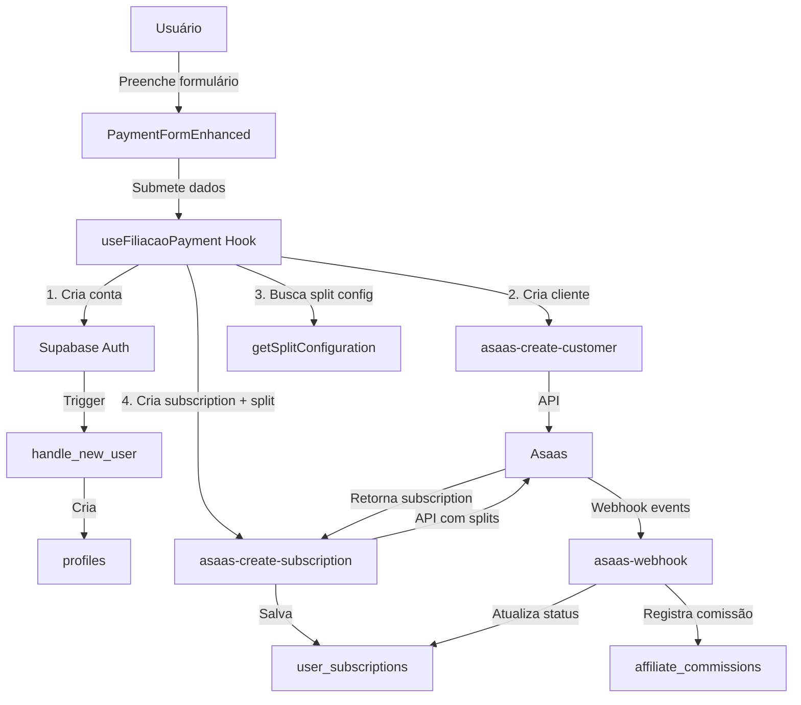

# Design Document - Correção Sistema de Filiação e Integração Asaas

## Overview

Este documento descreve a arquitetura e design da solução para corrigir o sistema de filiação, split de pagamentos e programa de afiliados do COMADEMIG. A solução aborda os problemas críticos identificados na análise do MANUS e implementa um fluxo robusto e confiável de transações financeiras.

### Objetivos do Design

1. Garantir que todas as transações financeiras funcionem corretamente
2. Implementar split automático de pagamentos entre COMADEMIG, RENUM e afiliados
3. Sincronizar automaticamente status de assinaturas via webhooks
4. Eliminar duplicação de dados e inconsistências
5. Fornecer logs e auditoria completa de todas as operações

### Princípios de Design

- **Single Source of Truth**: Uma única tabela para assinaturas
- **Fail-Safe**: Erros não devem impedir operações críticas
- **Idempotência**: Webhooks podem ser processados múltiplas vezes sem efeitos colaterais
- **Auditabilidade**: Todas as operações são logadas
- **Segurança**: Princípio do menor privilégio em políticas RLS

## Architecture

### High-Level Architecture

```
┌─────────────────┐
│   Frontend      │
│  (React/TS)     │
└────────┬────────┘
         │
         ▼
┌─────────────────┐
│  useFiliacaoPayment │
│     Hook        │
└────────┬────────┘
         │
         ├──────────────────────────────────┐
         │                                  │
         ▼                                  ▼
┌─────────────────┐              ┌─────────────────┐
│  Edge Function  │              │   Supabase      │
│ asaas-create-   │              │   Database      │
│  subscription   │              │                 │
└────────┬────────┘              └─────────────────┘
         │
         ▼
┌─────────────────┐
│   Asaas API     │
│  (Gateway)      │
└────────┬────────┘
         │
         │ (Webhooks)
         ▼
┌─────────────────┐
│  Edge Function  │
│ asaas-webhook   │
└────────┬────────┘
         │
         ▼
┌─────────────────┐
│   Database      │
│   Update        │
└─────────────────┘
```


### Component Diagram



## Components and Interfaces

### 1. Database Schema Changes

#### 1.1. Tabela user_subscriptions (Unificada)

```sql
CREATE TABLE user_subscriptions (
  id UUID PRIMARY KEY DEFAULT gen_random_uuid(),
  user_id UUID REFERENCES auth.users(id) ON DELETE CASCADE NOT NULL,
  
  -- Referências locais
  subscription_plan_id UUID REFERENCES subscription_plans(id),
  member_type_id UUID REFERENCES member_types(id),
  
  -- Referências Asaas
  asaas_subscription_id VARCHAR NOT NULL UNIQUE,
  asaas_customer_id VARCHAR NOT NULL,
  initial_payment_id VARCHAR, -- ID da cobrança imediata
  
  -- Dados da assinatura
  billing_type VARCHAR NOT NULL, -- CREDIT_CARD, PIX, BOLETO
  cycle VARCHAR NOT NULL, -- MONTHLY, QUARTERLY, SEMIANNUALLY, YEARLY
  value DECIMAL(10,2) NOT NULL,
  
  -- Status e datas
  status VARCHAR NOT NULL DEFAULT 'pending', -- pending, active, overdue, cancelled
  started_at TIMESTAMP WITH TIME ZONE,
  expires_at TIMESTAMP WITH TIME ZONE,
  next_due_date TIMESTAMP WITH TIME ZONE,
  
  -- Metadados
  created_at TIMESTAMP WITH TIME ZONE DEFAULT NOW(),
  updated_at TIMESTAMP WITH TIME ZONE DEFAULT NOW(),
  
  -- Constraints
  CONSTRAINT check_status_values CHECK (status IN ('pending', 'active', 'overdue', 'cancelled', 'suspended'))
);
```


#### 1.2. Tabela asaas_splits (Atualizada)

```sql
CREATE TABLE asaas_splits (
  id UUID PRIMARY KEY DEFAULT gen_random_uuid(),
  
  -- Referências
  subscription_id UUID REFERENCES user_subscriptions(id) ON DELETE CASCADE,
  payment_id VARCHAR, -- ID da cobrança no Asaas
  affiliate_id UUID REFERENCES affiliates(id),
  
  -- Dados do split
  recipient_type VARCHAR NOT NULL, -- 'renum', 'affiliate', 'comademig'
  recipient_name VARCHAR NOT NULL,
  wallet_id VARCHAR NOT NULL,
  percentage DECIMAL(5,2),
  fixed_value DECIMAL(10,2),
  
  -- Status
  asaas_split_id VARCHAR UNIQUE,
  status VARCHAR NOT NULL DEFAULT 'pending', -- pending, done, refused, cancelled
  refusal_reason TEXT,
  
  -- Valores
  commission_amount DECIMAL(10,2),
  total_value DECIMAL(10,2),
  
  -- Metadados
  created_at TIMESTAMP WITH TIME ZONE DEFAULT NOW(),
  updated_at TIMESTAMP WITH TIME ZONE DEFAULT NOW(),
  processed_at TIMESTAMP WITH TIME ZONE
);
```

#### 1.3. Tabela webhook_events (Nova)

```sql
CREATE TABLE webhook_events (
  id UUID PRIMARY KEY DEFAULT gen_random_uuid(),
  
  -- Identificação do evento
  asaas_event_id VARCHAR UNIQUE NOT NULL,
  event_type VARCHAR NOT NULL,
  
  -- Payload
  payload JSONB NOT NULL,
  
  -- Processamento
  processed BOOLEAN DEFAULT FALSE,
  processed_at TIMESTAMP WITH TIME ZONE,
  retry_count INTEGER DEFAULT 0,
  last_error TEXT,
  
  -- Metadados
  created_at TIMESTAMP WITH TIME ZONE DEFAULT NOW()
);
```

### 2. Edge Functions

#### 2.1. asaas-create-subscription (Refatorada)

**Responsabilidades:**
- Criar assinatura no Asaas COM split configurado
- Criar cobrança imediata (initial payment)
- Salvar dados em user_subscriptions
- Registrar splits em asaas_splits

**Interface:**

```typescript
interface CreateSubscriptionRequest {
  userId: string;
  customerId: string; // Asaas customer ID
  planId: string;
  billingType: 'CREDIT_CARD' | 'PIX' | 'BOLETO';
  cycle: 'MONTHLY' | 'QUARTERLY' | 'SEMIANNUALLY' | 'YEARLY';
  value: number;
  affiliateCode?: string; // Código de referral
  creditCard?: {
    holderName: string;
    number: string;
    expiryMonth: string;
    expiryYear: string;
    ccv: string;
  };
}

interface CreateSubscriptionResponse {
  subscriptionId: string;
  initialPaymentId: string;
  status: string;
  nextDueDate: string;
  splits: SplitInfo[];
}
```


**Fluxo de Execução:**

1. Validar dados de entrada
2. Buscar configuração de split (RENUM + afiliado se houver)
3. Criar cobrança imediata no Asaas com split
4. Criar assinatura no Asaas com split e nextDueDate = hoje + 30 dias
5. Salvar subscription em user_subscriptions
6. Registrar splits em asaas_splits
7. Retornar IDs e status

#### 2.2. asaas-webhook (Nova)

**Responsabilidades:**
- Receber webhooks do Asaas
- Validar autenticidade
- Processar eventos de forma idempotente
- Atualizar status de assinaturas e splits

**Interface:**

```typescript
interface WebhookPayload {
  event: string;
  payment?: PaymentData;
  subscription?: SubscriptionData;
  split?: SplitData;
}

interface WebhookResponse {
  success: boolean;
  message: string;
}
```

**Eventos Suportados:**
- `PAYMENT_RECEIVED`: Atualiza status para 'active'
- `PAYMENT_CONFIRMED`: Confirma pagamento
- `PAYMENT_OVERDUE`: Atualiza status para 'overdue'
- `SUBSCRIPTION_UPDATED`: Sincroniza dados
- `PAYMENT_SPLIT_DONE`: Atualiza status do split

### 3. Frontend Components

#### 3.1. useFiliacaoPayment Hook (Refatorado)

**Mudanças principais:**
- Remove chamada para `asaas-configure-split` (obsoleta)
- Passa código de afiliado para `asaas-create-subscription`
- Aguarda confirmação de split na resposta
- Trata erros específicos do Asaas

**Novo Fluxo:**

```typescript
async function processarFiliacaoComPagamento(data: FormData) {
  try {
    // 1. Criar conta (se necessário)
    const userId = await createUserAccount(data);
    
    // 2. Criar cliente Asaas
    const customer = await createAsaasCustomer(data, userId);
    
    // 3. Criar subscription COM split
    const subscription = await createSubscriptionWithSplit({
      userId,
      customerId: customer.id,
      planId: data.plan_id,
      billingType: data.payment_method,
      affiliateCode: data.affiliate_code,
      creditCard: data.credit_card
    });
    
    // 4. Atualizar profile
    await updateProfile(userId, data);
    
    // 5. Registrar afiliado (se houver)
    if (data.affiliate_code) {
      await registerAffiliateReferral(userId, data.affiliate_code);
    }
    
    return { success: true, subscriptionId: subscription.id };
    
  } catch (error) {
    // Tratamento de erro específico
    throw mapAsaasError(error);
  }
}
```


## Data Models

### Split Configuration Model

```typescript
interface SplitConfiguration {
  renum: {
    walletId: string;
    percentage: number; // 40% ou 50%
  };
  comademig: {
    walletId: string;
    percentage: number; // 40% ou 50%
  };
  affiliate?: {
    walletId: string;
    percentage: number; // 20%
    affiliateId: string;
  };
}
```

### Subscription Model

```typescript
interface Subscription {
  id: string;
  userId: string;
  asaasSubscriptionId: string;
  asaasCustomerId: string;
  initialPaymentId: string;
  planId: string;
  memberTypeId: string;
  billingType: 'CREDIT_CARD' | 'PIX' | 'BOLETO';
  cycle: 'MONTHLY' | 'QUARTERLY' | 'SEMIANNUALLY' | 'YEARLY';
  value: number;
  status: 'pending' | 'active' | 'overdue' | 'cancelled';
  startedAt: Date;
  expiresAt: Date;
  nextDueDate: Date;
  createdAt: Date;
  updatedAt: Date;
}
```

## Error Handling

### Error Types

```typescript
enum AsaasErrorType {
  DUPLICATE_CPF = 'duplicate_cpf',
  DUPLICATE_EMAIL = 'duplicate_email',
  INVALID_CARD = 'invalid_card',
  INSUFFICIENT_FUNDS = 'insufficient_funds',
  CUSTOMER_NOT_FOUND = 'customer_not_found',
  INVALID_PLAN = 'invalid_plan',
  INVALID_AFFILIATE = 'invalid_affiliate',
  SPLIT_DIVERGENCE = 'split_divergence',
  NETWORK_ERROR = 'network_error',
  UNKNOWN_ERROR = 'unknown_error'
}

interface AsaasError {
  type: AsaasErrorType;
  message: string;
  details?: any;
}
```

### Error Mapping

```typescript
function mapAsaasError(error: any): AsaasError {
  if (error.code === 'invalid_cpf') {
    return {
      type: AsaasErrorType.DUPLICATE_CPF,
      message: 'CPF já cadastrado no sistema'
    };
  }
  // ... outros mapeamentos
}
```

## Testing Strategy

### Unit Tests

1. **Split Configuration Logic**
   - Testar cálculo de percentuais com e sem afiliado
   - Validar que soma dos percentuais = 100%
   - Testar busca de wallet IDs

2. **Webhook Processing**
   - Testar idempotência (processar mesmo evento 2x)
   - Testar cada tipo de evento
   - Testar tratamento de erros

3. **Error Mapping**
   - Testar mapeamento de todos os tipos de erro
   - Validar mensagens de erro

### Integration Tests

1. **Fluxo Completo de Filiação**
   - Criar usuário → cliente → subscription com split
   - Verificar dados salvos corretamente
   - Simular webhook e verificar atualização

2. **Programa de Afiliados**
   - Criar filiação com código de referral
   - Verificar split inclui afiliado
   - Simular pagamento e verificar comissão

3. **Webhooks**
   - Enviar webhook de teste
   - Verificar processamento correto
   - Verificar retry em caso de falha


## Security Considerations

### 1. RLS Policies

```sql
-- user_subscriptions: Usuários veem apenas suas próprias
CREATE POLICY "Users can view own subscriptions"
  ON user_subscriptions FOR SELECT
  USING (auth.uid() = user_id);

-- Admins veem todas
CREATE POLICY "Admins can view all subscriptions"
  ON user_subscriptions FOR SELECT
  USING ((auth.jwt() -> 'app_metadata' ->> 'user_role') IN ('admin', 'super_admin'));

-- Apenas service_role pode inserir/atualizar
CREATE POLICY "Service role can manage subscriptions"
  ON user_subscriptions FOR ALL
  USING (auth.jwt() ->> 'role' = 'service_role');
```

### 2. Webhook Authentication

```typescript
function validateWebhook(request: Request): boolean {
  const token = request.headers.get('asaas-access-token');
  const expectedToken = Deno.env.get('ASAAS_WEBHOOK_TOKEN');
  return token === expectedToken;
}
```

### 3. Sensitive Data

- Dados de cartão NUNCA são salvos no banco
- Wallet IDs são armazenados de forma segura
- Logs não incluem dados sensíveis

## Performance Considerations

### 1. Database Indexes

```sql
-- Índices para queries frequentes
CREATE INDEX idx_user_subscriptions_user_id ON user_subscriptions(user_id);
CREATE INDEX idx_user_subscriptions_status ON user_subscriptions(status);
CREATE INDEX idx_user_subscriptions_asaas_id ON user_subscriptions(asaas_subscription_id);
CREATE INDEX idx_asaas_splits_subscription_id ON asaas_splits(subscription_id);
CREATE INDEX idx_webhook_events_processed ON webhook_events(processed, created_at);
```

### 2. Webhook Processing

- Processamento assíncrono via queue
- Retry automático com backoff exponencial
- Timeout de 30 segundos por webhook

### 3. Caching

- Configuração de split em cache (1 hora)
- Wallet IDs em cache (24 horas)
- Planos em cache (1 hora)

## Monitoring and Logging

### 1. Logs Estruturados

```typescript
interface LogEntry {
  timestamp: Date;
  level: 'info' | 'warn' | 'error';
  component: string;
  action: string;
  userId?: string;
  subscriptionId?: string;
  details: any;
}
```

### 2. Métricas

- Taxa de sucesso de cadastros
- Taxa de sucesso de webhooks
- Tempo médio de processamento
- Erros por tipo

### 3. Alertas

- Webhook com mais de 3 falhas consecutivas
- Split com divergência
- Erro crítico em Edge Function

## Migration Strategy

### Phase 1: Preparação (Sem impacto)
1. Criar novas tabelas e índices
2. Criar Edge Function de webhook
3. Atualizar Edge Function de subscription
4. Adicionar logs e monitoramento

### Phase 2: Migração de Dados
1. Migrar dados de asaas_subscriptions para user_subscriptions
2. Validar integridade dos dados
3. Marcar asaas_subscriptions como deprecated

### Phase 3: Ativação
1. Atualizar frontend para usar nova lógica
2. Configurar webhooks no Asaas
3. Monitorar por 48 horas

### Phase 4: Limpeza
1. Remover código obsoleto
2. Remover tabela asaas_subscriptions
3. Documentar mudanças

## Rollback Plan

Se houver problemas críticos:

1. **Imediato**: Reverter frontend para versão anterior
2. **Curto prazo**: Desabilitar webhooks no Asaas
3. **Médio prazo**: Restaurar Edge Functions antigas
4. **Dados**: Manter ambas as tabelas por 30 dias

## Documentation

### 1. API Documentation
- Swagger/OpenAPI para Edge Functions
- Exemplos de payloads
- Códigos de erro

### 2. Developer Guide
- Como testar localmente
- Como simular webhooks
- Como debugar problemas

### 3. Operations Guide
- Como monitorar sistema
- Como resolver problemas comuns
- Como fazer rollback
