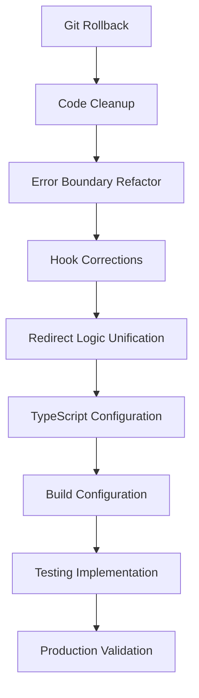
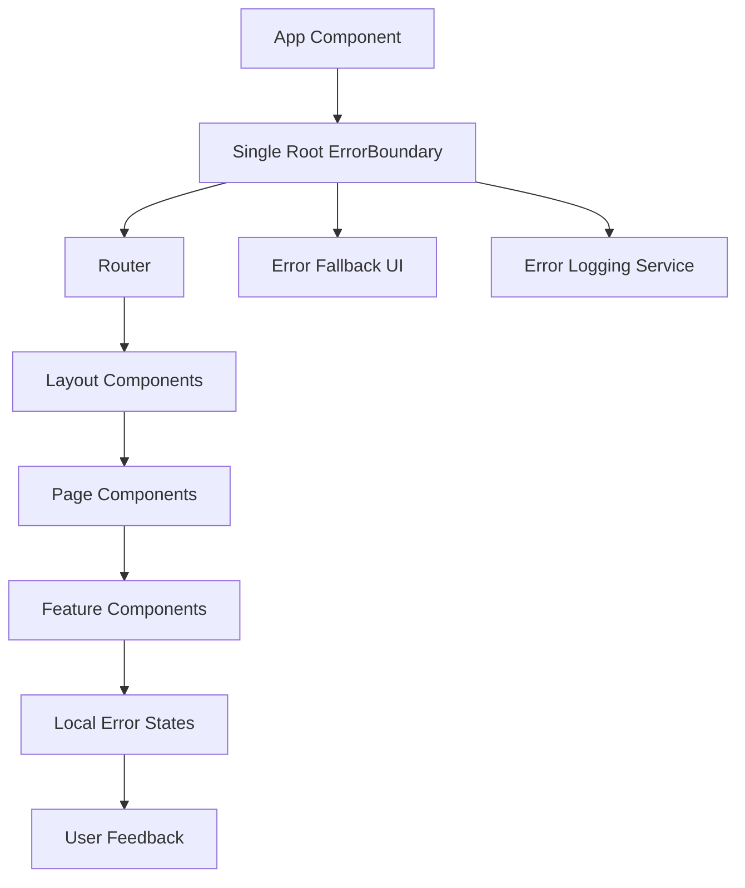
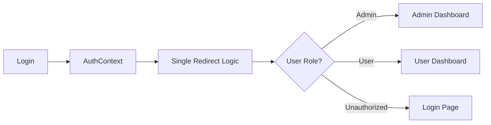

# Design Document

## Overview

Este documento detalha o design técnico para corrigir problemas críticos no sistema COMADEMIG que estão causando tela branca em produção. O design foca em reverter alterações problemáticas, implementar arquitetura correta de error handling, e estabelecer práticas robustas de desenvolvimento.

A abordagem prioriza simplicidade, conformidade com princípios React, e implementação de salvaguardas para prevenir regressões futuras.

## Architecture

### High-Level Architecture



### Error Handling Architecture



### Authentication Flow Architecture



## Components and Interfaces

### 1. Git Rollback Component

**Purpose:** Safely revert problematic commits while preserving valid changes

**Interface:**
```bash
# Rollback strategy
git revert 914888d bd9d9d8 --no-commit
git commit -m "Revert problematic error handling implementations"
```

**Key Considerations:**
- Create backup branch before rollback
- Resolve merge conflicts preserving functional code
- Validate compilation after rollback

### 2. Root Error Boundary

**Purpose:** Single point of error capture without nesting conflicts

**Interface:**
```typescript
interface RootErrorBoundaryProps {
  children: React.ReactNode;
  fallback?: React.ComponentType<ErrorFallbackProps>;
}

interface ErrorFallbackProps {
  error: Error;
  resetError: () => void;
}
```

**Implementation Strategy:**
- Replace all nested ErrorBoundaries with single root instance
- Implement graceful fallback UI
- Add error reporting without loops
- Provide recovery mechanisms

### 3. Authentication Context Refactor

**Purpose:** Remove hooks from try-catch blocks and implement proper error handling

**Current Problematic Pattern:**
```typescript
// ❌ WRONG - Hooks inside try-catch
try {
  const authState = useAuthState();
  const authActions = useAuthActions();
  // ... more hooks
} catch (error) {
  // Error handling
}
```

**Corrected Pattern:**
```typescript
// ✅ CORRECT - Hooks at top level with error states
const authState = useAuthState();
const authActions = useAuthActions();

// Error handling through state
if (authState.error) {
  return <ErrorComponent error={authState.error} />;
}
```

**Interface:**
```typescript
interface AuthContextValue {
  user: User | null;
  loading: boolean;
  error: Error | null;
  login: (credentials: LoginCredentials) => Promise<void>;
  logout: () => void;
  clearError: () => void;
}
```

### 4. Unified Redirect Logic

**Purpose:** Centralize redirection logic to prevent conflicts and loops

**Current Problem:** Multiple components handling redirects:
- Auth.tsx
- ProtectedRoute.tsx  
- DashboardLayout.tsx
- useAuthState.ts

**Solution:** Single redirect service

**Interface:**
```typescript
interface RedirectService {
  redirectAfterLogin(user: User): string;
  redirectAfterLogout(): string;
  getDefaultRoute(user: User): string;
  canAccessRoute(user: User, route: string): boolean;
}
```

**Implementation:**
```typescript
class RedirectService {
  redirectAfterLogin(user: User): string {
    if (user.role === 'admin' || user.role === 'super_admin') {
      return '/admin/dashboard';
    }
    return '/dashboard';
  }
  
  // Single source of truth for all redirects
}
```

### 5. TypeScript Configuration

**Purpose:** Enable strict type checking to catch errors at compile time

**Current Configuration (Problematic):**
```json
{
  "compilerOptions": {
    "strictNullChecks": false,
    "noImplicitAny": false
  }
}
```

**Corrected Configuration:**
```json
{
  "compilerOptions": {
    "strict": true,
    "strictNullChecks": true,
    "noImplicitAny": true,
    "noImplicitReturns": true,
    "noFallthroughCasesInSwitch": true
  }
}
```

### 6. Build Configuration

**Purpose:** Enable sourcemaps for production debugging

**Current Configuration (Problematic):**
```typescript
// vite.config.ts
export default defineConfig({
  build: {
    sourcemap: false // ❌ Disables debugging
  }
});
```

**Corrected Configuration:**
```typescript
// vite.config.ts
export default defineConfig({
  build: {
    sourcemap: true, // ✅ Enables debugging
    minify: 'terser',
    rollupOptions: {
      output: {
        sourcemapExcludeSources: true // Security: don't include source code
      }
    }
  }
});
```

## Data Models

### Error State Model

```typescript
interface ErrorState {
  hasError: boolean;
  error: Error | null;
  errorInfo: ErrorInfo | null;
  timestamp: Date;
  userId?: string;
  route?: string;
}
```

### User Authentication Model

```typescript
interface User {
  id: string;
  email: string;
  role: 'admin' | 'super_admin' | 'user';
  permissions: string[];
  isActive: boolean;
}

interface AuthState {
  user: User | null;
  loading: boolean;
  error: Error | null;
  isAuthenticated: boolean;
}
```

### Redirect Configuration Model

```typescript
interface RedirectConfig {
  defaultRoutes: Record<UserRole, string>;
  protectedRoutes: string[];
  publicRoutes: string[];
  adminRoutes: string[];
}
```

## Correctness Properties

*A property is a characteristic or behavior that should hold true across all valid executions of a system-essentially, a formal statement about what the system should do. Properties serve as the bridge between human-readable specifications and machine-verifiable correctness guarantees.*

Agora vou realizar a análise prework antes de escrever as propriedades de correção:

### Converting EARS to Properties

Baseado na análise prework, vou converter os critérios de aceitação em propriedades testáveis, consolidando redundâncias identificadas:

**Property 1: Rollback preserva funcionalidades válidas**
*For any* funcionalidade implementada corretamente em commits não problemáticos, após rollback dos commits 914888d e bd9d9d8, a funcionalidade deve continuar operacional
**Validates: Requirements 1.2**

**Property 2: ErrorBoundary estrutura correta**
*For any* aplicação React, deve existir exatamente um ErrorBoundary no nível raiz, sem ErrorBoundaries aninhados que causem conflitos
**Validates: Requirements 2.1, 2.5**

**Property 3: ErrorBoundary captura erros sem loops**
*For any* erro JavaScript que ocorra na aplicação, o ErrorBoundary deve capturar o erro, exibir fallback UI, registrar para debugging, e permitir que outras partes da aplicação continuem funcionais, sem causar loops infinitos
**Validates: Requirements 2.2, 2.3, 2.4**

**Property 4: Hooks seguem Rules of Hooks**
*For any* hook React na aplicação, deve estar fora de blocos try-catch, fora de estruturas condicionais, e seguir todas as Rules of Hooks do React
**Validates: Requirements 3.1, 3.3, 3.5**

**Property 5: Error handling via error states**
*For any* hook que precisa de tratamento de erro, deve usar error states ao invés de try-catch, e a aplicação deve usar Error Boundaries para captura de erros
**Validates: Requirements 3.2, 3.4**

**Property 6: Redirecionamento centralizado único**
*For any* redirecionamento de usuário na aplicação, deve ser controlado por uma única fonte de verdade, sem lógicas duplicadas em múltiplos componentes
**Validates: Requirements 4.1, 4.3**

**Property 7: Redirecionamento sem loops**
*For any* login de usuário, o redirecionamento deve ser baseado em lógica centralizada, prevenir loops infinitos, e manter histórico de navegação consistente
**Validates: Requirements 4.2, 4.4, 4.5**

**Property 8: TypeScript configuração rigorosa**
*For any* código TypeScript na aplicação, deve ser compilado com strictNullChecks e noImplicitAny habilitados, reportando todos os erros de tipo potenciais
**Validates: Requirements 5.1, 5.2, 5.3**

**Property 9: TypeScript compatibilidade mantida**
*For any* biblioteca existente na aplicação, deve continuar funcionando após configuração TypeScript rigorosa, com todos os erros de tipo corrigidos
**Validates: Requirements 5.4, 5.5**

**Property 10: Sourcemaps para debugging**
*For any* erro que ocorra em produção, deve ser possível rastrear até código fonte original através de sourcemaps, com stack traces legíveis, sem expor código sensível
**Validates: Requirements 6.2, 6.3, 6.4**

**Property 11: Error handling robusto**
*For any* erro que ocorra na aplicação, deve ser capturado por error boundaries, exibir mensagem amigável, ser registrado para análise, isolar o erro sem afetar resto da aplicação, e fornecer opção de recuperação
**Validates: Requirements 7.1, 7.2, 7.3, 7.4, 7.5**

**Property 12: Build válido e funcional**
*For any* build de produção gerado, deve compilar sem erros ou warnings, e a aplicação deve carregar corretamente quando deployada
**Validates: Requirements 8.1, 8.2**

**Property 13: Deploy com validação**
*For any* deploy realizado, deve executar testes automatizados, verificar funcionamento em produção, e executar smoke tests para validar funcionalidades críticas
**Validates: Requirements 8.3, 8.4, 8.5**

**Property 14: Testes preventivos estruturais**
*For any* modificação no código, deve executar testes que detectam ErrorBoundaries aninhados incorretamente, hooks dentro de try-catch, e violações das regras do React
**Validates: Requirements 9.1, 9.2, 9.3**

**Property 15: Testes preventivos funcionais**
*For any* modificação no código, deve executar testes de integração para fluxos de autenticação e redirecionamento, e testes que validam que aplicação carrega sem tela branca
**Validates: Requirements 9.4, 9.5**

## Error Handling

### Error Boundary Strategy

**Single Root Error Boundary:**
- One ErrorBoundary at the root level of the application
- Captures all unhandled JavaScript errors
- Provides graceful fallback UI
- Logs errors for debugging without causing loops

**Error State Management:**
- Hooks return error states instead of throwing
- Components handle error states through conditional rendering
- Error boundaries catch errors that escape component error handling

**Error Recovery:**
- Provide "Try Again" button in error fallback UI
- Allow partial application recovery
- Maintain application state when possible

### Logging Strategy

```typescript
interface ErrorLog {
  error: Error;
  errorInfo: ErrorInfo;
  timestamp: Date;
  userId?: string;
  route: string;
  userAgent: string;
  buildVersion: string;
}
```

**Error Reporting:**
- Log to console in development
- Send to monitoring service in production
- Include context information for debugging
- Avoid sensitive data in logs

## Testing Strategy

### Dual Testing Approach

**Unit Tests:**
- Test specific error scenarios and edge cases
- Validate individual component error handling
- Test redirect logic with different user roles
- Verify TypeScript configuration compliance

**Property Tests:**
- Verify ErrorBoundary structure across component tree
- Test that hooks follow Rules of Hooks consistently
- Validate redirect logic prevents loops with any user state
- Ensure builds are valid with any valid code changes

### Property-Based Testing Configuration

**Testing Library:** Jest with React Testing Library
**Minimum Iterations:** 100 per property test
**Test Tags:** Each property test must reference design document property

**Example Property Test:**
```typescript
// Feature: critical-production-fixes, Property 2: ErrorBoundary estrutura correta
test('should have exactly one root ErrorBoundary without nesting', () => {
  // Property test implementation
});
```

### Testing Categories

**Structural Tests:**
- Static analysis for ErrorBoundary nesting
- Hook usage pattern validation
- Redirect logic centralization verification

**Functional Tests:**
- Error boundary error capture and recovery
- Authentication flow and redirects
- Build and deployment validation

**Integration Tests:**
- End-to-end user flows
- Error scenarios in realistic contexts
- Production environment validation

### Smoke Tests

**Critical Path Validation:**
- Application loads without white screen
- Authentication flow works
- Admin and user dashboards accessible
- Error boundaries function correctly

**Post-Deploy Validation:**
- Health check endpoints
- Critical functionality verification
- Error monitoring validation