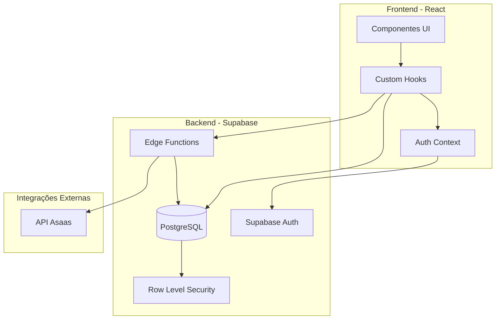

# Design Document

## Overview

Este documento descreve o design técnico para a refatoração e correção de três módulos críticos do sistema COMADEMIG: Suporte, Afiliados e Split de Pagamentos. O design segue os princípios de arquitetura já estabelecidos no projeto, utilizando React Query para gerenciamento de estado, Supabase como backend, e Edge Functions para lógica de negócio complexa.

### Objetivos do Design

1. **Módulo de Suporte**: Corrigir inconsistências de nomenclatura e garantir persistência correta
2. **Módulo de Afiliados**: Completar implementação com painéis funcionais para usuário e admin
3. **Módulo de Split**: Implementar divisão tripla correta (40%-40%-20%) e criar interface de gestão para super admin

### Princípios Arquiteturais

- **Separação de Responsabilidades**: Hooks para lógica de negócio, componentes para UI
- **Reutilização**: Componentes compartilhados entre módulos quando aplicável
- **Tipagem Forte**: TypeScript em todos os arquivos com tipos bem definidos
- **Real-time**: Subscriptions do Supabase para atualizações em tempo real
- **Segurança**: Políticas RLS rigorosas para proteção de dados

## Architecture

### Diagrama de Arquitetura Geral



### Fluxo de Dados

**Módulo de Suporte:**
```
Usuário → Componente → useSupport Hook → Supabase → support_tickets/support_messages
```

**Módulo de Afiliados:**
```
Usuário → Componente → useAffiliate Hook → Edge Function → Supabase → affiliates/affiliate_referrals
```

**Módulo de Split:**
```
Pagamento → Webhook → Edge Function → Cálculo Split → Asaas API → Registro Local
```


## Components and Interfaces

### 1. Módulo de Suporte - Correções

#### 1.1 Hook Consolidado: `useSupport.ts`

**Status**: Já existe e está correto

**Responsabilidades**:
- Gerenciar categorias de suporte
- CRUD de tickets
- CRUD de mensagens
- Atribuição de tickets (admin)
- Resolução/fechamento de tickets

**Interface Principal**:
```typescript
interface SupportTicket {
  id: string;
  user_id: string;
  category_id: string;
  subject: string;
  description: string;
  status: 'open' | 'in_progress' | 'waiting_user' | 'resolved' | 'closed';
  priority: 'low' | 'medium' | 'high' | 'urgent';
  assigned_to?: string;
  resolved_at?: string;
  closed_at?: string;
  created_at: string;
  updated_at: string;
}
```

#### 1.2 Hook a Ser Removido: `useSuporteTickets.ts`

**Problema**: Usa nomenclatura incorreta de tabelas (`suporte`, `suporte_mensagens`)

**Ação**: Deletar arquivo e atualizar importações

#### 1.3 Componentes Afetados

**Arquivo**: `src/pages/dashboard/Suporte.tsx`

**Mudança Necessária**:
```typescript
// ANTES (incorreto)
import { useSuporteTickets } from "@/hooks/useSuporteTickets";

// DEPOIS (correto)
import { useMyTickets, useCreateTicket } from "@/hooks/useSupport";
```

### 2. Módulo de Afiliados - Implementação Completa

#### 2.1 Estrutura de Banco de Dados

**Tabela Nova**: `affiliate_referrals`
```sql
CREATE TABLE affiliate_referrals (
  id UUID PRIMARY KEY DEFAULT gen_random_uuid(),
  affiliate_id UUID REFERENCES affiliates(id) ON DELETE CASCADE,
  referred_user_id UUID REFERENCES profiles(id) ON DELETE CASCADE,
  referral_code TEXT NOT NULL,
  status TEXT CHECK (status IN ('pending', 'converted', 'cancelled')) DEFAULT 'pending',
  conversion_date TIMESTAMPTZ,
  conversion_value DECIMAL(10,2),
  created_at TIMESTAMPTZ DEFAULT NOW(),
  updated_at TIMESTAMPTZ DEFAULT NOW()
);
```

**Índices**:
```sql
CREATE INDEX idx_affiliate_referrals_affiliate ON affiliate_referrals(affiliate_id);
CREATE INDEX idx_affiliate_referrals_referred ON affiliate_referrals(referred_user_id);
CREATE INDEX idx_affiliate_referrals_code ON affiliate_referrals(referral_code);
```


#### 2.2 Hook Atualizado: `useAffiliate.ts`

**Novas Funções a Adicionar**:
```typescript
// Buscar indicações do afiliado
const useAffiliateReferrals = (affiliateId: string) => {
  return useQuery({
    queryKey: ['affiliate-referrals', affiliateId],
    queryFn: async () => {
      const { data, error } = await supabase
        .from('affiliate_referrals')
        .select(`
          *,
          referred_user:profiles!referred_user_id(
            id,
            nome_completo,
            email
          )
        `)
        .eq('affiliate_id', affiliateId)
        .order('created_at', { ascending: false });
      
      if (error) throw error;
      return data;
    }
  });
};

// Buscar estatísticas do afiliado
const useAffiliateStats = (affiliateId: string) => {
  return useQuery({
    queryKey: ['affiliate-stats', affiliateId],
    queryFn: async () => {
      // Buscar indicações
      const { data: referrals } = await supabase
        .from('affiliate_referrals')
        .select('status, conversion_value')
        .eq('affiliate_id', affiliateId);
      
      // Buscar comissões
      const { data: commissions } = await supabase
        .from('affiliate_commissions')
        .select('amount, status')
        .eq('affiliate_id', affiliateId);
      
      return {
        totalReferrals: referrals?.length || 0,
        activeReferrals: referrals?.filter(r => r.status === 'converted').length || 0,
        totalCommissions: commissions?.reduce((sum, c) => sum + c.amount, 0) || 0,
        pendingCommissions: commissions?.filter(c => c.status === 'pending')
          .reduce((sum, c) => sum + c.amount, 0) || 0,
        paidCommissions: commissions?.filter(c => c.status === 'paid')
          .reduce((sum, c) => sum + c.amount, 0) || 0
      };
    }
  });
};
```

#### 2.3 Componentes do Painel do Usuário

**Estrutura de Arquivos**:
```
src/components/affiliates/
├── AffiliatesDashboard.tsx       # Dashboard principal com estatísticas
├── AffiliatesReferralsList.tsx   # Lista de indicações
├── AffiliatesCommissionsList.tsx # Histórico de comissões
├── AffiliatesTools.tsx           # Ferramentas de divulgação (link, QR code)
└── AffiliatesRegistration.tsx    # Formulário de cadastro (já existe)
```

**Componente Principal**: `AffiliatesDashboard.tsx`
```typescript
interface AffiliatesDashboardProps {
  affiliate: Affiliate;
  stats: AffiliateStats;
}

// Exibe cards com:
// - Saldo acumulado
// - Indicações ativas
// - Comissões pendentes
// - Comissões pagas
// - Gráfico de desempenho mensal
```


#### 2.4 Componentes do Painel Admin

**Estrutura de Arquivos**:
```
src/pages/admin/
├── AffiliatesManagement.tsx      # Página principal de gestão
└── components/
    ├── AffiliatesList.tsx        # Lista de afiliados com filtros
    ├── AffiliateDetail.tsx       # Detalhes de um afiliado
    ├── ReferralsManagement.tsx   # Gestão de indicações
    ├── CommissionsManagement.tsx # Gestão de comissões
    └── AffiliatesReports.tsx     # Relatórios e estatísticas
```

**Página Principal**: `AffiliatesManagement.tsx`
```typescript
// Tabs:
// 1. Afiliados (lista com ações: aprovar, suspender, banir)
// 2. Indicações (lista com filtros por afiliado, status, período)
// 3. Comissões (lista com aprovação manual quando necessário)
// 4. Relatórios (estatísticas gerais)
// 5. Configurações (percentuais, regras, bonificações)
```

### 3. Módulo de Split de Pagamentos - Implementação Correta

#### 3.1 Estrutura de Banco de Dados Atualizada

**Migração da Tabela `asaas_splits`**:
```sql
-- Adicionar novos campos para suportar divisão tripla
ALTER TABLE asaas_splits 
ADD COLUMN recipient_type TEXT CHECK (recipient_type IN ('comademig', 'renum', 'affiliate')),
ADD COLUMN recipient_name TEXT,
ADD COLUMN recipient_wallet_id TEXT;

-- Remover constraint de unicidade se existir
-- Permitir múltiplos splits por payment_id
ALTER TABLE asaas_splits DROP CONSTRAINT IF EXISTS asaas_splits_payment_id_key;

-- Criar índice composto
CREATE INDEX idx_asaas_splits_payment_recipient 
ON asaas_splits(payment_id, recipient_type);
```

**Tabela de Configurações de Split**:
```sql
CREATE TABLE split_configurations (
  id UUID PRIMARY KEY DEFAULT gen_random_uuid(),
  category TEXT NOT NULL, -- 'filiacao', 'servicos', 'publicidade'
  category_label TEXT NOT NULL,
  is_active BOOLEAN DEFAULT true,
  created_at TIMESTAMPTZ DEFAULT NOW(),
  updated_at TIMESTAMPTZ DEFAULT NOW()
);

CREATE TABLE split_recipients (
  id UUID PRIMARY KEY DEFAULT gen_random_uuid(),
  configuration_id UUID REFERENCES split_configurations(id) ON DELETE CASCADE,
  recipient_type TEXT CHECK (recipient_type IN ('fixed', 'dynamic')),
  recipient_name TEXT NOT NULL,
  recipient_identifier TEXT, -- 'comademig', 'renum', 'affiliate'
  wallet_id TEXT, -- NULL para COMADEMIG (conta principal)
  percentage DECIMAL(5,2) NOT NULL CHECK (percentage > 0 AND percentage <= 100),
  sort_order INTEGER DEFAULT 0,
  created_at TIMESTAMPTZ DEFAULT NOW()
);

-- Índices
CREATE INDEX idx_split_recipients_config ON split_recipients(configuration_id);
```


#### 3.2 Edge Function Atualizada: `asaas-configure-split`

**Lógica de Divisão Tripla**:
```typescript
// Configuração padrão por tipo de serviço
const SPLIT_CONFIGS = {
  filiacao: [
    { type: 'comademig', name: 'COMADEMIG', percentage: 40, walletId: null },
    { type: 'renum', name: 'RENUM', percentage: 40, walletId: process.env.RENUM_WALLET_ID },
    { type: 'affiliate', name: 'Afiliado', percentage: 20, walletId: 'dynamic' }
  ],
  servicos: [
    { type: 'comademig', name: 'COMADEMIG', percentage: 60, walletId: null },
    { type: 'renum', name: 'RENUM', percentage: 40, walletId: process.env.RENUM_WALLET_ID }
  ],
  publicidade: [
    { type: 'comademig', name: 'COMADEMIG', percentage: 100, walletId: null }
  ]
};

// Função principal
async function configureSplit(paymentId, serviceType, totalValue, affiliateId?) {
  const config = SPLIT_CONFIGS[serviceType];
  const splits = [];
  
  for (const recipient of config) {
    let walletId = recipient.walletId;
    
    // Se é afiliado, buscar wallet dinâmico
    if (recipient.type === 'affiliate' && affiliateId) {
      const affiliate = await getAffiliate(affiliateId);
      walletId = affiliate.asaas_wallet_id;
    }
    
    // Calcular valor
    const amount = (totalValue * recipient.percentage) / 100;
    
    // Criar split no Asaas (se não for COMADEMIG)
    let asaasSplitId = null;
    if (recipient.type !== 'comademig' && walletId) {
      asaasSplitId = await createAsaasSplit(paymentId, walletId, recipient.percentage);
    }
    
    // Registrar localmente
    const split = await supabase.from('asaas_splits').insert({
      payment_id: paymentId,
      recipient_type: recipient.type,
      recipient_name: recipient.name,
      recipient_wallet_id: walletId,
      commission_percentage: recipient.percentage,
      commission_value: amount,
      total_value: totalValue,
      service_type: serviceType,
      status: 'PENDING',
      asaas_split_id: asaasSplitId
    });
    
    splits.push(split);
  }
  
  return splits;
}
```

#### 3.3 Hook Atualizado: `useSplitManagement.ts`

**Novo Hook para Super Admin**:
```typescript
export function useSplitManagement() {
  // Buscar configurações de split
  const useConfigurations = () => {
    return useQuery({
      queryKey: ['split-configurations'],
      queryFn: async () => {
        const { data, error } = await supabase
          .from('split_configurations')
          .select(`
            *,
            recipients:split_recipients(*)
          `)
          .eq('is_active', true)
          .order('category');
        
        if (error) throw error;
        return data;
      }
    });
  };
  
  // Criar/atualizar configuração
  const updateConfiguration = useMutation({
    mutationFn: async (config: SplitConfiguration) => {
      // Validar que soma dos percentuais = 100%
      const total = config.recipients.reduce((sum, r) => sum + r.percentage, 0);
      if (total !== 100) {
        throw new Error('A soma dos percentuais deve ser 100%');
      }
      
      // Salvar configuração
      // ...
    }
  });
  
  // Buscar histórico de splits
  const useSplitHistory = (filters) => {
    return useQuery({
      queryKey: ['split-history', filters],
      queryFn: async () => {
        // Buscar splits com filtros
        // ...
      }
    });
  };
  
  return {
    useConfigurations,
    updateConfiguration,
    useSplitHistory
  };
}
```


#### 3.4 Componentes do Painel Super Admin

**Estrutura de Arquivos**:
```
src/pages/admin/
├── SplitManagement.tsx           # Página principal (apenas super admin)
└── components/
    ├── SplitConfigurations.tsx   # Configuração de categorias e percentuais
    ├── SplitHistory.tsx          # Histórico de splits processados
    ├── SplitReports.tsx          # Relatórios por beneficiário
    └── SplitAuditLog.tsx         # Log de alterações
```

**Página Principal**: `SplitManagement.tsx`
```typescript
// Verificação de acesso
const { user } = useAuth();
if (user?.tipo_membro !== 'super_admin') {
  return <Navigate to="/dashboard" />;
}

// Tabs:
// 1. Configurações (criar/editar categorias e beneficiários)
// 2. Histórico (splits processados com filtros)
// 3. Relatórios (quanto cada beneficiário recebeu)
// 4. Auditoria (log de alterações)
```

## Data Models

### Modelo de Dados Completo

```typescript
// Suporte
interface SupportTicket {
  id: string;
  user_id: string;
  category_id: string;
  subject: string;
  description: string;
  status: 'open' | 'in_progress' | 'waiting_user' | 'resolved' | 'closed';
  priority: 'low' | 'medium' | 'high' | 'urgent';
  assigned_to?: string;
  resolved_at?: string;
  closed_at?: string;
  created_at: string;
  updated_at: string;
}

interface SupportMessage {
  id: string;
  ticket_id: string;
  user_id: string;
  message: string;
  is_staff_reply: boolean;
  is_internal_note: boolean;
  attachments: string[];
  created_at: string;
}

// Afiliados
interface Affiliate {
  id: string;
  user_id: string;
  display_name: string;
  cpf_cnpj: string;
  asaas_wallet_id: string;
  contact_email: string;
  phone: string;
  status: 'pending' | 'active' | 'suspended';
  is_adimplent: boolean;
  referral_code: string;
  created_at: string;
  updated_at: string;
}

interface AffiliateReferral {
  id: string;
  affiliate_id: string;
  referred_user_id: string;
  referral_code: string;
  status: 'pending' | 'converted' | 'cancelled';
  conversion_date?: string;
  conversion_value?: number;
  created_at: string;
  updated_at: string;
}

interface AffiliateCommission {
  id: string;
  affiliate_id: string;
  payment_id: string;
  amount: number;
  status: 'pending' | 'paid' | 'cancelled';
  created_at: string;
}

// Split de Pagamentos
interface AsaasSplit {
  id: string;
  payment_id: string;
  recipient_type: 'comademig' | 'renum' | 'affiliate';
  recipient_name: string;
  recipient_wallet_id?: string;
  commission_percentage: number;
  commission_value: number;
  total_value: number;
  service_type: string;
  status: 'PENDING' | 'PROCESSED' | 'CANCELLED' | 'ERROR';
  asaas_split_id?: string;
  created_at: string;
  updated_at: string;
}

interface SplitConfiguration {
  id: string;
  category: string;
  category_label: string;
  is_active: boolean;
  recipients: SplitRecipient[];
  created_at: string;
  updated_at: string;
}

interface SplitRecipient {
  id: string;
  configuration_id: string;
  recipient_type: 'fixed' | 'dynamic';
  recipient_name: string;
  recipient_identifier: string;
  wallet_id?: string;
  percentage: number;
  sort_order: number;
  created_at: string;
}
```


## Error Handling

### Estratégias de Tratamento de Erros

#### 1. Erros de Validação

**Frontend**:
```typescript
// Validação com Zod
const affiliateSchema = z.object({
  display_name: z.string().min(3, 'Nome deve ter no mínimo 3 caracteres'),
  cpf_cnpj: z.string().regex(/^\d{11}$|^\d{14}$/, 'CPF/CNPJ inválido'),
  asaas_wallet_id: z.string().min(1, 'Wallet ID é obrigatório'),
  contact_email: z.string().email('Email inválido'),
  phone: z.string().optional()
});

// Uso em formulários
const form = useForm({
  resolver: zodResolver(affiliateSchema)
});
```

**Backend (Edge Functions)**:
```typescript
// Validação de entrada
if (!paymentId || !serviceType || !totalValue) {
  return new Response(
    JSON.stringify({ 
      success: false, 
      error: 'Dados obrigatórios faltando' 
    }),
    { status: 400 }
  );
}

// Validação de percentuais
const totalPercentage = recipients.reduce((sum, r) => sum + r.percentage, 0);
if (totalPercentage !== 100) {
  return new Response(
    JSON.stringify({ 
      success: false, 
      error: 'A soma dos percentuais deve ser 100%' 
    }),
    { status: 400 }
  );
}
```

#### 2. Erros de Integração com Asaas

```typescript
try {
  const response = await fetch(`${ASAAS_API_URL}/v3/transfers`, {
    method: 'POST',
    headers: {
      'access_token': ASAAS_API_KEY,
      'Content-Type': 'application/json'
    },
    body: JSON.stringify(transferData)
  });
  
  if (!response.ok) {
    const error = await response.json();
    throw new Error(`Asaas API Error: ${error.message || response.statusText}`);
  }
  
  return await response.json();
} catch (error) {
  console.error('Erro na integração com Asaas:', error);
  
  // Registrar erro para reprocessamento
  await supabase.from('asaas_splits').update({
    status: 'ERROR',
    notes: error.message
  }).eq('id', splitId);
  
  throw error;
}
```

#### 3. Erros de Banco de Dados

```typescript
// Tratamento de erros RLS
try {
  const { data, error } = await supabase
    .from('support_tickets')
    .insert(ticketData);
  
  if (error) {
    if (error.code === '42501') {
      // Erro de permissão RLS
      toast.error('Você não tem permissão para realizar esta ação');
    } else if (error.code === '23505') {
      // Violação de constraint única
      toast.error('Este registro já existe');
    } else {
      toast.error('Erro ao salvar dados: ' + error.message);
    }
    throw error;
  }
  
  return data;
} catch (error) {
  console.error('Database error:', error);
  throw error;
}
```

#### 4. Erros de Autenticação

```typescript
// Verificação de sessão
const { data: { session }, error } = await supabase.auth.getSession();

if (error || !session) {
  toast.error('Sessão expirada. Faça login novamente.');
  navigate('/login');
  return;
}

// Verificação de permissões
if (requiredRole && user?.tipo_membro !== requiredRole) {
  toast.error('Você não tem permissão para acessar esta página');
  navigate('/dashboard');
  return;
}
```


## Testing Strategy

### Abordagem de Testes

#### 1. Testes de Integração

**Módulo de Suporte**:
```typescript
describe('Support Module', () => {
  it('should create ticket and save to correct table', async () => {
    const ticket = await createTicket({
      category_id: 'cat-123',
      subject: 'Test Ticket',
      description: 'Test Description',
      priority: 'medium'
    });
    
    expect(ticket).toBeDefined();
    expect(ticket.id).toBeDefined();
    
    // Verificar que foi salvo na tabela correta
    const { data } = await supabase
      .from('support_tickets')
      .select('*')
      .eq('id', ticket.id)
      .single();
    
    expect(data).toBeDefined();
    expect(data.subject).toBe('Test Ticket');
  });
  
  it('should display ticket in user panel', async () => {
    // Criar ticket
    const ticket = await createTicket({...});
    
    // Buscar tickets do usuário
    const tickets = await getMyTickets();
    
    expect(tickets).toContainEqual(
      expect.objectContaining({ id: ticket.id })
    );
  });
});
```

**Módulo de Afiliados**:
```typescript
describe('Affiliates Module', () => {
  it('should create affiliate with wallet ID', async () => {
    const affiliate = await createAffiliate({
      display_name: 'Test Affiliate',
      cpf_cnpj: '12345678901',
      asaas_wallet_id: 'wallet_123',
      contact_email: 'test@example.com'
    });
    
    expect(affiliate.status).toBe('pending');
    expect(affiliate.referral_code).toBeDefined();
  });
  
  it('should track referrals correctly', async () => {
    // Criar afiliado
    const affiliate = await createAffiliate({...});
    
    // Simular indicação
    const referral = await createReferral({
      affiliate_id: affiliate.id,
      referred_user_id: 'user-123',
      referral_code: affiliate.referral_code
    });
    
    expect(referral.status).toBe('pending');
    
    // Buscar indicações do afiliado
    const referrals = await getAffiliateReferrals(affiliate.id);
    expect(referrals).toHaveLength(1);
  });
});
```

**Módulo de Split**:
```typescript
describe('Split Module', () => {
  it('should create triple split for filiacao', async () => {
    const splits = await configureSplit({
      paymentId: 'pay-123',
      serviceType: 'filiacao',
      totalValue: 1000,
      affiliateId: 'aff-123'
    });
    
    expect(splits).toHaveLength(3);
    
    // Verificar COMADEMIG (40%)
    const comademig = splits.find(s => s.recipient_type === 'comademig');
    expect(comademig.commission_percentage).toBe(40);
    expect(comademig.commission_value).toBe(400);
    
    // Verificar RENUM (40%)
    const renum = splits.find(s => s.recipient_type === 'renum');
    expect(renum.commission_percentage).toBe(40);
    expect(renum.commission_value).toBe(400);
    
    // Verificar Afiliado (20%)
    const affiliate = splits.find(s => s.recipient_type === 'affiliate');
    expect(affiliate.commission_percentage).toBe(20);
    expect(affiliate.commission_value).toBe(200);
  });
  
  it('should validate percentage sum equals 100', async () => {
    await expect(
      updateSplitConfiguration({
        category: 'test',
        recipients: [
          { percentage: 50 },
          { percentage: 40 } // Total = 90%
        ]
      })
    ).rejects.toThrow('A soma dos percentuais deve ser 100%');
  });
});
```

#### 2. Testes de Políticas RLS

```sql
-- Testar que usuário vê apenas seus tickets
BEGIN;
  SET LOCAL ROLE authenticated;
  SET LOCAL request.jwt.claims.sub TO 'user-123';
  
  SELECT * FROM support_tickets; -- Deve retornar apenas tickets do user-123
  
ROLLBACK;

-- Testar que admin vê todos os tickets
BEGIN;
  SET LOCAL ROLE authenticated;
  SET LOCAL request.jwt.claims.sub TO 'admin-123';
  
  SELECT * FROM support_tickets; -- Deve retornar todos os tickets
  
ROLLBACK;
```

#### 3. Testes de Edge Functions

```typescript
describe('Edge Functions', () => {
  it('should configure split via edge function', async () => {
    const response = await supabase.functions.invoke('asaas-configure-split', {
      body: {
        paymentId: 'pay-123',
        serviceType: 'filiacao',
        totalValue: 1000,
        affiliateId: 'aff-123'
      }
    });
    
    expect(response.data.success).toBe(true);
    expect(response.data.splits).toHaveLength(3);
  });
  
  it('should process splits when payment confirmed', async () => {
    const response = await supabase.functions.invoke('asaas-process-splits', {
      body: {
        cobrancaId: 'cob-123',
        paymentValue: 1000
      }
    });
    
    expect(response.data.success).toBe(true);
    expect(response.data.processed).toBe(true);
  });
});
```

### Estratégia de Testes Manuais

#### Checklist de Testes Manuais

**Módulo de Suporte**:
- [ ] Criar ticket como usuário
- [ ] Verificar ticket aparece no painel do usuário
- [ ] Verificar ticket aparece no painel admin
- [ ] Enviar mensagem como usuário
- [ ] Responder como admin
- [ ] Verificar mensagem aparece em tempo real
- [ ] Atribuir ticket a admin
- [ ] Resolver ticket
- [ ] Fechar ticket

**Módulo de Afiliados**:
- [ ] Cadastrar como afiliado com Wallet ID
- [ ] Verificar status "pendente"
- [ ] Aprovar afiliado como admin
- [ ] Gerar link de indicação
- [ ] Cadastrar usuário com código de afiliado
- [ ] Verificar indicação registrada
- [ ] Simular pagamento de indicado
- [ ] Verificar comissão calculada
- [ ] Verificar comissão aparece no painel do afiliado

**Módulo de Split**:
- [ ] Criar pagamento de filiação
- [ ] Verificar 3 splits criados (40%-40%-20%)
- [ ] Confirmar pagamento
- [ ] Verificar transferências no Asaas
- [ ] Acessar painel super admin
- [ ] Visualizar histórico de splits
- [ ] Editar configuração de percentuais
- [ ] Validar que soma = 100%
- [ ] Gerar relatório por beneficiário


## Security Considerations

### Políticas RLS (Row Level Security)

#### 1. Módulo de Suporte

```sql
-- support_tickets: Usuário vê apenas seus próprios tickets
CREATE POLICY "users_view_own_tickets"
  ON support_tickets FOR SELECT
  TO authenticated
  USING (auth.uid() = user_id);

-- support_tickets: Admins veem todos os tickets
CREATE POLICY "admins_view_all_tickets"
  ON support_tickets FOR SELECT
  TO authenticated
  USING (
    EXISTS (
      SELECT 1 FROM profiles
      WHERE id = auth.uid()
      AND tipo_membro IN ('admin', 'super_admin')
    )
  );

-- support_tickets: Usuário pode criar tickets
CREATE POLICY "users_create_tickets"
  ON support_tickets FOR INSERT
  TO authenticated
  WITH CHECK (auth.uid() = user_id);

-- support_tickets: Admins podem atualizar tickets
CREATE POLICY "admins_update_tickets"
  ON support_tickets FOR UPDATE
  TO authenticated
  USING (
    EXISTS (
      SELECT 1 FROM profiles
      WHERE id = auth.uid()
      AND tipo_membro IN ('admin', 'super_admin')
    )
  );

-- support_messages: Usuário vê mensagens dos seus tickets
CREATE POLICY "users_view_own_messages"
  ON support_messages FOR SELECT
  TO authenticated
  USING (
    ticket_id IN (
      SELECT id FROM support_tickets WHERE user_id = auth.uid()
    )
  );

-- support_messages: Admins veem todas as mensagens
CREATE POLICY "admins_view_all_messages"
  ON support_messages FOR SELECT
  TO authenticated
  USING (
    EXISTS (
      SELECT 1 FROM profiles
      WHERE id = auth.uid()
      AND tipo_membro IN ('admin', 'super_admin')
    )
  );

-- support_messages: Usuário pode enviar mensagens nos seus tickets
CREATE POLICY "users_send_messages"
  ON support_messages FOR INSERT
  TO authenticated
  WITH CHECK (
    ticket_id IN (
      SELECT id FROM support_tickets WHERE user_id = auth.uid()
    )
  );

-- support_messages: Admins podem enviar mensagens em qualquer ticket
CREATE POLICY "admins_send_messages"
  ON support_messages FOR INSERT
  TO authenticated
  WITH CHECK (
    EXISTS (
      SELECT 1 FROM profiles
      WHERE id = auth.uid()
      AND tipo_membro IN ('admin', 'super_admin')
    )
  );

-- support_categories: Todos podem ver categorias ativas
CREATE POLICY "anyone_view_active_categories"
  ON support_categories FOR SELECT
  TO authenticated
  USING (is_active = true);
```

#### 2. Módulo de Afiliados

```sql
-- affiliates: Usuário vê apenas seu próprio cadastro
CREATE POLICY "users_view_own_affiliate"
  ON affiliates FOR SELECT
  TO authenticated
  USING (auth.uid() = user_id);

-- affiliates: Admins veem todos os afiliados
CREATE POLICY "admins_view_all_affiliates"
  ON affiliates FOR SELECT
  TO authenticated
  USING (
    EXISTS (
      SELECT 1 FROM profiles
      WHERE id = auth.uid()
      AND tipo_membro IN ('admin', 'super_admin')
    )
  );

-- affiliates: Usuário pode criar seu cadastro
CREATE POLICY "users_create_affiliate"
  ON affiliates FOR INSERT
  TO authenticated
  WITH CHECK (auth.uid() = user_id);

-- affiliates: Usuário pode atualizar seu cadastro
CREATE POLICY "users_update_own_affiliate"
  ON affiliates FOR UPDATE
  TO authenticated
  USING (auth.uid() = user_id);

-- affiliates: Admins podem atualizar qualquer afiliado
CREATE POLICY "admins_update_affiliates"
  ON affiliates FOR UPDATE
  TO authenticated
  USING (
    EXISTS (
      SELECT 1 FROM profiles
      WHERE id = auth.uid()
      AND tipo_membro IN ('admin', 'super_admin')
    )
  );

-- affiliate_referrals: Afiliado vê apenas suas indicações
CREATE POLICY "affiliates_view_own_referrals"
  ON affiliate_referrals FOR SELECT
  TO authenticated
  USING (
    affiliate_id IN (
      SELECT id FROM affiliates WHERE user_id = auth.uid()
    )
  );

-- affiliate_referrals: Admins veem todas as indicações
CREATE POLICY "admins_view_all_referrals"
  ON affiliate_referrals FOR SELECT
  TO authenticated
  USING (
    EXISTS (
      SELECT 1 FROM profiles
      WHERE id = auth.uid()
      AND tipo_membro IN ('admin', 'super_admin')
    )
  );

-- affiliate_commissions: Afiliado vê apenas suas comissões
CREATE POLICY "affiliates_view_own_commissions"
  ON affiliate_commissions FOR SELECT
  TO authenticated
  USING (
    affiliate_id IN (
      SELECT id FROM affiliates WHERE user_id = auth.uid()
    )
  );

-- affiliate_commissions: Admins veem todas as comissões
CREATE POLICY "admins_view_all_commissions"
  ON affiliate_commissions FOR SELECT
  TO authenticated
  USING (
    EXISTS (
      SELECT 1 FROM profiles
      WHERE id = auth.uid()
      AND tipo_membro IN ('admin', 'super_admin')
    )
  );
```

#### 3. Módulo de Split

```sql
-- asaas_splits: Apenas admins e super admins podem ver
CREATE POLICY "admins_view_splits"
  ON asaas_splits FOR SELECT
  TO authenticated
  USING (
    EXISTS (
      SELECT 1 FROM profiles
      WHERE id = auth.uid()
      AND tipo_membro IN ('admin', 'super_admin')
    )
  );

-- split_configurations: Apenas super admins podem ver
CREATE POLICY "super_admins_view_configurations"
  ON split_configurations FOR SELECT
  TO authenticated
  USING (
    EXISTS (
      SELECT 1 FROM profiles
      WHERE id = auth.uid()
      AND tipo_membro = 'super_admin'
    )
  );

-- split_configurations: Apenas super admins podem modificar
CREATE POLICY "super_admins_modify_configurations"
  ON split_configurations FOR ALL
  TO authenticated
  USING (
    EXISTS (
      SELECT 1 FROM profiles
      WHERE id = auth.uid()
      AND tipo_membro = 'super_admin'
    )
  )
  WITH CHECK (
    EXISTS (
      SELECT 1 FROM profiles
      WHERE id = auth.uid()
      AND tipo_membro = 'super_admin'
    )
  );

-- split_recipients: Apenas super admins podem ver e modificar
CREATE POLICY "super_admins_manage_recipients"
  ON split_recipients FOR ALL
  TO authenticated
  USING (
    EXISTS (
      SELECT 1 FROM profiles
      WHERE id = auth.uid()
      AND tipo_membro = 'super_admin'
    )
  )
  WITH CHECK (
    EXISTS (
      SELECT 1 FROM profiles
      WHERE id = auth.uid()
      AND tipo_membro = 'super_admin'
    )
  );
```

### Validações de Segurança

#### 1. Validação de Wallet ID

```typescript
// Validar formato do Wallet ID do Asaas
function validateWalletId(walletId: string): boolean {
  // Wallet ID do Asaas geralmente tem formato específico
  const walletIdRegex = /^[a-zA-Z0-9_-]{20,}$/;
  return walletIdRegex.test(walletId);
}

// Uso
if (!validateWalletId(data.asaas_wallet_id)) {
  throw new Error('Wallet ID inválido');
}
```

#### 2. Sanitização de Inputs

```typescript
import DOMPurify from 'dompurify';

// Sanitizar mensagens antes de salvar
function sanitizeMessage(message: string): string {
  return DOMPurify.sanitize(message, {
    ALLOWED_TAGS: ['b', 'i', 'em', 'strong', 'a', 'p', 'br'],
    ALLOWED_ATTR: ['href', 'target']
  });
}
```

#### 3. Rate Limiting

```typescript
// Implementar rate limiting em Edge Functions
const RATE_LIMIT = {
  maxRequests: 10,
  windowMs: 60000 // 1 minuto
};

// Verificar rate limit por usuário
async function checkRateLimit(userId: string): Promise<boolean> {
  const key = `rate_limit:${userId}`;
  const count = await redis.incr(key);
  
  if (count === 1) {
    await redis.expire(key, RATE_LIMIT.windowMs / 1000);
  }
  
  return count <= RATE_LIMIT.maxRequests;
}
```

### Proteção de Dados Sensíveis

#### 1. Não Expor Wallet IDs Completos

```typescript
// Mascarar Wallet ID na UI
function maskWalletId(walletId: string): string {
  if (walletId.length <= 8) return walletId;
  return `${walletId.substring(0, 4)}...${walletId.substring(walletId.length - 4)}`;
}

// Exemplo: "wal_abc123xyz789" → "wal_...x789"
```

#### 2. Logs Seguros

```typescript
// Nunca logar dados sensíveis
console.log('Creating affiliate:', {
  display_name: data.display_name,
  cpf_cnpj: '[REDACTED]',
  asaas_wallet_id: '[REDACTED]',
  contact_email: data.contact_email
});
```

#### 3. Variáveis de Ambiente

```typescript
// Nunca commitar chaves de API
// Usar variáveis de ambiente do Supabase
const ASAAS_API_KEY = Deno.env.get('ASAAS_API_KEY');
const RENUM_WALLET_ID = Deno.env.get('RENUM_WALLET_ID');

if (!ASAAS_API_KEY || !RENUM_WALLET_ID) {
  throw new Error('Variáveis de ambiente não configuradas');
}
```


## Performance Considerations

### Otimizações de Performance

#### 1. Queries Otimizadas

```typescript
// Usar select específico ao invés de select('*')
const { data } = await supabase
  .from('support_tickets')
  .select('id, subject, status, created_at, category:support_categories(name, icon)')
  .eq('user_id', userId)
  .order('created_at', { ascending: false })
  .limit(20); // Limitar resultados

// Usar índices compostos para queries frequentes
CREATE INDEX idx_tickets_user_status ON support_tickets(user_id, status);
CREATE INDEX idx_tickets_created ON support_tickets(created_at DESC);
```

#### 2. Paginação

```typescript
// Implementar paginação para listas grandes
function useAffiliateReferralsPaginated(affiliateId: string, page: number = 1, pageSize: number = 20) {
  return useQuery({
    queryKey: ['affiliate-referrals', affiliateId, page],
    queryFn: async () => {
      const from = (page - 1) * pageSize;
      const to = from + pageSize - 1;
      
      const { data, error, count } = await supabase
        .from('affiliate_referrals')
        .select('*', { count: 'exact' })
        .eq('affiliate_id', affiliateId)
        .order('created_at', { ascending: false })
        .range(from, to);
      
      if (error) throw error;
      
      return {
        data,
        totalPages: Math.ceil((count || 0) / pageSize),
        currentPage: page
      };
    }
  });
}
```

#### 3. Cache Estratégico

```typescript
// Configurar staleTime e cacheTime apropriados
const { data: categories } = useQuery({
  queryKey: ['support-categories'],
  queryFn: fetchCategories,
  staleTime: 5 * 60 * 1000, // 5 minutos
  cacheTime: 10 * 60 * 1000, // 10 minutos
});

// Invalidar cache apenas quando necessário
const createTicket = useMutation({
  mutationFn: createTicketFn,
  onSuccess: () => {
    // Invalidar apenas queries relacionadas
    queryClient.invalidateQueries({ queryKey: ['my-tickets'] });
    queryClient.invalidateQueries({ queryKey: ['ticket-stats'] });
    // NÃO invalidar categories (não mudaram)
  }
});
```

#### 4. Lazy Loading de Componentes

```typescript
// Carregar componentes pesados sob demanda
const AffiliatesReports = lazy(() => import('@/components/affiliates/AffiliatesReports'));
const SplitManagement = lazy(() => import('@/pages/admin/SplitManagement'));

// Uso com Suspense
<Suspense fallback={<LoadingSpinner />}>
  <AffiliatesReports />
</Suspense>
```

#### 5. Debounce em Buscas

```typescript
// Debounce para evitar queries excessivas
import { useDebouncedValue } from '@/hooks/useDebouncedValue';

function SearchTickets() {
  const [searchTerm, setSearchTerm] = useState('');
  const debouncedSearch = useDebouncedValue(searchTerm, 500);
  
  const { data: tickets } = useQuery({
    queryKey: ['tickets-search', debouncedSearch],
    queryFn: () => searchTickets(debouncedSearch),
    enabled: debouncedSearch.length >= 3
  });
  
  return (
    <Input 
      value={searchTerm}
      onChange={(e) => setSearchTerm(e.target.value)}
      placeholder="Buscar tickets..."
    />
  );
}
```

#### 6. Otimização de Real-time

```typescript
// Usar subscriptions apenas quando necessário
useEffect(() => {
  if (!ticketId) return;
  
  const subscription = supabase
    .channel(`ticket-${ticketId}`)
    .on('postgres_changes', {
      event: 'INSERT',
      schema: 'public',
      table: 'support_messages',
      filter: `ticket_id=eq.${ticketId}`
    }, (payload) => {
      queryClient.setQueryData(['ticket-messages', ticketId], (old: any) => {
        return [...(old || []), payload.new];
      });
    })
    .subscribe();
  
  return () => {
    subscription.unsubscribe();
  };
}, [ticketId]);
```

### Monitoramento de Performance

#### 1. Métricas a Acompanhar

```typescript
// Tempo de resposta de queries
const startTime = performance.now();
const { data } = await supabase.from('support_tickets').select('*');
const endTime = performance.now();
console.log(`Query took ${endTime - startTime}ms`);

// Tamanho de payloads
console.log(`Payload size: ${JSON.stringify(data).length} bytes`);

// Taxa de cache hit
const cacheHitRate = (cacheHits / totalQueries) * 100;
console.log(`Cache hit rate: ${cacheHitRate}%`);
```

#### 2. Alertas de Performance

```typescript
// Alertar se query demorar muito
const SLOW_QUERY_THRESHOLD = 1000; // 1 segundo

async function monitoredQuery(queryFn: () => Promise<any>, queryName: string) {
  const start = performance.now();
  const result = await queryFn();
  const duration = performance.now() - start;
  
  if (duration > SLOW_QUERY_THRESHOLD) {
    console.warn(`Slow query detected: ${queryName} took ${duration}ms`);
    // Enviar para sistema de monitoramento
  }
  
  return result;
}
```

## Deployment Strategy

### Estratégia de Deploy

#### 1. Ordem de Implementação

**Fase 1: Correção do Módulo de Suporte (1-2 dias)**
1. Deletar hook `useSuporteTickets.ts`
2. Atualizar importações em `Suporte.tsx`
3. Testar criação e visualização de tickets
4. Criar políticas RLS
5. Deploy e validação

**Fase 2: Estrutura de Banco para Afiliados e Split (1 dia)**
1. Criar migração para `affiliate_referrals`
2. Criar migrações para tabelas de split
3. Atualizar `types.ts`
4. Executar migrações em produção
5. Validar estrutura

**Fase 3: Módulo de Afiliados - Painel do Usuário (3-4 dias)**
1. Implementar hooks atualizados
2. Criar componentes do dashboard
3. Implementar lista de indicações
4. Implementar histórico de comissões
5. Implementar ferramentas de divulgação
6. Testes e ajustes

**Fase 4: Módulo de Afiliados - Painel Admin (3-4 dias)**
1. Criar página de gestão de afiliados
2. Implementar aprovação de cadastros
3. Implementar gestão de indicações
4. Implementar gestão de comissões
5. Criar relatórios
6. Testes e ajustes

**Fase 5: Módulo de Split - Correção e Interface (4-5 dias)**
1. Atualizar Edge Function para divisão tripla
2. Configurar variável `RENUM_WALLET_ID`
3. Criar hook `useSplitManagement`
4. Criar página super admin
5. Implementar configurações
6. Implementar histórico e relatórios
7. Testes extensivos

**Fase 6: Integração e Testes Finais (2-3 dias)**
1. Integrar fluxo completo de indicação → pagamento → comissão
2. Testar divisão tripla em ambiente real
3. Validar transferências no Asaas
4. Testes de carga
5. Ajustes finais

#### 2. Rollback Plan

```typescript
// Manter versões anteriores de Edge Functions
// Permitir rollback rápido se necessário

// Exemplo de feature flag
const USE_NEW_SPLIT_LOGIC = Deno.env.get('USE_NEW_SPLIT_LOGIC') === 'true';

if (USE_NEW_SPLIT_LOGIC) {
  // Nova lógica de divisão tripla
  await configureTripleSplit(paymentData);
} else {
  // Lógica antiga (fallback)
  await configureSingleSplit(paymentData);
}
```

#### 3. Monitoramento Pós-Deploy

```typescript
// Logs estruturados para monitoramento
console.log(JSON.stringify({
  timestamp: new Date().toISOString(),
  event: 'split_configured',
  payment_id: paymentId,
  service_type: serviceType,
  recipients_count: splits.length,
  total_value: totalValue,
  success: true
}));

// Alertas para erros críticos
if (error.code === 'ASAAS_API_ERROR') {
  // Enviar alerta para equipe
  await sendAlert({
    severity: 'critical',
    message: 'Erro na integração com Asaas',
    details: error
  });
}
```

### Checklist de Deploy

- [ ] Código revisado e aprovado
- [ ] Testes automatizados passando
- [ ] Testes manuais realizados
- [ ] Migrações de banco testadas
- [ ] Variáveis de ambiente configuradas
- [ ] Políticas RLS criadas e testadas
- [ ] Documentação atualizada
- [ ] Equipe notificada sobre mudanças
- [ ] Plano de rollback preparado
- [ ] Monitoramento configurado
- [ ] Deploy em horário de baixo tráfego
- [ ] Validação pós-deploy realizada

