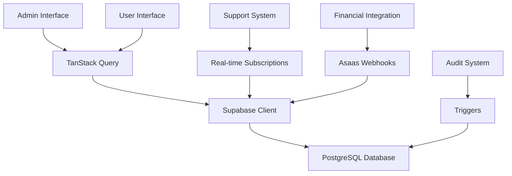

# Design - Refatoração Painel Administrativo COMADEMIG

## Overview

O design da refatoração do painel administrativo COMADEMIG foca na correção de bugs críticos do sistema de cargos/planos e na reorganização da interface administrativa para melhor separação de responsabilidades. A arquitetura será baseada em componentes React modulares com hooks customizados para gerenciamento de estado via TanStack Query.

## Architecture

### Arquitetura de Componentes
```
src/
├── components/
│   ├── admin/
│   │   ├── MemberTypeManagement/     # Gestão de cargos refatorada
│   │   ├── SupportManagement/        # Sistema de suporte admin
│   │   ├── FinancialDashboard/       # Dashboard financeiro
│   │   ├── AuditLogs/               # Logs de auditoria
│   │   └── AdminSidebar/            # Menu lateral administrativo
│   ├── support/
│   │   ├── TicketForm/              # Formulário de tickets
│   │   ├── TicketList/              # Lista de tickets
│   │   └── TicketChat/              # Chat de mensagens
│   └── financial/
│       ├── TransactionHistory/       # Histórico de transações
│       └── PaymentStatus/           # Status de pagamentos
├── hooks/
│   ├── useMemberTypes.ts            # Hook corrigido para cargos/planos
│   ├── useSupport.ts                # Hooks do sistema de suporte
│   ├── useFinancial.ts              # Hooks financeiros
│   └── useAudit.ts                  # Hooks de auditoria
└── pages/
    ├── admin/
    │   ├── MemberTypeManagement.tsx  # Página refatorada
    │   ├── SupportManagement.tsx     # Gestão de suporte
    │   ├── FinancialAdmin.tsx        # Financeiro administrativo
    │   └── AuditLogs.tsx            # Página de auditoria
    └── dashboard/
        └── Support.tsx               # Suporte do usuário
```

### Fluxo de Dados


## Components and Interfaces

### 1. Sistema de Cargos e Planos Refatorado

#### MemberTypeManagement Component
```typescript
interface MemberTypeWithPlans {
  id: string;
  name: string;
  description: string;
  is_active: boolean;
  sort_order: number;
  subscription_plans: SubscriptionPlan[];
}

interface SubscriptionPlan {
  id: string;
  member_type_id: string;
  name: string;
  price: number;
  duration_months: number;
  features: Record<string, any>;
  is_active: boolean;
}
```

#### Hook useMemberTypes Corrigido
```typescript
export function useMemberTypes(options?: {
  includeInactive?: boolean;
  includePlans?: boolean;
}) {
  // Implementação com relacionamento 1:N correto
}

export function useCreateMemberTypeWithPlans() {
  // Mutation que cria cargo + múltiplos planos atomicamente
}

export function useToggleMemberTypeStatus() {
  // Mutation para ativar/desativar cargos
}

export function useDeleteMemberType() {
  // Mutation para soft delete
}
```
#
## 2. Sistema de Suporte Completo

#### Estrutura de Dados
```typescript
interface SupportTicket {
  id: string;
  user_id: string;
  category_id: string;
  subject: string;
  description: string;
  status: 'open' | 'in_progress' | 'waiting_user' | 'resolved' | 'closed';
  priority: 'low' | 'medium' | 'high' | 'urgent';
  assigned_to?: string;
  created_at: string;
  updated_at: string;
}

interface SupportMessage {
  id: string;
  ticket_id: string;
  user_id: string;
  message: string;
  is_staff_reply: boolean;
  attachments: string[];
  created_at: string;
}
```

#### Componentes do Sistema de Suporte
- **TicketForm**: Formulário para criação de tickets com categorias predefinidas
- **TicketList**: Lista de tickets com filtros por status, categoria e prioridade
- **TicketChat**: Interface de chat para mensagens do ticket
- **SupportDashboard**: Dashboard administrativo com métricas de atendimento

### 3. Sistema de Auditoria

#### Estrutura de Logs
```typescript
interface UserActivityLog {
  id: string;
  user_id: string;
  action: 'INSERT' | 'UPDATE' | 'DELETE';
  table_name: string;
  record_id: string;
  old_values?: Record<string, any>;
  new_values?: Record<string, any>;
  ip_address: string;
  user_agent: string;
  created_at: string;
}
```

#### Componentes de Auditoria
- **AuditLogTable**: Tabela com filtros avançados por usuário, tabela, período
- **AuditDashboard**: Métricas de atividade e alertas de segurança
- **UserActivityTimeline**: Timeline de atividades por usuário

### 4. Dashboard Financeiro Administrativo

#### Métricas e KPIs
```typescript
interface FinancialMetrics {
  monthly_revenue: number;
  annual_revenue: number;
  pending_payments: number;
  overdue_payments: number;
  revenue_by_member_type: Array<{
    member_type: string;
    revenue: number;
    count: number;
  }>;
}
```

#### Componentes Financeiros
- **RevenueChart**: Gráfico de receitas por período
- **PaymentStatusCards**: Cards com métricas de pagamentos
- **MemberTypeRevenue**: Breakdown de receita por cargo
- **OverduePayments**: Lista de pagamentos em atraso

## Data Models

### Relacionamento Corrigido: Member Types → Subscription Plans

```sql
-- Relacionamento 1:N (Um cargo pode ter múltiplos planos)
member_types (1) ──── (N) subscription_plans

-- Estrutura corrigida
CREATE TABLE member_types (
  id UUID PRIMARY KEY,
  name TEXT NOT NULL,
  description TEXT,
  is_active BOOLEAN DEFAULT true,
  sort_order INTEGER,
  created_at TIMESTAMP DEFAULT now(),
  updated_at TIMESTAMP DEFAULT now()
);

CREATE TABLE subscription_plans (
  id UUID PRIMARY KEY,
  member_type_id UUID REFERENCES member_types(id),
  name TEXT NOT NULL,
  price DECIMAL(10,2) NOT NULL,
  duration_months INTEGER NOT NULL,
  features JSONB DEFAULT '{}',
  is_active BOOLEAN DEFAULT true,
  sort_order INTEGER DEFAULT 0,
  created_at TIMESTAMP DEFAULT now(),
  updated_at TIMESTAMP DEFAULT now(),
  UNIQUE(member_type_id, duration_months)
);
```

### Novas Tabelas do Sistema de Suporte

```sql
CREATE TABLE support_categories (
  id UUID PRIMARY KEY,
  name TEXT NOT NULL UNIQUE,
  description TEXT,
  icon TEXT,
  is_active BOOLEAN DEFAULT true,
  sort_order INTEGER DEFAULT 0
);

CREATE TABLE support_tickets (
  id UUID PRIMARY KEY,
  user_id UUID REFERENCES profiles(id),
  category_id UUID REFERENCES support_categories(id),
  subject TEXT NOT NULL,
  description TEXT NOT NULL,
  status TEXT DEFAULT 'open',
  priority TEXT DEFAULT 'medium',
  assigned_to UUID REFERENCES profiles(id),
  resolved_at TIMESTAMP,
  closed_at TIMESTAMP
);

CREATE TABLE support_messages (
  id UUID PRIMARY KEY,
  ticket_id UUID REFERENCES support_tickets(id),
  user_id UUID REFERENCES profiles(id),
  message TEXT NOT NULL,
  is_staff_reply BOOLEAN DEFAULT false,
  attachments JSONB DEFAULT '[]'
);
```

### Sistema de Auditoria

```sql
CREATE TABLE user_activity_log (
  id UUID PRIMARY KEY,
  user_id UUID REFERENCES profiles(id),
  action TEXT NOT NULL,
  table_name TEXT,
  record_id UUID,
  old_values JSONB,
  new_values JSONB,
  ip_address INET,
  user_agent TEXT,
  created_at TIMESTAMP DEFAULT now()
);
```

### Histórico Financeiro

```sql
CREATE TABLE financial_transactions (
  id UUID PRIMARY KEY,
  user_id UUID REFERENCES profiles(id),
  subscription_id UUID REFERENCES user_subscriptions(id),
  amount DECIMAL(10,2) NOT NULL,
  status TEXT DEFAULT 'pending',
  payment_method TEXT,
  asaas_payment_id TEXT,
  asaas_invoice_url TEXT,
  description TEXT,
  due_date DATE,
  paid_at TIMESTAMP
);
```

## Error Handling

### Estratégias de Tratamento de Erro

1. **Validação de Dados**
   - Validação client-side com Zod schemas
   - Validação server-side via RLS policies
   - Sanitização de inputs para prevenir XSS

2. **Tratamento de Erros de API**
   - Retry automático para falhas temporárias
   - Fallback para dados em cache quando possível
   - Mensagens de erro user-friendly via toast notifications

3. **Recuperação de Estado**
   - Invalidação automática de cache em caso de erro
   - Rollback de mutations falhadas
   - Sincronização de estado após reconexão

### Códigos de Erro Padronizados

```typescript
enum ErrorCodes {
  MEMBER_TYPE_NOT_FOUND = 'MEMBER_TYPE_NOT_FOUND',
  SUBSCRIPTION_PLAN_CONFLICT = 'SUBSCRIPTION_PLAN_CONFLICT',
  INSUFFICIENT_PERMISSIONS = 'INSUFFICIENT_PERMISSIONS',
  PAYMENT_PROCESSING_ERROR = 'PAYMENT_PROCESSING_ERROR',
  SUPPORT_TICKET_LIMIT_EXCEEDED = 'SUPPORT_TICKET_LIMIT_EXCEEDED'
}
```

## Testing Strategy

### Testes Unitários
- Hooks customizados (useMemberTypes, useSupport, useFinancial)
- Componentes de formulário com validação
- Utilitários de formatação e validação

### Testes de Integração
- Fluxo completo de criação de cargo + planos
- Sistema de suporte end-to-end
- Sincronização com Asaas via webhooks

### Testes de Performance
- Carregamento de listas grandes (paginação)
- Queries complexas do dashboard financeiro
- Real-time updates do sistema de suporte

### Testes de Segurança
- Políticas RLS do Supabase
- Validação de permissões por role
- Sanitização de inputs e prevenção de XSS

## Menu Lateral Reorganizado

### Estrutura Proposta

```typescript
interface MenuStructure {
  user_section: {
    title: "Área do Membro";
    items: [
      { label: "Dashboard", route: "/dashboard" },
      { label: "Meu Perfil", route: "/dashboard/perfil-completo" },
      { label: "Carteira Digital", route: "/dashboard/carteira-digital" },
      { label: "Financeiro", route: "/dashboard/financeiro" },
      { label: "Certidões", route: "/dashboard/certidoes" },
      { label: "Afiliados", route: "/dashboard/afiliados" },
      { label: "Suporte", route: "/dashboard/suporte" }
    ];
  };
  admin_section: {
    title: "Administração";
    items: [
      { label: "Gestão de Usuários", route: "/dashboard/admin/usuarios" },
      { label: "Cargos e Planos", route: "/dashboard/admin/member-management" },
      { label: "Dashboard Financeiro", route: "/dashboard/admin/financeiro" },
      { label: "Atendimento", route: "/dashboard/admin/suporte" },
      { label: "Auditoria", route: "/dashboard/admin/auditoria" },
      { label: "Gerenciar Conteúdo", route: "/dashboard/admin/content" },
      { label: "Diagnóstico", route: "/dashboard/admin/diagnostics" }
    ];
  };
}
```

### Lógica de Exibição por Role

```typescript
function getMenuItems(userRole: string) {
  const baseItems = menuStructure.user_section.items;
  
  if (userRole === 'super_admin' || userRole === 'admin') {
    return {
      user: baseItems,
      admin: menuStructure.admin_section.items
    };
  }
  
  return { user: baseItems };
}
```

## Performance Considerations

### Otimizações de Query
- Paginação para listas grandes
- Índices otimizados no banco de dados
- Cache inteligente com TanStack Query

### Lazy Loading
- Componentes administrativos carregados sob demanda
- Chunks separados para funcionalidades admin/user

### Real-time Updates
- Subscriptions do Supabase apenas para dados críticos
- Debounce em inputs de busca e filtros
- Otimistic updates para melhor UX