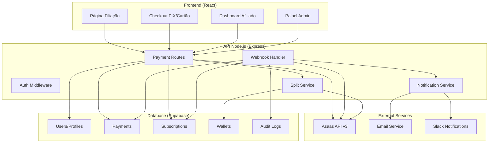
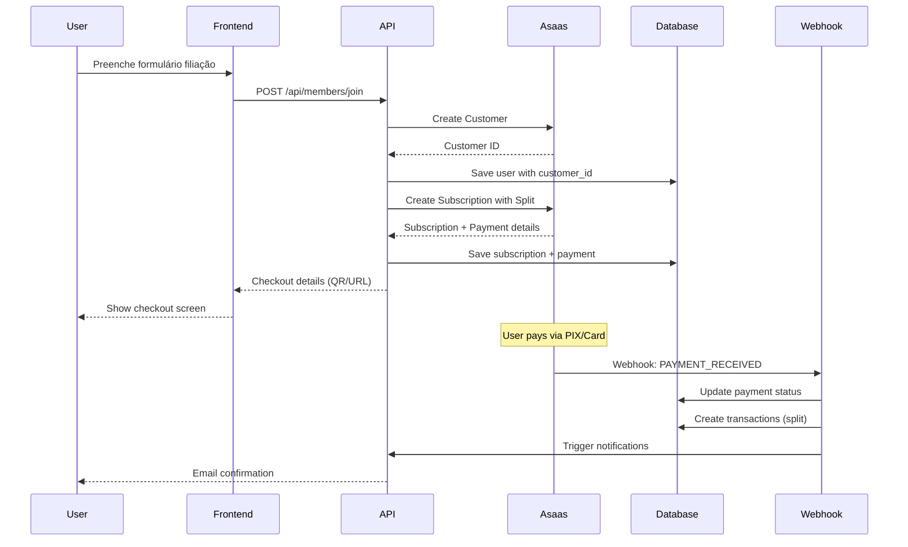
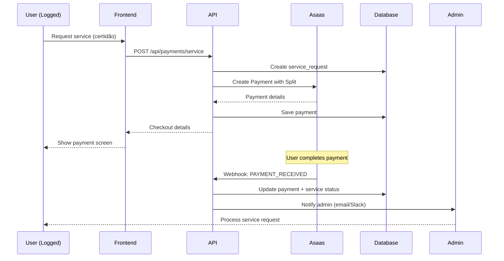

# Design Document - Sistema de Pagamentos Asaas

## Overview

O sistema de pagamentos será implementado como uma arquitetura de microsserviços com Node.js, integrando diretamente com a API Asaas v3 para processamento de pagamentos PIX/cartão, assinaturas recorrentes e split automático entre múltiplas wallets. A solução substitui completamente o sistema anterior removido e implementa todas as funcionalidades de forma robusta e escalável.

## Architecture

### High-Level Architecture



### Component Architecture

**1. API Gateway Layer**
- Express.js server com middleware de autenticação
- Rate limiting e validação de entrada
- CORS configurado para domínios específicos
- Logging estruturado com Winston

**2. Business Logic Layer**
- Payment Service: criação de customers/payments/subscriptions
- Split Service: cálculo e aplicação de divisão de pagamentos
- Webhook Service: processamento de eventos Asaas com retry automático
- Notification Service: alertas para admins e usuários com payload padronizado
- Reconciliation Service: conciliação periódica de splits com Asaas
- Token Service: gestão segura de tokens de cartão para renovações
- Affiliate Service: validação obrigatória de wallets para ativação

**3. Data Access Layer**
- Supabase client para operações de banco
- Redis para cache de sessões e idempotência
- Audit logging para compliance

## Components and Interfaces

### API Endpoints

#### Public Endpoints
```typescript
// Filiação de novos membros
POST /api/members/join
Request: {
  name: string;
  email: string;
  phone: string;
  cpfCnpj?: string;
  cargo: string;
  plan_id: string;
  payment_method: 'PIX' | 'CREDIT_CARD';
  affiliate_code?: string;
}
Response: {
  success: boolean;
  customer_id: string;
  subscription_id?: string;
  payment_id?: string;
  checkout_url?: string;
  pix_qr_code?: string;
  pix_payload?: string;
}

// Serviços pontuais
POST /api/payments/service
Request: {
  service_type: 'certidao' | 'regularizacao';
  service_data: object;
  payment_method: 'PIX' | 'CREDIT_CARD';
}
Response: {
  success: boolean;
  payment_id: string;
  checkout_url?: string;
  pix_qr_code?: string;
  pix_payload?: string;
}

// Tokenização de cartão
POST /api/cards/tokenize
Request: {
  card_number: string;
  card_holder: string;
  expiry_month: string;
  expiry_year: string;
  cvv: string;
}
Response: {
  success: boolean;
  token: string;
}

// Status de pagamento
GET /api/payments/:id/status
Response: {
  payment_id: string;
  status: 'PENDING' | 'RECEIVED' | 'CONFIRMED' | 'FAILED';
  amount: number;
  split_details?: object;
}
```

#### Webhook Endpoint
```typescript
POST /webhook/asaas
Request: {
  event: string;
  payment?: object;
  subscription?: object;
  dateCreated: string;
}
Response: {
  success: boolean;
  processed: boolean;
}
```

#### Admin Endpoints
```typescript
// Cadastro de wallet de afiliado (obrigatório para ativação)
PUT /api/affiliate/wallet
Request: {
  wallet_id: string;
}
Response: {
  success: boolean;
  validated: boolean;
  affiliate_activated: boolean;
}

// Persistir token de cartão para assinaturas
POST /api/subscriptions/save-card-token
Request: {
  subscription_id: string;
  card_token: string;
}
Response: {
  success: boolean;
  token_saved: boolean;
}

// Notificações internas (payload padronizado)
POST /internal/admin/notify
Request: {
  type: 'service_paid' | 'subscription_created' | 'payment_failed';
  service_id?: string;
  user_id: string;
  payment_id: string;
  service_type?: 'certidao' | 'regularizacao';
  amount: number; // em centavos
}

// Conciliação de splits
POST /internal/reconcile/splits
Request: {
  payment_ids?: string[];
  date_range?: { start: string; end: string };
}
Response: {
  success: boolean;
  reconciled_count: number;
  discrepancies: object[];
}
```

### Asaas API Integration

#### Customer Creation
```typescript
// POST https://api.asaas.com/v3/customers
const createCustomer = {
  name: "João Silva",
  email: "joao@exemplo.com",
  phone: "5591999999999",
  cpfCnpj: "00000000000",
  externalReference: "user_{USER_ID}"
}
```

#### Subscription with Split
```typescript
// POST https://api.asaas.com/v3/subscriptions
const createSubscription = {
  customer: "cus_XXX",
  billingType: "PIX", // or "CREDIT_CARD"
  nextDueDate: "2025-10-05",
  value: 199.90,
  cycle: "MONTHLY", // or "ANNUAL"
  description: "Assinatura Plano PRO - Cargo Presbítero",
  split: [
    { walletId: "wallet_comademig", percentage: 40 },
    { walletId: "wallet_renum", percentage: 40 },
    { walletId: "wallet_affiliate", percentage: 20 }
  ],
  externalReference: "subscription_user_{USER_ID}"
}
```

#### One-time Payment with Split
```typescript
// POST https://api.asaas.com/v3/payments
const createPayment = {
  customer: "cus_XXX",
  billingType: "PIX",
  dueDate: "2025-09-10",
  value: 49.90,
  description: "Solicitação de certidão - user_{USER_ID}",
  externalReference: "service_certidao_{REQ_ID}",
  split: [
    { walletId: "wallet_comademig", percentage: 40 },
    { walletId: "wallet_renum", percentage: 40 },
    { walletId: "wallet_affiliate", percentage: 20 }
  ]
}
```

## Data Models

### Database Schema

```sql
-- Tabela de usuários (estende profiles existente)
ALTER TABLE profiles ADD COLUMN IF NOT EXISTS asaas_customer_id VARCHAR(255);
ALTER TABLE profiles ADD COLUMN IF NOT EXISTS affiliate_wallet_id VARCHAR(255);

-- Planos de assinatura
CREATE TABLE subscription_plans (
  id UUID PRIMARY KEY DEFAULT gen_random_uuid(),
  name VARCHAR(255) NOT NULL,
  description TEXT,
  price_cents INTEGER NOT NULL,
  billing_cycle VARCHAR(20) NOT NULL CHECK (billing_cycle IN ('MONTHLY', 'ANNUAL')),
  asaas_plan_meta JSONB,
  is_active BOOLEAN DEFAULT true,
  created_at TIMESTAMP DEFAULT NOW(),
  updated_at TIMESTAMP DEFAULT NOW()
);

-- Assinaturas
CREATE TABLE subscriptions (
  id UUID PRIMARY KEY DEFAULT gen_random_uuid(),
  user_id UUID REFERENCES profiles(id) ON DELETE CASCADE,
  plan_id UUID REFERENCES subscription_plans(id),
  asaas_subscription_id VARCHAR(255) UNIQUE NOT NULL,
  status VARCHAR(20) DEFAULT 'pending' CHECK (status IN ('active', 'pending', 'canceled', 'past_due')),
  next_due_date DATE,
  asaas_card_token VARCHAR(255), -- Token persistido para renovações automáticas
  created_at TIMESTAMP DEFAULT NOW(),
  updated_at TIMESTAMP DEFAULT NOW()
);

-- Solicitações de serviços
CREATE TABLE services_requests (
  id UUID PRIMARY KEY DEFAULT gen_random_uuid(),
  user_id UUID REFERENCES profiles(id) ON DELETE CASCADE,
  service_type VARCHAR(50) NOT NULL CHECK (service_type IN ('certidao', 'regularizacao')),
  payload JSONB NOT NULL,
  status VARCHAR(20) DEFAULT 'pending' CHECK (status IN ('pending', 'paid', 'processing', 'done')),
  admin_note TEXT,
  created_at TIMESTAMP DEFAULT NOW(),
  updated_at TIMESTAMP DEFAULT NOW()
);

-- Pagamentos
CREATE TABLE payments (
  id UUID PRIMARY KEY DEFAULT gen_random_uuid(),
  user_id UUID REFERENCES profiles(id) ON DELETE SET NULL,
  asaas_payment_id VARCHAR(255) UNIQUE NOT NULL,
  type VARCHAR(20) NOT NULL CHECK (type IN ('pix', 'credit_card')),
  amount_cents INTEGER NOT NULL,
  status VARCHAR(20) DEFAULT 'PENDING' CHECK (status IN ('PENDING', 'RECEIVED', 'CONFIRMED', 'FAILED')),
  split JSONB,
  metadata JSONB,
  created_at TIMESTAMP DEFAULT NOW(),
  updated_at TIMESTAMP DEFAULT NOW()
);

-- Wallets para split
CREATE TABLE wallets (
  id UUID PRIMARY KEY DEFAULT gen_random_uuid(),
  owner_type VARCHAR(20) NOT NULL CHECK (owner_type IN ('COMADEMIG', 'RENUM', 'AFFILIATE')),
  wallet_id_asaas VARCHAR(255) UNIQUE NOT NULL,
  description TEXT,
  is_active BOOLEAN DEFAULT true,
  created_at TIMESTAMP DEFAULT NOW()
);

-- Transações (bookkeeping)
CREATE TABLE transactions (
  id UUID PRIMARY KEY DEFAULT gen_random_uuid(),
  payment_id UUID REFERENCES payments(id) ON DELETE CASCADE,
  amount_cents INTEGER NOT NULL,
  recipient_wallet_id VARCHAR(255),
  share_percentage DECIMAL(5,2),
  share_amount_cents INTEGER,
  settled_at TIMESTAMP,
  reconciled BOOLEAN DEFAULT false, -- Para controle de conciliação
  reconciled_at TIMESTAMP,
  asaas_split_data JSONB, -- Dados reais do split retornados pelo Asaas
  created_at TIMESTAMP DEFAULT NOW()
);

-- Eventos de webhook (idempotência)
CREATE TABLE webhook_events (
  id UUID PRIMARY KEY DEFAULT gen_random_uuid(),
  asaas_event_id VARCHAR(255) UNIQUE NOT NULL,
  event_type VARCHAR(100) NOT NULL,
  payload JSONB NOT NULL,
  processed BOOLEAN DEFAULT false,
  processed_at TIMESTAMP,
  retry_count INTEGER DEFAULT 0,
  last_retry_at TIMESTAMP,
  error_message TEXT,
  created_at TIMESTAMP DEFAULT NOW()
);

-- Logs de auditoria
CREATE TABLE audit_logs (
  id UUID PRIMARY KEY DEFAULT gen_random_uuid(),
  action VARCHAR(100) NOT NULL,
  entity_type VARCHAR(50),
  entity_id VARCHAR(255),
  user_id UUID REFERENCES profiles(id) ON DELETE SET NULL,
  payload JSONB,
  ip_address INET,
  user_agent TEXT,
  created_at TIMESTAMP DEFAULT NOW()
);
```

### Data Flow Diagrams

#### Filiação Flow


#### Service Payment Flow


## Error Handling

### Error Categories and Responses

**1. Validation Errors (400)**
```typescript
{
  success: false,
  error: "VALIDATION_ERROR",
  message: "Invalid input data",
  details: {
    field: "email",
    reason: "Invalid email format"
  }
}
```

**2. Asaas API Errors (502)**
```typescript
{
  success: false,
  error: "ASAAS_API_ERROR",
  message: "External service unavailable",
  details: {
    asaas_error: "Customer creation failed",
    retry_after: 30
  }
}
```

**3. Split Configuration Errors (422)**
```typescript
{
  success: false,
  error: "SPLIT_ERROR",
  message: "Invalid wallet configuration",
  details: {
    invalid_wallets: ["wallet_affiliate_123"],
    reason: "Wallet not found or inactive"
  }
}
```

### Retry Logic and Circuit Breaker

```typescript
// Implementar retry exponential backoff para Asaas API
const retryConfig = {
  retries: 3,
  factor: 2,
  minTimeout: 1000,
  maxTimeout: 10000
};

// Circuit breaker para proteger contra falhas em cascata
const circuitBreakerConfig = {
  timeout: 5000,
  errorThresholdPercentage: 50,
  resetTimeout: 30000
};
```

## Testing Strategy

### Unit Tests
- Validação de entrada de dados
- Lógica de cálculo de split
- Formatação de payloads Asaas
- Processamento de webhooks

### Integration Tests
- Fluxo completo de filiação (sandbox)
- Criação de pagamentos com split
- Processamento de webhooks reais
- Validação de idempotência

### End-to-End Tests
- Jornada completa do usuário
- Testes de pagamento PIX e cartão
- Verificação de notificações
- Testes de falha e recuperação

### Performance Tests
- Load testing dos endpoints
- Stress testing do webhook handler
- Teste de concorrência para idempotência
- Monitoramento de latência Asaas API

## Security Considerations

### Authentication & Authorization
- JWT tokens para endpoints protegidos
- API keys seguras para Asaas (rotação regular)
- Rate limiting por IP e usuário
- Validação de origem para webhooks

### Data Protection
- Tokenização de cartões (nunca armazenar dados sensíveis)
- Criptografia de logs de auditoria
- Sanitização de dados de entrada
- Compliance com LGPD

### Webhook Security
- Validação de assinatura Asaas (se disponível)
- Whitelist de IPs Asaas
- Timeout configurável para processamento
- Logging detalhado para auditoria

## Deployment and Infrastructure

### Environment Configuration
```typescript
// Configurações por ambiente
const config = {
  development: {
    asaas_api_url: 'https://api-sandbox.asaas.com/v3',
    asaas_api_key: process.env.ASAAS_SANDBOX_KEY,
    webhook_url: 'https://dev.comademig.com/webhook/asaas'
  },
  production: {
    asaas_api_url: 'https://api.asaas.com/v3',
    asaas_api_key: process.env.ASAAS_PRODUCTION_KEY,
    webhook_url: 'https://comademig.com/webhook/asaas'
  }
};
```

### Monitoring and Observability
- Structured logging com Winston
- Métricas de performance (Prometheus)
- Health checks para dependências
- Alertas para falhas críticas
- Dashboard de transações em tempo real