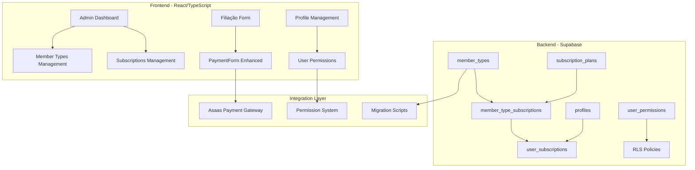

# Sistema de Tipos de Membro e Assinaturas - Design Document

## Overview

Este documento detalha o design técnico para implementar um sistema robusto de gerenciamento de tipos de membro e assinaturas na COMADEMIG. O sistema permitirá que administradores configurem tipos de membro personalizados e assinaturas com permissões específicas, integrando essas funcionalidades ao processo de filiação de forma transparente e mantendo total compatibilidade com o sistema existente.

## Architecture

### Arquitetura Geral



### Princípios Arquiteturais

1. **Compatibilidade Regressiva**: Sistema híbrido mantendo funcionalidades existentes
2. **Separação de Responsabilidades**: Módulos independentes mas interconectados
3. **Extensibilidade**: Estrutura preparada para futuras expansões
4. **Auditabilidade**: Logs completos de todas as operações
5. **Performance**: Índices otimizados e consultas eficientes

## Components and Interfaces

### Componentes Frontend

#### 1. Módulo de Tipos de Membro

**Localização**: `src/components/admin/member-types/`

```typescript
// MemberTypesManagement.tsx
interface MemberType {
  id: string;
  name: string;
  description: string;
  created_at: string;
  updated_at: string;
  _count?: {
    users: number;
    subscriptions: number;
  };
}

interface MemberTypesManagementProps {
  onTypeCreated?: (type: MemberType) => void;
  onTypeUpdated?: (type: MemberType) => void;
  onTypeDeleted?: (typeId: string) => void;
}
```

**Subcomponentes**:
- `MemberTypesList.tsx` - Lista com busca, filtros e paginação
- `MemberTypeForm.tsx` - Formulário de criação/edição
- `MemberTypeDeleteModal.tsx` - Modal de confirmação de exclusão
- `MemberTypeStats.tsx` - Estatísticas de uso

#### 2. Módulo de Assinaturas

**Localização**: `src/components/admin/subscriptions/`

```typescript
// SubscriptionsManagement.tsx
interface SubscriptionPlan {
  id: string;
  name: string;
  price: number;
  recurrence: 'monthly' | 'semestral' | 'annual';
  permissions: {
    manage_events: boolean;
    manage_news: boolean;
    manage_media: boolean;
    [key: string]: boolean;
  };
  member_types: string[]; // IDs dos tipos permitidos
  created_at: string;
  updated_at: string;
}

interface SubscriptionsManagementProps {
  onPlanCreated?: (plan: SubscriptionPlan) => void;
  onPlanUpdated?: (plan: SubscriptionPlan) => void;
  onPlanDeleted?: (planId: string) => void;
}
```

**Subcomponentes**:
- `SubscriptionsList.tsx` - Lista de planos com filtros
- `SubscriptionForm.tsx` - Formulário com seção de permissões
- `PermissionsSelector.tsx` - Checkboxes para permissões
- `MemberTypeSelector.tsx` - Seleção de tipos permitidos
- `PricingDisplay.tsx` - Exibição formatada de preços

#### 3. PaymentForm Aprimorado

**Localização**: `src/components/payments/PaymentFormEnhanced.tsx`

```typescript
interface PaymentFormEnhancedProps extends PaymentFormProps {
  showMemberTypeSelection?: boolean;
  showSubscriptionSelection?: boolean;
  onMemberTypeChange?: (typeId: string) => void;
  onSubscriptionChange?: (planId: string) => void;
  availableSubscriptions?: SubscriptionPlan[];
}

interface FiliacaoFormData {
  // Dados pessoais existentes
  nome_completo: string;
  cpf: string;
  telefone: string;
  // Novos campos
  member_type_id: string;
  subscription_plan_id: string;
  // Campos calculados
  cargo_display: string; // Nome do tipo selecionado
  subscription_display: string; // Nome da assinatura
}
```

#### 4. Hooks Personalizados

```typescript
// useMemberTypes.ts
export const useMemberTypes = () => {
  const { data: memberTypes, isLoading, error, refetch } = useSupabaseQuery(
    ['member-types'],
    async () => {
      const { data, error } = await supabase
        .from('member_types')
        .select('*')
        .order('name');
      
      if (error) throw error;
      return data;
    }
  );

  const createMemberType = useSupabaseMutation(/* ... */);
  const updateMemberType = useSupabaseMutation(/* ... */);
  const deleteMemberType = useSupabaseMutation(/* ... */);

  return {
    memberTypes,
    isLoading,
    error,
    refetch,
    createMemberType,
    updateMemberType,
    deleteMemberType
  };
};

// useSubscriptionPlans.ts
export const useSubscriptionPlans = (memberTypeId?: string) => {
  // Filtra planos baseado no tipo de membro se fornecido
  const { data: plans, isLoading } = useSupabaseQuery(
    ['subscription-plans', memberTypeId],
    async () => {
      let query = supabase
        .from('subscription_plans')
        .select(`
          *,
          member_type_subscriptions!inner(
            member_type_id
          )
        `);

      if (memberTypeId) {
        query = query.eq('member_type_subscriptions.member_type_id', memberTypeId);
      }

      const { data, error } = await query;
      if (error) throw error;
      return data;
    }
  );

  return { plans, isLoading };
};

// useUserPermissions.ts
export const useUserPermissions = () => {
  const { user } = useAuth();
  
  const { data: permissions } = useSupabaseQuery(
    ['user-permissions', user?.id],
    async () => {
      if (!user) return {};

      const { data, error } = await supabase
        .from('user_subscriptions')
        .select(`
          subscription_plans(permissions)
        `)
        .eq('user_id', user.id)
        .eq('status', 'active')
        .single();

      if (error) return {};
      return data?.subscription_plans?.permissions || {};
    }
  );

  const hasPermission = (permission: string): boolean => {
    return permissions?.[permission] === true;
  };

  return { permissions, hasPermission };
};
```

### Integração com Sistema Existente

#### 1. Atualização do DashboardSidebar

```typescript
// Adicionar novos itens de menu (SEM alterar existentes)
const adminMenuItems = [
  // ... itens existentes preservados
  {
    title: "Tipos de Membro",
    href: "/dashboard/admin/member-types",
    icon: Users,
    permission: "manage_users"
  },
  {
    title: "Assinaturas",
    href: "/dashboard/admin/subscriptions", 
    icon: CreditCard,
    permission: "manage_finance"
  }
];
```

#### 2. Adaptação do PerfilCompleto

```typescript
// Tornar campo cargo somente leitura se preenchido via filiação
const isCargoReadonly = profile?.member_type_id ? true : false;

<Input
  id="cargo"
  value={formData.cargo}
  onChange={(e) => handleInputChange('cargo', e.target.value)}
  disabled={!isEditing || isCargoReadonly}
  placeholder={isCargoReadonly ? "Definido durante a filiação" : ""}
/>
```

## Data Models

### Modelo de Dados Completo

```sql
-- 1. Tipos de Membro Personalizados
CREATE TABLE public.member_types (
    id UUID PRIMARY KEY DEFAULT gen_random_uuid(),
    name VARCHAR(100) UNIQUE NOT NULL,
    description TEXT,
    is_active BOOLEAN DEFAULT true,
    sort_order INTEGER DEFAULT 0,
    created_at TIMESTAMP WITH TIME ZONE DEFAULT now(),
    updated_at TIMESTAMP WITH TIME ZONE DEFAULT now(),
    created_by UUID REFERENCES auth.users(id),
    
    CONSTRAINT member_types_name_check CHECK (length(trim(name)) > 0)
);

-- 2. Planos de Assinatura
CREATE TABLE public.subscription_plans (
    id UUID PRIMARY KEY DEFAULT gen_random_uuid(),
    name VARCHAR(100) UNIQUE NOT NULL,
    description TEXT,
    price DECIMAL(10,2) NOT NULL CHECK (price >= 0),
    recurrence VARCHAR(20) NOT NULL CHECK (recurrence IN ('monthly', 'semestral', 'annual')),
    permissions JSONB NOT NULL DEFAULT '{}',
    is_active BOOLEAN DEFAULT true,
    sort_order INTEGER DEFAULT 0,
    created_at TIMESTAMP WITH TIME ZONE DEFAULT now(),
    updated_at TIMESTAMP WITH TIME ZONE DEFAULT now(),
    created_by UUID REFERENCES auth.users(id),
    
    CONSTRAINT subscription_plans_name_check CHECK (length(trim(name)) > 0)
);

-- 3. Relacionamento Tipos de Membro ↔ Assinaturas
CREATE TABLE public.member_type_subscriptions (
    id UUID PRIMARY KEY DEFAULT gen_random_uuid(),
    member_type_id UUID NOT NULL REFERENCES member_types(id) ON DELETE CASCADE,
    subscription_plan_id UUID NOT NULL REFERENCES subscription_plans(id) ON DELETE CASCADE,
    created_at TIMESTAMP WITH TIME ZONE DEFAULT now(),
    created_by UUID REFERENCES auth.users(id),
    
    UNIQUE(member_type_id, subscription_plan_id)
);

-- 4. Assinaturas Ativas dos Usuários
CREATE TABLE public.user_subscriptions (
    id UUID PRIMARY KEY DEFAULT gen_random_uuid(),
    user_id UUID NOT NULL REFERENCES auth.users(id) ON DELETE CASCADE,
    subscription_plan_id UUID NOT NULL REFERENCES subscription_plans(id),
    member_type_id UUID NOT NULL REFERENCES member_types(id),
    status VARCHAR(20) DEFAULT 'active' CHECK (status IN ('active', 'expired', 'cancelled', 'pending')),
    payment_id VARCHAR(255), -- ID do pagamento na Asaas
    started_at TIMESTAMP WITH TIME ZONE DEFAULT now(),
    expires_at TIMESTAMP WITH TIME ZONE,
    created_at TIMESTAMP WITH TIME ZONE DEFAULT now(),
    updated_at TIMESTAMP WITH TIME ZONE DEFAULT now(),
    
    -- Índices para performance
    INDEX idx_user_subscriptions_user_id (user_id),
    INDEX idx_user_subscriptions_status (status),
    INDEX idx_user_subscriptions_expires_at (expires_at)
);

-- 5. Atualização da tabela profiles (compatibilidade)
ALTER TABLE public.profiles 
ADD COLUMN member_type_id UUID REFERENCES member_types(id),
ADD COLUMN subscription_source VARCHAR(20) DEFAULT 'manual' CHECK (subscription_source IN ('manual', 'filiacao'));

-- 6. Tabela de Auditoria
CREATE TABLE public.member_system_audit (
    id UUID PRIMARY KEY DEFAULT gen_random_uuid(),
    table_name VARCHAR(50) NOT NULL,
    record_id UUID NOT NULL,
    action VARCHAR(20) NOT NULL CHECK (action IN ('INSERT', 'UPDATE', 'DELETE')),
    old_values JSONB,
    new_values JSONB,
    user_id UUID REFERENCES auth.users(id),
    created_at TIMESTAMP WITH TIME ZONE DEFAULT now(),
    
    INDEX idx_audit_table_record (table_name, record_id),
    INDEX idx_audit_user_id (user_id),
    INDEX idx_audit_created_at (created_at)
);
```

### Índices de Performance

```sql
-- Índices otimizados para consultas frequentes
CREATE INDEX idx_member_types_active ON member_types(is_active, sort_order);
CREATE INDEX idx_subscription_plans_active ON subscription_plans(is_active, sort_order);
CREATE INDEX idx_member_type_subs_type ON member_type_subscriptions(member_type_id);
CREATE INDEX idx_member_type_subs_plan ON member_type_subscriptions(subscription_plan_id);
CREATE INDEX idx_profiles_member_type ON profiles(member_type_id);
```

### Triggers de Auditoria

```sql
-- Função de auditoria
CREATE OR REPLACE FUNCTION audit_member_system()
RETURNS TRIGGER AS $$
BEGIN
    IF TG_OP = 'INSERT' THEN
        INSERT INTO member_system_audit (table_name, record_id, action, new_values, user_id)
        VALUES (TG_TABLE_NAME, NEW.id, 'INSERT', to_jsonb(NEW), auth.uid());
        RETURN NEW;
    ELSIF TG_OP = 'UPDATE' THEN
        INSERT INTO member_system_audit (table_name, record_id, action, old_values, new_values, user_id)
        VALUES (TG_TABLE_NAME, NEW.id, 'UPDATE', to_jsonb(OLD), to_jsonb(NEW), auth.uid());
        RETURN NEW;
    ELSIF TG_OP = 'DELETE' THEN
        INSERT INTO member_system_audit (table_name, record_id, action, old_values, user_id)
        VALUES (TG_TABLE_NAME, OLD.id, 'DELETE', to_jsonb(OLD), auth.uid());
        RETURN OLD;
    END IF;
END;
$$ LANGUAGE plpgsql SECURITY DEFINER;

-- Aplicar triggers
CREATE TRIGGER audit_member_types AFTER INSERT OR UPDATE OR DELETE ON member_types
    FOR EACH ROW EXECUTE FUNCTION audit_member_system();

CREATE TRIGGER audit_subscription_plans AFTER INSERT OR UPDATE OR DELETE ON subscription_plans
    FOR EACH ROW EXECUTE FUNCTION audit_member_system();

CREATE TRIGGER audit_user_subscriptions AFTER INSERT OR UPDATE OR DELETE ON user_subscriptions
    FOR EACH ROW EXECUTE FUNCTION audit_member_system();
```

## Error Handling

### Estratégias de Tratamento de Erro

#### 1. Validação Frontend

```typescript
// Validação com Zod
const memberTypeSchema = z.object({
  name: z.string()
    .min(2, "Nome deve ter pelo menos 2 caracteres")
    .max(100, "Nome não pode exceder 100 caracteres")
    .regex(/^[a-zA-ZÀ-ÿ\s]+$/, "Nome deve conter apenas letras e espaços"),
  description: z.string()
    .max(500, "Descrição não pode exceder 500 caracteres")
    .optional()
});

const subscriptionPlanSchema = z.object({
  name: z.string().min(2).max(100),
  price: z.number().min(0, "Preço deve ser positivo"),
  recurrence: z.enum(['monthly', 'semestral', 'annual']),
  permissions: z.record(z.boolean()),
  member_types: z.array(z.string().uuid())
});
```

#### 2. Tratamento de Erros de Banco

```typescript
// Hook com tratamento robusto
export const useMemberTypes = () => {
  const createMemberType = useSupabaseMutation(
    async (data: CreateMemberTypeData) => {
      const { data: result, error } = await supabase
        .from('member_types')
        .insert(data)
        .select()
        .single();

      if (error) {
        // Tratar erros específicos
        if (error.code === '23505') { // Unique violation
          throw new Error('Já existe um tipo de membro com este nome');
        }
        if (error.code === '23514') { // Check violation
          throw new Error('Dados inválidos fornecidos');
        }
        throw new Error(`Erro ao criar tipo de membro: ${error.message}`);
      }

      return result;
    },
    {
      onSuccess: (data) => {
        toast({
          title: "Tipo de membro criado",
          description: `${data.name} foi criado com sucesso`,
        });
      },
      onError: (error) => {
        toast({
          title: "Erro ao criar tipo de membro",
          description: error.message,
          variant: "destructive",
        });
      }
    }
  );

  return { createMemberType };
};
```

#### 3. Fallbacks e Recuperação

```typescript
// Sistema de fallback para compatibilidade
export const useCargoDisplay = (profile: Profile) => {
  const { data: memberType } = useSupabaseQuery(
    ['member-type', profile?.member_type_id],
    async () => {
      if (!profile?.member_type_id) return null;
      
      const { data, error } = await supabase
        .from('member_types')
        .select('name')
        .eq('id', profile.member_type_id)
        .single();
        
      return error ? null : data;
    },
    { enabled: !!profile?.member_type_id }
  );

  // Fallback: usar campo cargo tradicional se não houver tipo
  return memberType?.name || profile?.cargo || 'Membro';
};
```

## Testing Strategy

### Estratégia de Testes Abrangente

#### 1. Testes Unitários

```typescript
// __tests__/hooks/useMemberTypes.test.ts
describe('useMemberTypes', () => {
  it('should create member type successfully', async () => {
    const { result } = renderHook(() => useMemberTypes());
    
    await act(async () => {
      await result.current.createMemberType.mutateAsync({
        name: 'Pastor',
        description: 'Líder da igreja local'
      });
    });

    expect(result.current.createMemberType.isSuccess).toBe(true);
  });

  it('should handle duplicate name error', async () => {
    // Mock Supabase error
    mockSupabase.from.mockReturnValue({
      insert: () => ({
        select: () => ({
          single: () => Promise.resolve({
            data: null,
            error: { code: '23505', message: 'duplicate key value' }
          })
        })
      })
    });

    const { result } = renderHook(() => useMemberTypes());
    
    await expect(
      result.current.createMemberType.mutateAsync({
        name: 'Pastor',
        description: 'Test'
      })
    ).rejects.toThrow('Já existe um tipo de membro com este nome');
  });
});
```

#### 2. Testes de Integração

```typescript
// __tests__/integration/filiacao-flow.test.ts
describe('Fluxo de Filiação Completo', () => {
  it('should complete filiation with member type and subscription', async () => {
    // 1. Renderizar formulário de filiação
    render(<Filiacao />);
    
    // 2. Preencher dados pessoais
    await userEvent.type(screen.getByLabelText('Nome Completo'), 'João Silva');
    await userEvent.type(screen.getByLabelText('CPF'), '123.456.789-00');
    
    // 3. Selecionar tipo de membro
    await userEvent.click(screen.getByLabelText('Cargo Ministerial'));
    await userEvent.click(screen.getByText('Pastor'));
    
    // 4. Verificar se assinaturas foram filtradas
    expect(screen.getByText('Plano Liderança')).toBeInTheDocument();
    expect(screen.queryByText('Plano Básico')).not.toBeInTheDocument();
    
    // 5. Selecionar assinatura
    await userEvent.click(screen.getByText('Plano Liderança'));
    
    // 6. Finalizar pagamento
    await userEvent.click(screen.getByText('Finalizar Filiação'));
    
    // 7. Verificar criação de registros
    await waitFor(() => {
      expect(mockSupabase.from('user_subscriptions').insert).toHaveBeenCalledWith({
        user_id: expect.any(String),
        subscription_plan_id: expect.any(String),
        member_type_id: expect.any(String),
        status: 'active'
      });
    });
  });
});
```

#### 3. Testes de Migração

```typescript
// __tests__/migration/data-migration.test.ts
describe('Migração de Dados', () => {
  it('should migrate existing cargo data to member types', async () => {
    // Setup: dados existentes
    const existingProfiles = [
      { id: '1', cargo: 'Pastor', nome_completo: 'João' },
      { id: '2', cargo: 'Diácono', nome_completo: 'Pedro' },
      { id: '3', cargo: 'Pastor', nome_completo: 'Maria' }
    ];

    // Executar migração
    await runMigration('create_default_member_types');

    // Verificar tipos criados
    const memberTypes = await supabase
      .from('member_types')
      .select('*');
    
    expect(memberTypes.data).toHaveLength(2); // Pastor, Diácono
    expect(memberTypes.data.map(t => t.name)).toContain('Pastor');
    expect(memberTypes.data.map(t => t.name)).toContain('Diácono');

    // Verificar profiles atualizados
    const updatedProfiles = await supabase
      .from('profiles')
      .select('*, member_types(name)')
      .in('id', ['1', '2', '3']);

    expect(updatedProfiles.data[0].member_types.name).toBe('Pastor');
    expect(updatedProfiles.data[1].member_types.name).toBe('Diácono');
  });
});
```

#### 4. Testes E2E com Playwright

```typescript
// e2e/admin-member-management.spec.ts
test('Admin can manage member types', async ({ page }) => {
  // Login como admin
  await page.goto('/login');
  await page.fill('[data-testid="email"]', 'admin@comademig.org');
  await page.fill('[data-testid="password"]', 'password');
  await page.click('[data-testid="login-button"]');

  // Navegar para tipos de membro
  await page.click('text=Tipos de Membro');
  await expect(page).toHaveURL('/dashboard/admin/member-types');

  // Criar novo tipo
  await page.click('text=Novo Tipo');
  await page.fill('[data-testid="member-type-name"]', 'Evangelista');
  await page.fill('[data-testid="member-type-description"]', 'Ministro evangelista');
  await page.click('[data-testid="save-member-type"]');

  // Verificar criação
  await expect(page.locator('text=Evangelista')).toBeVisible();
  await expect(page.locator('text=Tipo criado com sucesso')).toBeVisible();
});
```

### Cobertura de Testes

- **Unitários**: 90%+ cobertura em hooks e utilitários
- **Integração**: Fluxos críticos completos
- **E2E**: Jornadas de usuário principais
- **Performance**: Testes de carga para consultas complexas

## Implementação Faseada

### Fase 1: Fundação (Módulo de Tipos de Membro)
- ✅ Criar tabela `member_types`
- ✅ Implementar CRUD administrativo
- ✅ Migrar dados existentes
- ✅ Testes unitários e integração

### Fase 2: Assinaturas (Módulo de Assinaturas)
- ✅ Criar tabelas de assinaturas
- ✅ Interface administrativa completa
- ✅ Sistema de permissões
- ✅ Relacionamentos tipos ↔ assinaturas

### Fase 3: Integração (Formulário de Filiação)
- ✅ Atualizar PaymentForm
- ✅ Lógica de filtro dinâmico
- ✅ Integração com Asaas
- ✅ Testes E2E completos

### Fase 4: Refinamento (Otimizações)
- ✅ Performance tuning
- ✅ UX improvements
- ✅ Documentação completa
- ✅ Treinamento de usuários

Este design garante uma implementação robusta, escalável e totalmente compatível com o sistema existente, seguindo todas as regras de preservação estabelecidas.