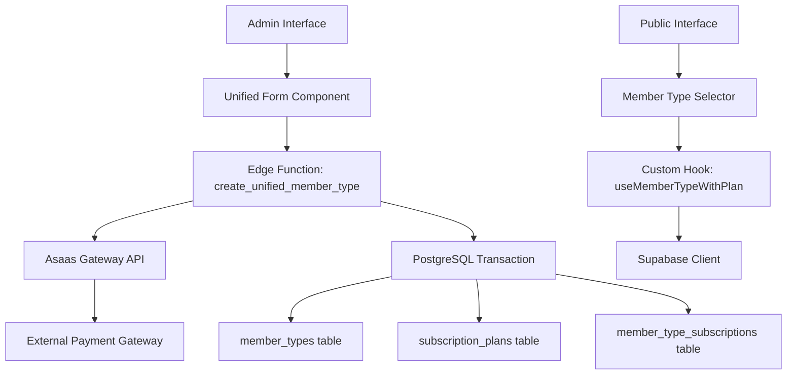

# Design Document

## Overview

Este documento detalha o design técnico para a unificação do sistema de tipos de membro e assinaturas do COMADEMIG. A solução implementa uma arquitetura baseada em Edge Functions do Supabase para garantir transações atômicas, mantendo a estrutura de dados existente enquanto unifica a experiência do usuário.

## Architecture

### High-Level Architecture



### Core Components

1. **Edge Function**: Orquestra a criação transacional
2. **Unified Form Component**: Interface administrativa unificada
3. **Custom Hook**: Busca e desnormalização de dados
4. **Member Type Selector**: Interface pública simplificada

## Components and Interfaces

### 1. Edge Function: create_unified_member_type

**Location**: `supabase/functions/create-unified-member-type/index.ts`

**Purpose**: Executar transação atômica para criação de tipo de membro com plano associado

**Input Schema**:
```typescript
interface CreateUnifiedMemberTypeRequest {
  // Member Type Data
  memberType: {
    name: string;
    description: string;
    order_of_exhibition: number;
    is_active: boolean;
  };
  
  // Subscription Plan Data
  subscriptionPlan: {
    plan_title: string;
    price: number;
    recurrence: 'Mensal' | 'Anual';
  };
  
  // Authentication
  adminUserId: string;
}
```

**Output Schema**:
```typescript
interface CreateUnifiedMemberTypeResponse {
  success: boolean;
  data?: {
    memberTypeId: string;
    subscriptionPlanId: string;
    gatewayPlanId: string;
  };
  error?: {
    code: string;
    message: string;
    details?: any;
  };
}
```

**Transaction Flow**:
1. Validate input data using Zod schema
2. Check uniqueness constraints
3. Create plan in Asaas Gateway
4. Begin PostgreSQL transaction
5. Insert into subscription_plans
6. Insert into member_types
7. Insert into member_type_subscriptions
8. Commit or rollback based on success

### 2. Unified Admin Form Component

**Location**: `src/components/admin/UnifiedMemberTypeForm.tsx`

**Purpose**: Formulário administrativo unificado para criação de tipos de membro com planos

**Key Features**:
- Seções separadas para dados do cargo e configuração financeira
- Validação em tempo real
- Feedback de unicidade
- Tratamento de erros específicos

**Form Sections**:
```typescript
interface FormData {
  // Cargo Section
  memberName: string;
  memberDescription: string;
  orderOfExhibition: number;
  
  // Financial Configuration Section
  planTitle: string;
  contributionValue: number;
  billingFrequency: 'Mensal' | 'Anual';
  
  // Optional Permissions Section
  permissions?: {
    can_manage_events?: boolean;
    // other permissions
  };
}
```

### 3. Custom Hook: useMemberTypeWithPlan

**Location**: `src/hooks/useMemberTypeWithPlan.ts`

**Purpose**: Buscar e desnormalizar dados de tipos de membro com planos associados

**Return Type**:
```typescript
interface UnifiedMemberType {
  id: string;
  name: string;
  description: string;
  order_of_exhibition: number;
  is_active: boolean;
  
  // Financial Data (denormalized)
  plan_id: string;
  plan_title: string;
  plan_value: number;
  plan_recurrence: 'Mensal' | 'Anual';
  plan_id_gateway: string;
}

interface UseMemberTypeWithPlanReturn {
  memberTypes: UnifiedMemberType[];
  isLoading: boolean;
  error: Error | null;
  refetch: () => void;
}
```

**Query Implementation**:
```sql
SELECT 
  mt.id,
  mt.name,
  mt.description,
  mt.order_of_exhibition,
  mt.is_active,
  sp.id as plan_id,
  sp.plan_title,
  sp.price as plan_value,
  sp.recurrence as plan_recurrence,
  sp.plan_id_gateway
FROM member_types mt
JOIN member_type_subscriptions mts ON mt.id = mts.member_type_id
JOIN subscription_plans sp ON mts.subscription_plan_id = sp.id
WHERE mt.is_active = true
ORDER BY mt.order_of_exhibition ASC
```

### 4. Public Member Type Selector

**Location**: `src/components/public/MemberTypeSelector.tsx`

**Purpose**: Seletor simplificado para usuários públicos com feedback automático

**Key Features**:
- Dropdown com tipos de membro ativos
- Resumo de cobrança automático
- Estado unificado para checkout

## Data Models

### Existing Tables (Preserved)

**member_types**:
```sql
CREATE TABLE member_types (
  id UUID PRIMARY KEY DEFAULT gen_random_uuid(),
  name VARCHAR(255) UNIQUE NOT NULL,
  description TEXT,
  order_of_exhibition INTEGER,
  is_active BOOLEAN DEFAULT true,
  created_at TIMESTAMP DEFAULT NOW(),
  updated_at TIMESTAMP DEFAULT NOW()
);
```

**subscription_plans**:
```sql
CREATE TABLE subscription_plans (
  id UUID PRIMARY KEY DEFAULT gen_random_uuid(),
  plan_title VARCHAR(255) UNIQUE NOT NULL,
  price DECIMAL(10,2) NOT NULL CHECK (price >= 25.00),
  recurrence VARCHAR(20) CHECK (recurrence IN ('Mensal', 'Anual')),
  plan_id_gateway VARCHAR(255),
  created_at TIMESTAMP DEFAULT NOW(),
  updated_at TIMESTAMP DEFAULT NOW()
);
```

**member_type_subscriptions**:
```sql
CREATE TABLE member_type_subscriptions (
  id UUID PRIMARY KEY DEFAULT gen_random_uuid(),
  member_type_id UUID REFERENCES member_types(id) ON DELETE CASCADE,
  subscription_plan_id UUID REFERENCES subscription_plans(id) ON DELETE CASCADE,
  created_at TIMESTAMP DEFAULT NOW(),
  UNIQUE(member_type_id, subscription_plan_id)
);
```

### New Constraints and Indexes

```sql
-- Ensure uniqueness constraints
ALTER TABLE member_types ADD CONSTRAINT unique_member_type_name UNIQUE (name);
ALTER TABLE subscription_plans ADD CONSTRAINT unique_plan_title UNIQUE (plan_title);

-- Add minimum value constraint
ALTER TABLE subscription_plans ADD CONSTRAINT min_price_check CHECK (price >= 25.00);

-- Add recurrence constraint
ALTER TABLE subscription_plans ADD CONSTRAINT valid_recurrence CHECK (recurrence IN ('Mensal', 'Anual'));

-- Performance indexes
CREATE INDEX idx_member_types_active ON member_types(is_active, order_of_exhibition);
CREATE INDEX idx_member_type_subscriptions_lookup ON member_type_subscriptions(member_type_id, subscription_plan_id);
```

## Error Handling

### Validation Errors

**Client-Side Validation**:
- Real-time field validation using Zod
- Immediate feedback for uniqueness constraints
- Format validation for currency and numeric fields

**Server-Side Validation**:
- Schema validation in Edge Function
- Database constraint validation
- Gateway API response validation

### Transaction Error Handling

**Error Categories**:
1. **Validation Errors**: Invalid input data
2. **Uniqueness Errors**: Duplicate names or titles
3. **Gateway Errors**: Asaas API failures
4. **Database Errors**: Transaction failures

**Error Response Format**:
```typescript
interface ErrorResponse {
  code: 'VALIDATION_ERROR' | 'UNIQUENESS_ERROR' | 'GATEWAY_ERROR' | 'DATABASE_ERROR';
  message: string;
  field?: string;
  details?: {
    constraint?: string;
    gatewayResponse?: any;
  };
}
```

### Rollback Strategy

**Transaction Rollback Triggers**:
- Gateway plan creation failure
- Database constraint violation
- Network connectivity issues
- Authentication failures

**Rollback Process**:
1. Catch any error during transaction
2. Execute PostgreSQL ROLLBACK
3. If gateway plan was created, attempt deletion
4. Log error details for debugging
5. Return structured error response

## Testing Strategy

### Unit Tests

**Edge Function Tests**:
- Input validation scenarios
- Transaction rollback scenarios
- Gateway integration mocking
- Error handling coverage

**Component Tests**:
- Form validation behavior
- State management
- Error display
- User interaction flows

**Hook Tests**:
- Data fetching scenarios
- Loading states
- Error states
- Cache invalidation

### Integration Tests

**End-to-End Scenarios**:
- Complete member type creation flow
- Public selection and checkout flow
- Error recovery scenarios
- Data consistency validation

**Database Tests**:
- Constraint validation
- Transaction atomicity
- Performance under load
- Data migration compatibility

### Performance Tests

**Load Testing**:
- Concurrent member type creation
- High-volume public queries
- Gateway API rate limits
- Database connection pooling

## Security Considerations

### Authentication and Authorization

**Admin Operations**:
- JWT token validation
- Admin role verification
- Rate limiting for creation operations
- Audit logging for all changes

**Public Operations**:
- Read-only access to active member types
- No sensitive data exposure
- Rate limiting for queries

### Data Validation

**Input Sanitization**:
- SQL injection prevention
- XSS protection in form inputs
- Type safety with TypeScript
- Schema validation with Zod

### Gateway Security

**API Key Management**:
- Secure storage in Supabase secrets
- Environment-specific configurations
- Rotation procedures
- Error message sanitization

## Migration Strategy

### Backward Compatibility

**Existing Data**:
- All current member types remain functional
- Existing subscription plans continue working
- Current user associations preserved
- No breaking changes to public APIs

### Deployment Plan

**Phase 1**: Deploy Edge Function and database constraints
**Phase 2**: Update admin interface with unified form
**Phase 3**: Update public interface with simplified selector
**Phase 4**: Monitor and optimize performance

### Rollback Plan

**Emergency Rollback**:
- Revert to separate form interfaces
- Disable Edge Function
- Restore original menu structure
- Maintain data integrity throughout