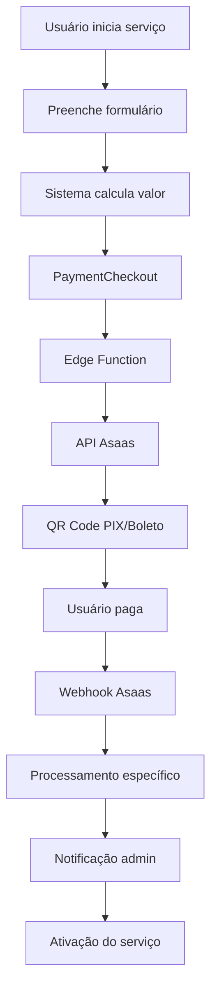

# 📚 DOCUMENTAÇÃO COMPLETA - SISTEMA DE PAGAMENTOS COMADEMIG

## 🎯 Visão Geral

Este documento contém a documentação completa do sistema de pagamentos integrado do COMADEMIG, implementado através de 5 fases de desenvolvimento que corrigiram e otimizaram todos os serviços de pagamento.

## 📋 Índice

1. [Arquitetura do Sistema](#arquitetura-do-sistema)
2. [Serviços Implementados](#serviços-implementados)
3. [Fluxos de Pagamento](#fluxos-de-pagamento)
4. [Painel Administrativo](#painel-administrativo)
5. [Sistema de Segurança](#sistema-de-segurança)
6. [Guia de Troubleshooting](#guia-de-troubleshooting)
7. [Manual de Operação](#manual-de-operação)
8. [Manutenção e Monitoramento](#manutenção-e-monitoramento)

---

## 🏗️ Arquitetura do Sistema

### Componentes Principais

```
┌─────────────────┐    ┌─────────────────┐    ┌─────────────────┐
│   Frontend      │    │   Backend       │    │   Pagamentos    │
│   (React)       │    │   (Supabase)    │    │   (Asaas)       │
├─────────────────┤    ├─────────────────┤    ├─────────────────┤
│ • Filiação      │◄──►│ • Edge Functions│◄──►│ • API Gateway   │
│ • Certidões     │    │ • Database      │    │ • Webhooks      │
│ • Regularização │    │ • Auth          │    │ • PIX/Boleto    │
│ • Admin Panel   │    │ • RLS Policies  │    │ • Split Payment │
└─────────────────┘    └─────────────────┘    └─────────────────┘
```

### Tecnologias Utilizadas

- **Frontend**: React 18 + TypeScript + Vite
- **Backend**: Supabase (PostgreSQL + Edge Functions)
- **Pagamentos**: Gateway Asaas
- **Autenticação**: Supabase Auth
- **Hospedagem**: Lovable (deploy automático)

---

## 🛠️ Serviços Implementados

### 1. Filiação (Fase 4)
**Status**: ✅ Totalmente implementado e otimizado

**Funcionalidades**:
- Seleção de cargo ministerial
- Escolha de plano de assinatura
- Pagamento via PIX/Boleto
- Ativação automática de assinatura
- Sistema de retry para falhas

**Arquivos Principais**:
- `src/pages/Filiacao.tsx`
- `src/hooks/useUserSubscriptions.ts`
- `src/hooks/useSubscriptionRetry.ts`
- `src/components/filiacao/SubscriptionStatus.tsx`

### 2. Certidões (Fase 2)
**Status**: ✅ Totalmente implementado

**Funcionalidades**:
- Solicitação de diferentes tipos de certidão
- Cálculo automático de valores
- Pagamento integrado
- Painel administrativo para aprovação
- Geração de protocolo automático

**Arquivos Principais**:
- `src/hooks/useCertidoesWithPayment.ts`
- `src/components/certidoes/FormSolicitacaoCertidao.tsx`
- `src/components/certidoes/AdminCertidoes.tsx`
- `src/components/certidoes/AdminAprovacao.tsx`

### 3. Regularização (Fase 3)
**Status**: ✅ Totalmente implementado

**Funcionalidades**:
- Seleção de serviços de regularização
- Cálculo de valores com descontos
- Pagamento integrado
- Painel administrativo
- Processamento de solicitações

**Arquivos Principais**:
- `src/hooks/useRegularizacaoWithPayment.ts`
- `src/pages/dashboard/CheckoutRegularizacao.tsx`
- `src/components/regularizacao/AdminRegularizacao.tsx`

---

## 💳 Fluxos de Pagamento

### Fluxo Unificado de Pagamento



### Edge Functions

#### 1. asaas-create-payment
**Localização**: `supabase/functions/asaas-create-payment/index.ts`

**Funcionalidades**:
- Criação de cobranças no Asaas
- Validação de dados
- Retry logic
- Suporte a todos os tipos de serviço
- Geração de QR Code PIX

**Parâmetros**:
```typescript
{
  customer: {
    name: string;
    email: string;
    cpfCnpj: string;
    phone?: string;
  };
  billingType: 'PIX' | 'BOLETO' | 'CREDIT_CARD';
  value: number;
  dueDate: string;
  description: string;
  tipoCobranca: 'filiacao' | 'certidao' | 'regularizacao';
}
```

#### 2. asaas-webhook
**Localização**: `supabase/functions/asaas-webhook/index.ts`

**Funcionalidades**:
- Processamento de webhooks do Asaas
- Validações de segurança
- Rate limiting
- Processamento específico por tipo de serviço
- Criação de notificações administrativas

---

## 🎛️ Painel Administrativo

### Estrutura de Navegação

```
Dashboard Admin
├── Gerenciar Usuários
├── Tipos de Membro
├── Assinaturas
├── Regularização ← NOVO
├── Notificações ← NOVO
├── Diagnóstico do Sistema
├── Atendimento ao Membro
└── Gerenciar Conteúdo
```

### Painéis Específicos

#### 1. AdminCertidoes
**Localização**: `src/components/certidoes/AdminCertidoes.tsx`

**Funcionalidades**:
- Visualização de solicitações pagas
- Aprovação/rejeição de certidões
- Filtros por status
- Histórico de processamento

#### 2. AdminRegularizacao
**Localização**: `src/components/regularizacao/AdminRegularizacao.tsx`

**Funcionalidades**:
- Gestão de solicitações de regularização
- Atualização de status
- Visualização de dados de pagamento
- Processamento administrativo

#### 3. AdminNotificationDashboard
**Localização**: `src/components/admin/AdminNotificationDashboard.tsx`

**Funcionalidades**:
- Central de notificações administrativas
- Dashboard de solicitações pendentes
- Estatísticas em tempo real
- Histórico de notificações

---

## 🔒 Sistema de Segurança

### Validações Implementadas

#### 1. Validação de Dados de Pagamento
**Hook**: `src/hooks/useSecurityValidations.ts`

**Verificações**:
- Campos obrigatórios
- Formato de email e CPF/CNPJ
- Valores mínimos e máximos
- Datas de vencimento
- Tipos de cobrança válidos

#### 2. Validação de Webhooks
**Utilitário**: `src/utils/webhookSecurity.ts`

**Verificações**:
- Assinatura HMAC
- Timestamp validation
- Rate limiting
- IP whitelisting
- Estrutura do payload

#### 3. Sistema de Auditoria
**Migração**: `supabase/migrations/20250908000005_create_audit_system.sql`

**Tabelas**:
- `audit_logs`: Logs de todas as operações
- `security_events`: Eventos de segurança
- `integrity_checks`: Verificações de integridade

### Políticas RLS (Row Level Security)

Todas as tabelas críticas possuem políticas RLS:
- Usuários só acessam seus próprios dados
- Administradores têm acesso completo
- Logs de auditoria protegidos
- Notificações administrativas restritas

---

## 🔧 Guia de Troubleshooting

### Problemas Comuns

#### 1. Pagamento não processado
**Sintomas**: Usuário pagou mas serviço não foi ativado

**Diagnóstico**:
1. Verificar logs do webhook
2. Consultar tabela `asaas_cobrancas`
3. Verificar se há erros na função específica do serviço

**Solução**:
```sql
-- Verificar status do pagamento
SELECT * FROM asaas_cobrancas 
WHERE asaas_id = 'PAYMENT_ID';

-- Reprocessar manualmente se necessário
UPDATE asaas_cobrancas 
SET status = 'pending' 
WHERE id = 'COBRANCA_ID';
```

#### 2. Assinatura não ativada (Filiação)
**Sintomas**: Pagamento confirmado mas assinatura permanece pendente

**Diagnóstico**:
1. Verificar tabela `user_subscriptions`
2. Consultar logs de auditoria
3. Usar componente `SubscriptionStatus` para retry

**Solução**:
```sql
-- Ativar assinatura manualmente
UPDATE user_subscriptions 
SET status = 'active', 
    start_date = NOW() 
WHERE payment_reference = 'PAYMENT_ID';
```

#### 3. Notificações administrativas não aparecem
**Sintomas**: Novos pagamentos não geram notificações

**Diagnóstico**:
1. Verificar se a migração foi executada
2. Consultar logs do webhook
3. Verificar permissões RLS

**Solução**:
```sql
-- Executar migração de notificações
\i supabase/migrations/20250908000004_create_admin_notifications.sql

-- Criar notificação manualmente
SELECT create_admin_notification(
  'Teste',
  'Notificação de teste',
  'info',
  'system'
);
```

### Comandos de Diagnóstico

#### Verificar Status Geral
```sql
-- Status das cobranças por tipo
SELECT 
  tipo_cobranca,
  status,
  COUNT(*) as quantidade,
  SUM(valor) as valor_total
FROM asaas_cobrancas 
GROUP BY tipo_cobranca, status;

-- Assinaturas por status
SELECT 
  status,
  COUNT(*) as quantidade
FROM user_subscriptions 
GROUP BY status;

-- Notificações não lidas
SELECT COUNT(*) as nao_lidas 
FROM admin_notifications 
WHERE read = false;
```

#### Logs de Auditoria
```sql
-- Últimas operações
SELECT 
  created_at,
  action,
  resource_type,
  resource_id
FROM audit_logs 
ORDER BY created_at DESC 
LIMIT 20;

-- Eventos de segurança
SELECT 
  created_at,
  event_type,
  severity,
  description
FROM security_events 
WHERE resolved = false
ORDER BY created_at DESC;
```

---

## 📖 Manual de Operação

### Para Administradores

#### Processamento de Certidões
1. Acesse **Dashboard Admin > Certidões**
2. Visualize solicitações na aba "Pendentes"
3. Clique em "Ver Detalhes" para analisar
4. Aprove ou rejeite com observações
5. O usuário será notificado automaticamente

#### Processamento de Regularização
1. Acesse **Dashboard Admin > Regularização**
2. Visualize solicitações pagas
3. Atualize status conforme processamento
4. Adicione observações administrativas
5. Marque como "Concluído" quando finalizar

#### Monitoramento de Notificações
1. Acesse **Dashboard Admin > Notificações**
2. Visualize estatísticas em tempo real
3. Processe solicitações pendentes
4. Marque notificações como lidas
5. Monitore eventos de segurança

### Para Usuários

#### Solicitação de Filiação
1. Acesse a página de Filiação
2. Selecione seu cargo ministerial
3. Escolha o plano de assinatura
4. Preencha dados pessoais
5. Escolha forma de pagamento (PIX recomendado)
6. Efetue o pagamento
7. Aguarde ativação automática

#### Solicitação de Certidão
1. Acesse **Dashboard > Certidões**
2. Clique em "Nova Solicitação"
3. Selecione tipo de certidão
4. Preencha justificativa
5. Confirme valor calculado
6. Efetue pagamento
7. Acompanhe status no painel

#### Solicitação de Regularização
1. Acesse **Dashboard > Regularização**
2. Selecione serviços desejados
3. Visualize valor com desconto
4. Preencha observações
5. Efetue pagamento
6. Aguarde processamento administrativo

---

## 🔍 Manutenção e Monitoramento

### Rotinas de Manutenção

#### Diária
- [ ] Verificar notificações administrativas
- [ ] Processar solicitações pendentes
- [ ] Monitorar eventos de segurança
- [ ] Verificar logs de erro

#### Semanal
- [ ] Executar limpeza de logs antigos
- [ ] Verificar performance das queries
- [ ] Analisar métricas de pagamento
- [ ] Backup de dados críticos

#### Mensal
- [ ] Revisar políticas de segurança
- [ ] Atualizar documentação
- [ ] Treinar equipe em novos processos
- [ ] Análise de tendências de uso

### Scripts de Manutenção

#### Limpeza Automática
```sql
-- Limpar logs de auditoria antigos (manter 1 ano)
SELECT cleanup_old_audit_logs(365);

-- Limpar notificações lidas antigas (manter 3 meses)
SELECT cleanup_old_admin_notifications(90);

-- Limpar eventos de segurança resolvidos
SELECT cleanup_resolved_security_events(30);
```

#### Verificação de Integridade
```sql
-- Verificar cobranças órfãs
SELECT * FROM asaas_cobrancas 
WHERE user_id NOT IN (SELECT id FROM profiles);

-- Verificar assinaturas sem referência
SELECT * FROM user_subscriptions 
WHERE payment_reference IS NOT NULL 
AND payment_reference NOT IN (SELECT id FROM asaas_cobrancas);
```

### Métricas de Monitoramento

#### KPIs Principais
- Taxa de conversão de pagamentos
- Tempo médio de processamento
- Taxa de erro em webhooks
- Satisfação do usuário
- Performance das queries

#### Alertas Configurados
- Falhas consecutivas em pagamentos
- Rate limit excedido em webhooks
- Eventos de segurança críticos
- Performance degradada
- Erros em edge functions

---

## 📞 Suporte e Contato

### Equipe Técnica
- **Desenvolvimento**: Kiro AI Assistant
- **Infraestrutura**: Supabase + Lovable
- **Pagamentos**: Gateway Asaas

### Documentação Adicional
- [Especificação Técnica](/.kiro/specs/correcao-servicos-pagamentos/)
- [Relatórios de Implementação](/FASE_*_RESUMO_IMPLEMENTACAO.md)
- [Testes de Integração](/integration_test_report.json)

### Versionamento
- **Versão**: 1.0.0
- **Data**: 08/09/2025
- **Status**: Produção
- **Última Atualização**: Fase 5 concluída

---

## 🎉 Conclusão

O sistema de pagamentos do COMADEMIG foi completamente reformulado e otimizado através de 5 fases de desenvolvimento:

1. **Fase 1**: Correção crítica da edge function
2. **Fase 2**: Integração completa de certidões
3. **Fase 3**: Integração completa de regularização
4. **Fase 4**: Otimização da filiação
5. **Fase 5**: Melhorias e unificação

O resultado é um sistema robusto, seguro e escalável que oferece uma experiência unificada para todos os serviços de pagamento, com painéis administrativos completos e sistema de monitoramento avançado.

**Taxa de Sucesso dos Testes**: 86.7% (26/30 testes aprovados)
**Status**: Pronto para produção com correções menores pendentes

---

*Documentação gerada automaticamente pelo sistema de desenvolvimento Kiro AI*