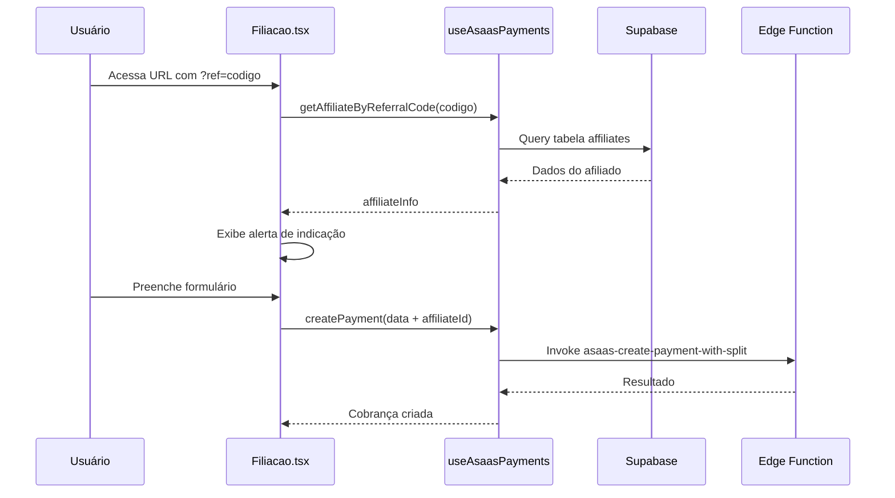
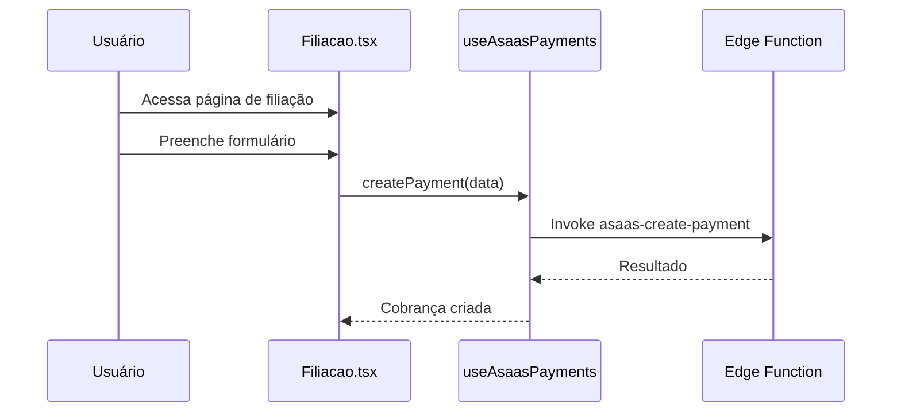

# Análise do Fluxo de Pagamento no Frontend - COMADEMIG

## Resumo Executivo

Esta análise examina a implementação do fluxo de pagamento no frontend do sistema COMADEMIG, identificando como os dados são coletados, processados e enviados para as Edge Functions, bem como possíveis pontos de falha na integração.

## Arquitetura do Frontend

### Componentes Principais

#### 1. useAsaasPayments Hook
**Arquivo:** `/src/hooks/useAsaasPayments.ts`
**Função:** Gerencia todas as operações relacionadas a pagamentos
**Responsabilidades:**
- Criação de pagamentos (com e sem split)
- Verificação de status de pagamentos
- Busca de cobranças do usuário
- Validação de códigos de afiliado

#### 2. PaymentForm Component
**Arquivo:** `/src/components/payments/PaymentForm.tsx`
**Função:** Interface para coleta de dados de pagamento
**Responsabilidades:**
- Coleta de dados do cliente
- Seleção de forma de pagamento
- Validação de formulário
- Envio de dados para o hook

#### 3. Filiacao Page
**Arquivo:** `/src/pages/Filiacao.tsx`
**Função:** Página de processo de filiação
**Responsabilidades:**
- Detecção de códigos de afiliado via URL
- Exibição de benefícios da filiação
- Integração com formulário de pagamento

## Fluxo de Dados Detalhado

### 1. Processo de Filiação com Afiliado



### 2. Processo de Filiação Simples



## Análise do Código

### ✅ Pontos Positivos

#### 1. Seleção Automática de Edge Function
```typescript
// useAsaasPayments.ts linha 32-33
const functionName = paymentData.affiliateId ? 'asaas-create-payment-with-split' : 'asaas-create-payment';
```
**Análise:** Boa implementação que seleciona automaticamente a função correta baseada na presença de afiliado.

#### 2. Tratamento de Erros Estruturado
```typescript
// useAsaasPayments.ts linha 40-50
if (error) {
  throw error;
}

if (!data.success) {
  throw new Error(data.error?.message || 'Erro ao criar cobrança');
}
```
**Análise:** Tratamento adequado de erros da Edge Function.

#### 3. Interface de Dados Tipada
```typescript
// useAsaasPayments.ts linha 4-25
export interface PaymentData {
  customer: { ... },
  billingType: 'BOLETO' | 'CREDIT_CARD' | 'PIX',
  // ...
}
```
**Análise:** Boa tipagem TypeScript para validação de dados.

### ⚠️ Problemas Identificados

#### 1. Falta de Validação de CPF/CNPJ
**Problema:** Não há validação de formato de CPF/CNPJ no frontend
```typescript
// PaymentForm.tsx linha 95-102
<Input
  id="cpfCnpj"
  value={formData.customer.cpfCnpj}
  onChange={(e) => handleCustomerChange('cpfCnpj', e.target.value)}
  required
/>
```
**Impacto:** Dados inválidos podem ser enviados para a API Asaas
**Solução:** Implementar validação de CPF/CNPJ

#### 2. Ausência de Feedback Visual Detalhado
**Problema:** Não há indicação clara do progresso do pagamento
```typescript
// useAsaasPayments.ts linha 52-56
toast({
  title: "Cobrança criada com sucesso",
  description: `${paymentData.billingType === 'PIX' ? 'PIX' : 'Boleto'} gerado com sucesso`,
});
```
**Impacto:** Usuário não sabe o que aconteceu após criar a cobrança
**Solução:** Implementar redirecionamento para página de pagamento

#### 3. Falta de Validação de Afiliado Inválido
**Problema:** Não há tratamento quando código de afiliado é inválido
```typescript
// Filiacao.tsx linha 25-29
const loadAffiliateInfo = async (referralCode: string) => {
  const affiliate = await getAffiliateByReferralCode(referralCode);
  if (affiliate) {
    setAffiliateInfo({ id: affiliate.id, referralCode });
  }
  // ⚠️ Não há tratamento para afiliado inválido
};
```
**Impacto:** Usuário não sabe se o código de afiliado é válido
**Solução:** Exibir mensagem quando código for inválido

#### 4. Hardcoded de Valores e Configurações
**Problema:** Valores fixos no código
```typescript
// Filiacao.tsx linha 119-120
value: 250,
description: "Taxa de Filiação - COMADEMIG",
```
**Impacto:** Dificuldade para alterar valores sem deploy
**Solução:** Mover para configuração dinâmica

## Integração com Edge Functions

### Chamadas Identificadas

#### 1. Criação de Pagamento Simples
```typescript
await supabase.functions.invoke('asaas-create-payment', {
  body: paymentData
});
```

#### 2. Criação de Pagamento com Split
```typescript
await supabase.functions.invoke('asaas-create-payment-with-split', {
  body: paymentData
});
```

#### 3. Verificação de Status
```typescript
await supabase.functions.invoke('asaas-check-payment', {
  body: { paymentId }
});
```

### Possíveis Pontos de Falha

#### 1. Timeout de Requisições
**Problema:** Não há configuração de timeout para chamadas das Edge Functions
**Sintoma:** Usuário fica aguardando indefinidamente
**Solução:** Implementar timeout nas chamadas

#### 2. Falta de Retry Logic
**Problema:** Não há tentativas de retry em caso de falha temporária
**Sintoma:** Falhas esporádicas não são recuperadas automaticamente
**Solução:** Implementar retry com backoff exponencial

#### 3. Ausência de Validação de Resposta
**Problema:** Não há validação da estrutura da resposta das Edge Functions
**Sintoma:** Erros não tratados quando resposta tem formato inesperado
**Solução:** Implementar validação de schema de resposta

## Fluxo de Dados Esperado vs Real

### Fluxo Esperado (Filiação)
1. ✅ Usuário acessa página de filiação
2. ✅ Sistema detecta código de afiliado (se presente)
3. ✅ Usuário preenche formulário
4. ✅ Sistema valida dados
5. ❌ **FALHA:** Sistema cria pagamento via Edge Function
6. ❌ **FALHA:** Sistema redireciona para checkout
7. ❌ **FALHA:** Usuário completa pagamento

### Problemas no Fluxo Real
- **Step 5:** Edge Function falha por problemas de configuração
- **Step 6:** Não há redirecionamento implementado
- **Step 7:** Usuário não consegue completar pagamento

## Recomendações de Correção

### Prioridade Alta
1. **Implementar redirecionamento para checkout** após criação da cobrança
2. **Adicionar validação robusta** de CPF/CNPJ
3. **Implementar tratamento de timeout** nas chamadas das Edge Functions
4. **Adicionar feedback visual** do progresso do pagamento

### Prioridade Média
1. **Implementar retry logic** para chamadas falhadas
2. **Adicionar validação de afiliado inválido**
3. **Mover valores hardcoded** para configuração
4. **Implementar validação de schema** de resposta

### Prioridade Baixa
1. **Adicionar loading states** mais detalhados
2. **Implementar cache** para dados de afiliados
3. **Adicionar analytics** de conversão
4. **Otimizar performance** do formulário

## Correções Sugeridas

### 1. Redirecionamento para Checkout
```typescript
const handlePaymentSuccess = (cobranca: any) => {
  // Redirecionar para URL de pagamento
  if (cobranca.url_pagamento) {
    window.open(cobranca.url_pagamento, '_blank');
  } else if (cobranca.asaas_data?.invoiceUrl) {
    window.open(cobranca.asaas_data.invoiceUrl, '_blank');
  }
};
```

### 2. Validação de CPF/CNPJ
```typescript
const validateCpfCnpj = (value: string) => {
  // Implementar validação de CPF/CNPJ
  const cleaned = value.replace(/\D/g, '');
  return cleaned.length === 11 || cleaned.length === 14;
};
```

### 3. Timeout nas Chamadas
```typescript
const createPayment = async (paymentData: PaymentData) => {
  const controller = new AbortController();
  const timeoutId = setTimeout(() => controller.abort(), 30000); // 30s timeout
  
  try {
    const { data, error } = await supabase.functions.invoke(functionName, {
      body: paymentData,
      signal: controller.signal
    });
    // ...
  } finally {
    clearTimeout(timeoutId);
  }
};
```

## Próximos Passos

1. ✅ **Análise do frontend** - CONCLUÍDA
2. 🔄 **Aguardando acesso aos logs** do Supabase
3. ⏳ **Implementação de correções** no frontend
4. ⏳ **Testes de integração** completos
5. ⏳ **Deploy das correções**

---
*Análise realizada em: 09/09/2025*
*Próxima etapa: Análise dos logs das Edge Functions (aguardando acesso ao Supabase)*

